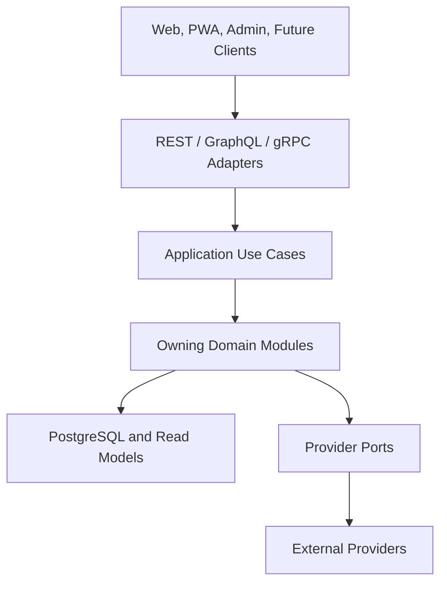
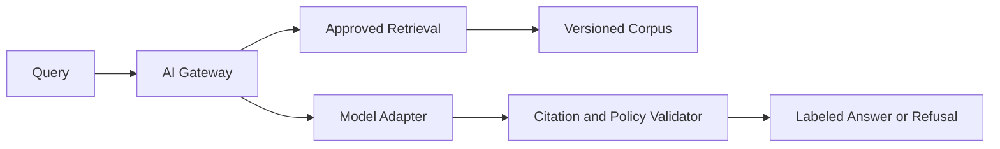
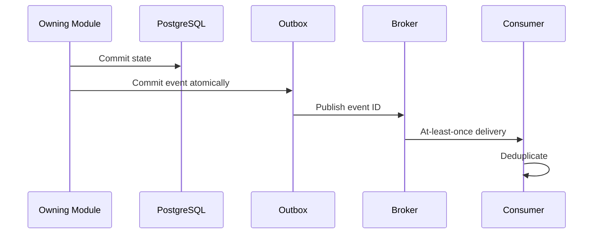

# Alsamad — API Architecture

**Status:** Approved architecture; documentation only  
**Release model:** Release 1 / Prepared / Approved Later Module / Future–Research  
**Authority:** Product, Database, Admin, AI, Sakinah, Infrastructure, Observability, QA, Analytics, and Roadmap architecture documents.

This document defines Alsamad's provider- and protocol-independent API constitution. It authorizes no code, UI, migration, provider, deployment, or later module.

---

# 1. Executive Decision

Alsamad exposes domain capabilities, never tables. Application use cases and owning modules define behavior; REST, GraphQL, gRPC, jobs, events, and webhooks are replaceable adapters. Every representation preserves one canonical religious truth, stable identifiers, explicit provenance, module ownership, human review, and compatibility.

REST/JSON is the Release 1 external adapter. GraphQL and gRPC remain Prepared until a named consumer proves the need. Deterministic search ships in Release 1. Runtime AI, semantic search, and the Knowledge Graph remain Future/Research.

# 2. API Constitutional Principles

1. **Domain before transport.** Protocol handlers parse, authorize, invoke use cases, and serialize; they never own business rules.
2. **Provider independence.** Identity, storage, search, prayer, Hijri, analytics, payment, notification, and AI providers sit behind owned ports.
3. **Protocol independence.** Equivalent operations preserve identity, authorization, validation, idempotency, consistency, and errors across adapters.
4. **Stable identity.** UUIDv7 is the default opaque business ID; canonical Quran locators remain stable natural coordinates; slugs and provider IDs are aliases only.
5. **Single ownership.** Every resource and mutation has exactly one owning module. Shared write ownership and table-shaped CRUD are prohibited.
6. **Content Integrity supremacy.** No API bypasses source, license, edition, checksum, language, religious review, publication, correction, or withdrawal gates.
7. **Guest-first core.** Quran, duas, adhkar, prayer, Hijri, deterministic search, sources, and methodology are public without login.
8. **Default deny.** Protected operations require explicit capability, scope, assurance, and valid state.
9. **Explicit contracts.** Input, output, error, concurrency, cache, privacy, localization, and observability are documented.
10. **Determinism before synthesis.** Release 1 discovery is reproducible and source-aware; generated answers never silently replace it.
11. **Minimal disclosure.** Return only fields required by the operation and authorized representation.
12. **Additive evolution.** Preserve identifiers, canonical relationships, and historical records; breaking change requires explicit approval.

# 3. Architecture



| Boundary               | Owns                                                  | Cannot own                    |
| ---------------------- | ----------------------------------------------------- | ----------------------------- |
| Adapter                | Parsing, negotiation, serialization, transport status | Business rules                |
| Use case               | Orchestration, transaction, capability requirement    | Another module's invariants   |
| Domain module          | Invariants, transitions, resource ownership           | Protocol/provider assumptions |
| Provider port          | Provider-neutral capability                           | Provider response leakage     |
| Infrastructure adapter | SDK, timeout, retry, mapping                          | Public identity or truth      |

# 4. Protocol Adapter Boundaries

## 4.1 REST — Release 1

HTTPS REST/JSON serves public reads and administrative commands. Paths are versioned at `/api/v1`. Governed transitions are explicit action subresources, not arbitrary `PATCH` of status.

- `GET /api/v1/quran/surahs`
- `GET /api/v1/quran/ayahs/{id}`
- `GET /api/v1/devotional-items/{id}`
- `GET /api/v1/search`
- `GET /api/v1/prayer-times`
- `POST /api/v1/admin/content-items/{id}/revisions`
- `POST /api/v1/admin/content-revisions/{id}/reviews`
- `POST /api/v1/admin/content-revisions/{id}/publication-events`

## 4.2 GraphQL — Prepared

GraphQL may compose approved read models for a proven multi-surface need. Resolvers call the same use cases and capability checks. Arbitrary database traversal, unrestricted mutations, unbounded depth, sensitive production introspection, and resolver-owned business logic are prohibited.

## 4.3 gRPC — Prepared

gRPC may serve measured internal throughput needs. Protobuf maps to application DTOs; field numbers are never reused. Interceptors add transport authentication and telemetry, while the same use case enforces authorization and invariants.

| Concern       | REST                 | GraphQL                | gRPC                    |
| ------------- | -------------------- | ---------------------- | ----------------------- |
| Identity      | Canonical Alsamad ID | Same                   | Same                    |
| Authorization | Use-case capability  | Same resolver use case | Same RPC use case       |
| Errors        | Problem Details      | Typed extension        | Canonical status/detail |
| Idempotency   | Header               | Mutation input/header  | Metadata/request field  |
| Observability | Route template       | Operation/field        | Service/method          |

# 5. Resource Ownership

| Resources                                               | Owning module       | Status                |
| ------------------------------------------------------- | ------------------- | --------------------- |
| Locales, geographic areas                               | Global Architecture | Release 1             |
| Works, editions, passages, texts, licenses, references  | Content Integrity   | Release 1             |
| Surahs, ayahs, Quran texts, markers, Quran translations | Quran               | Release 1             |
| Devotional items, collections, content translations     | Devotional          | Release 1             |
| Staff, role grants, reviews                             | Editorial           | Release 1             |
| Prayer methods and regional defaults                    | Prayer              | Release 1             |
| Hijri methods, adjustments, Muslim events               | Calendar            | Release 1             |
| Publication and audit events                            | Audit/Publication   | Release 1             |
| Accounts and sessions                                   | Identity            | Expanded V1 prerequisite architecture open; API implementation blocked |
| Preferences and saved items                             | Identity            | Prepared/deferred     |
| Hadith                                                  | Hadith              | Approved Later Module |
| Talibeen                                                | Talibeen            | Expanded V1 separately feature-gated; implementation blocked |
| Subscriptions, payments, Balance                        | Commerce/Ledger     | Approved Later Module |
| AI answers, semantic retrieval, Knowledge Graph         | AI/Knowledge Engine | Future/Research       |

Cross-module reads use services or approved views. Cross-module writes invoke the owner's command. Provider IDs never become public Alsamad IDs.

# 6. Request Contract

## 6.1 Common Headers

| Header            | Contract                                               |
| ----------------- | ------------------------------------------------------ |
| `Accept`          | Supported media type                                   |
| `Accept-Language` | Presentation preference, never canonical identity      |
| `Authorization`   | Protected operations only                              |
| `Idempotency-Key` | Required for retryable mutations                       |
| `If-None-Match`   | Conditional read                                       |
| `If-Match`        | Optimistic mutation precondition                       |
| `Traceparent`     | Accepted when valid                                    |
| `X-Request-ID`    | Optional client correlation; server emits canonical ID |

Boundary schemas reject malformed JSON, unsupported media, unknown mutation fields, invalid UUID/locale/date/time-zone/coordinate/enum/filter/cursor values, excessive size, nesting, arrays, or strings. Server derives actor, ownership, state, checksums, and audit metadata. Generic Unicode normalization never alters canonical religious text.

## 6.2 Mutation Preconditions

Every protected mutation declares required capability, resource scope, current state, concurrency version, idempotency behavior, reason requirements, separation-of-duty rule, and transaction boundary. High-impact operations require recent strong authentication.

# 7. Response Contract

Single reads return a stable resource representation. Collections return:

```json
{
  "data": [],
  "page": { "next_cursor": null, "has_more": false, "limit": 20 },
  "meta": { "request_id": "opaque", "locale": "ar" }
}
```

Timestamps are RFC 3339 UTC. Money and exact decimals use documented exact types. Empty collections are `[]`. Optional `null` is schema-defined. Response metadata contains no secret or hidden ranking signal.

Religious representations expose applicable canonical ID/locator, exact edition/version, translation edition and attribution, classification, source references, review/publication status, corrections, and method disclosure. Editorial General Dua is always `editorial_general_dua` and never presented as transmitted Quran or Sunnah.

`include` supports only allowlisted, authorized, bounded, one-level expansions unless a dedicated read model states otherwise. Circular graphs and arbitrary field selection are prohibited.

# 8. Standard Errors

Errors use `application/problem+json`:

```json
{
  "type": "https://al-samad.com/problems/conflict",
  "title": "Conflict",
  "status": 409,
  "code": "revision_conflict",
  "detail": "The resource changed after it was loaded.",
  "instance": "/api/v1/admin/content-revisions/opaque",
  "request_id": "opaque",
  "errors": []
}
```

| Status | Meaning                                     |
| ------ | ------------------------------------------- |
| 400    | Malformed request/combination               |
| 401    | Missing or invalid authentication           |
| 403    | Capability denied                           |
| 404    | Missing or intentionally concealed resource |
| 409    | State, uniqueness, or idempotency conflict  |
| 412    | ETag/precondition failed                    |
| 415    | Unsupported media type                      |
| 422    | Semantic validation failure                 |
| 429    | Rate/abuse limit                            |
| 503    | Required dependency unavailable             |

Errors never reveal SQL, stack traces, secrets, provider payloads, topology, concealed identity existence, or sensitive authorization detail.

# 9. Authentication

Release 1 staff APIs use an approved provider-independent identity adapter and revocable server session. Cookies are Secure, HttpOnly, appropriately SameSite, and CSRF-protected. Staff MFA is mandatory; high-impact roles prefer phishing-resistant passkeys.

Under `REG-0028` and `ADR-0011`, Public ALSAMAD Identity is a provider-neutral Expanded V1 prerequisite architecture track. Authentication may later establish control of a credential or provider identity and resolve it to one stable ALSAMAD account subject; the credential/provider identity, session, and recovery mechanism never become that durable account identity. Recovery restores access to the same account rather than silently creating a duplicate, and account-state changes may require session invalidation. These are conceptual boundaries only: no endpoint, route, version, request/response schema, transport, token format, cookie, provider, account/session store, implementation, or real-user processing is authorized. Preferences and saved items remain Prepared/deferred.

`REG-0029`/`ADR-0012` approve only a negative API contract for the possible future runtime-inert `users` root. The persistence root is internal, unreachable from public or staff APIs and routes, absent from request/response contracts and public identifiers, never serialized to a client, and unavailable through REST, GraphQL, RPC, server actions, account services, repositories, or other runtime consumers. No endpoint, path, version, schema, handler, route, service, repository, import, account operation, or implementation is created or authorized. A later API/privacy/Security/Roadmap crossing is required before any external representation or operation.

Services use workload identity or short-lived signed credentials. Shared permanent internal API keys are prohibited.

# 10. Capability-Based Authorization

Decision input is:

`subject + capability + owner + resource + content class + locale + region + environment + assurance + time + constraints`

Capabilities include `content.revision.create`, `content.source.verify`, `content.language.review:ar`, `content.religious.review`, `content.publish`, `content.withdraw.emergency`, `quran.import.verify`, `prayer.defaults.manage:NO`, `hijri.adjustments.manage:NO`, `staff.grants.manage`, and `audit.read`.

Roles are grant templates, not decisions. The server evaluates every request. UI visibility is never enforcement. Self-approval is denied where review separation applies.

# 11. Localization

- URL locale selects presentation; canonical IDs remain locale-neutral.
- `Accept-Language` negotiates only when route/policy permits.
- Response reports resolved locale and available renderings.
- Fallback is explicit and never labels English as Arabic.
- Canonical Arabic is returned unchanged from the approved edition.
- UI localization and religious translation have separate pipelines.
- Time output carries UTC instant, selected IANA zone, and local representation.
- Prayer/Hijri output discloses method, authority, adjustment, and qualification.

# 12. Deterministic Search API

`GET /api/v1/search?q=&corpus=&locale=&source=&category=&cursor=&limit=`

Release 1 queries canonical owners through rebuildable views/materialized views using PostgreSQL FTS, justified `pg_trgm`, versioned Arabic normalization, and explicit weights.

- Same corpus, normalizer, ranking version, query, and filters yield the same order.
- Tie-breaker is canonical type then stable ID.
- Payment, popularity, user value, and worship activity never rank religious results.
- Exact source/canonical matches precede fuzzy matches.
- Hits identify corpus, source, locale, edition/version, safe excerpt, and direct canonical URL.
- Search scores may remain internal so clients cannot couple to them.
- Cursor is opaque, signed, filter-bound, and contains ranking version plus final sort tuple.
- Display text is canonical; normalization applies only to matching.

# 13. AI API Boundary

Runtime AI is not Release 1. Any future endpoint uses a dedicated AI Gateway; public route handlers never call a model directly.



Future contract requires approved immutable corpora, claim-level readable citations, no invented IDs, visible separation from sources, uncertainty and scholarly-difference disclosure, refusal/escalation for personalized fatwa/takfir/unsupported or high-risk claims, versioned prompt/model/corpus/policy/evaluation, minimized traces, provider privacy controls, and an independently available deterministic search fallback.

# 14. Idempotency and Concurrency

Retryable mutations require an idempotency key scoped to actor, owner, and operation. Same key plus same canonical request returns the original result; different request returns `409 idempotency_conflict`. Imports, publication, withdrawal, provider events, future payments, and webhooks require durable deduplication.

Mutable admin resources expose ETags derived from identity/version. `If-Match` is mandatory for conflict-sensitive changes; stale writes return `412`. Published religious revisions are immutable and superseded with a new revision.

# 15. Pagination, Filtering, Sorting, Expansion

- Cursor pagination is default; cursors are opaque, signed, versioned, and filter-bound.
- Limits are endpoint-specific with documented defaults and maxima.
- Offset is limited to small static admin dictionaries or exports.
- Filters and operators are allowlisted; repeated-filter semantics are explicit.
- Every sort includes a stable unique tie-breaker.
- Religious ordering is canonical/curated, never payment or popularity driven.
- Expansions are allowlisted, authorization-aware, depth-bounded, and complexity-limited.

# 16. Caching, ETags, Conditional Requests

| Data                                     | Policy                                                       |
| ---------------------------------------- | ------------------------------------------------------------ |
| Immutable published edition/revision     | Public, long-lived, immutable version URL                    |
| Current canonical pointer                | Public, shorter TTL, event revalidation                      |
| Prayer/Hijri result                      | Input/method-bound; private if location sensitivity requires |
| Public deterministic search              | Short cache for non-sensitive queries only                   |
| Admin, drafts, audit, identity, Talibeen | Private/no-store                                             |

ETags include representation, locale, edition, expansion set, and authorization visibility. `If-None-Match` returns `304`; `Last-Modified` is supplemental. Publication/configuration events invalidate affected pointers and derived projections. `Vary` remains minimal. Sensitive responses never enter shared caches.

# 17. Rate Limits and Abuse Controls

Limits combine operation risk, subject/workload identity, privacy-preserving network signals, and anomalies. Quran reading receives generous graceful limits. Authentication, search, correction intake, exports, imports, admin, future AI, provider callbacks, and Talibeen discovery receive stricter budgets. Controls preserve accessibility and low-bandwidth use and do not reveal protected identity existence.

# 18. Observability

Every request emits correlation ID and structured telemetry: route template, operation, status class, latency, owner, release, dependency outcome, cache result, and safe error code. OpenTelemetry-compatible context crosses adapters, use cases, database, queues, and providers. Metric labels have bounded cardinality.

Never log secrets, tokens, cookies, unnecessary religious payloads, raw private queries by default, precise private location, Talibeen data, payments, or sensitive AI prompts. Privileged content/security actions create durable audit events in addition to operational logs.

# 19. Events and Webhooks — Prepared

Events become asynchronous only when a real consumer requires reliability. A transactional outbox is Prepared, not a Release 1 physical table.



Event envelope: ID, type, schema version, aggregate ID/version, owner, occurred time, correlation/causation IDs, classification, and minimal payload. Consumers are idempotent.

Outbound webhooks are HTTPS, signed, timestamped, replay-protected, event-allowlisted, retried with bounded backoff, observable, and disableable. Inbound webhooks verify signature before business parsing and deduplicate provider event IDs. No event/webhook contains secrets or full sensitive records.

# 20. Versioning, Deprecation, Compatibility

Major REST version appears in `/api/v1`. Compatible evolution may add optional fields, resources, filters, includes, and safely extensible enum values. Breaking changes include removal/rename, changed meaning/unit/nullability/identity/order, tighter accepted input beyond urgent security correction, changed exposure, or changed canonical religious semantics.

Breaking change requires an architecture decision, migration guide, client inventory, parallel window where feasible, telemetry evidence, `Deprecation`/`Sunset` signaling, announced date, and rollback. Security/content-integrity emergency changes may accelerate but remain documented.

# 21. Administrative APIs

- Separate staff surface and authentication.
- Explicit draft, verify, review, publish, correct, supersede, withdraw, restore, import, and configure commands.
- No generic production CRUD over tables.
- Bulk operations require dry run, affected counts, exceptions, reason, idempotency, audit, and rollback/compensation.
- Publication atomically checks exact revision, evidence, license, classification, reviews, authorization, and concurrent state.
- Direct database writes are not an API.
- Support impersonation is prohibited unless separately designed with consent, banner, scope, time limit, and audit.

# 22. Security and Privacy Contract

TLS and HSTS protect network boundaries. Cookie mutations use CSRF defense. CORS uses a strict allowlist. Controls cover injection, SSRF, XSS, request smuggling, mass assignment, path traversal, unsafe deserialization, and body exhaustion. Response fields are allowlisted. Sensitive exports are encrypted, expiring, scoped, and audited. `REG-0025` places Talibeen in an Expanded V1 governance-design track, but authorizes no API implementation or contract. Later client-independent Talibeen domain/API boundaries may serve ALSAMAD Web and deferred standalone web/mobile clients only after separate authority; they require isolation, anti-enumeration, privacy-preserving discovery, heightened retention, and purpose-bound access. No route, endpoint, schema, version, transport, service, or future client is selected here.

# 23. Contract and Release Verification

Each endpoint class requires schema/golden contract tests; authorization allow/deny matrix; ownership-boundary, idempotency, concurrency, pagination, localization, cache, conditional request, error-redaction, rate-limit, and provider-failure tests; real PostgreSQL integrity tests where relevant; religious checksum/source/review/classification/correction/withdrawal tests; performance evidence; observability; backward-compatibility diff; rollback; and documentation.

# 24. Release Classification

| Capability                                                          | Classification             |
| ------------------------------------------------------------------- | -------------------------- |
| Public Quran, devotional, source, prayer, Hijri, event, locale APIs | Release 1                  |
| Deterministic search                                                | Release 1                  |
| Editorial review/publication/configuration/grants/audit APIs        | Release 1                  |
| Public accounts, sync, bookmarks, reading position                  | Prepared                   |
| Audio catalog, correction intake, notification preferences          | Prepared                   |
| GraphQL, gRPC, outbox, broker, webhooks                             | Prepared after proven need |
| Hadith                                                              | Approved Later Module      |
| Talibeen                                                            | Expanded V1 separately feature-gated; implementation blocked |
| Subscription, payment, Balance                                      | Approved Later Module      |
| Runtime AI, semantic search, Knowledge Graph, recommendations       | Future/Research            |

# 25. Open Decisions

- Public base URL/gateway topology and whether public reads use a dedicated origin.
- Staff identity provider and phishing-resistant MFA rollout.
- Exact Quran.Foundation resources, Quran/translation rights, and devotional, prayer, and Hijri providers/licenses.
- Endpoint limits, Quran.Foundation quotas, approved retention/cache TTLs, and later Public Identity implementation/activation; its Expanded V1 prerequisite architecture is open under `REG-0028`/`ADR-0011`, but no public-authentication API or runtime is authorized.
- First proven GraphQL/gRPC consumer.
- Event broker and webhook signing scheme when approved.
- Public API documentation and controlled admin schema exposure.
- AI model/provider only after governance and evaluation gates.

# 26. Final Validation

## 25.1 M0.5 Quran provider boundary

The Quran module owns a provider-independent `QuranContentProvider` port. Its Quran.Foundation adapter normalizes chapters and chapter information; canonical ayah identities and ranges; text/script and translation editions; translation footnotes; tafsir; pages, juz, hizb, rub el hizb, ruku and manzil; reciters, audio and timing capabilities; Quran search; catalogs; synchronization; pagination; provider errors; attribution; licenses; availability; schema/API versions; freshness; and deletion signals. Raw Quran.Foundation objects, IDs, cursors, errors, credentials, and URLs never become public ALSAMAD contracts.

A separate dormant `QuranUserInteropProvider` port covers optional OIDC subject linking, Quran bookmarks/Favorites/collections, reading bookmark and sessions, private progress/notes/preferences, approved non-competitive goals, Mushaf-aware synchronization, export, revocation, and deletion. Content credentials and user credentials remain separate. This port is Prepared and has no public Release 1 activation.

Content and Search calls are server-side only. Quran.Foundation Search is evaluation-only until its production approval gate passes; local deterministic search remains the public Release 1 contract. Provider replacement must not change ALSAMAD public URLs, identifiers, pagination, or error semantics.

- Provider/protocol independence and REST/GraphQL/gRPC boundaries are explicit.
- IDs are stable and locale/provider independent.
- Every resource has one owner.
- Requests, responses, errors, auth, capabilities, localization, deterministic search, AI boundary, idempotency, pagination, filtering, sorting, expansion, cache, ETags, observability, events, webhooks, versioning, deprecation, and compatibility are governed.
- Canonical religious truth is never duplicated; Editorial General Dua remains distinct.
- Release 1 / Prepared / Approved Later Module / Future–Research boundaries remain intact.
