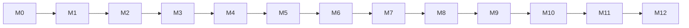

# ALSAMAD Implementation Roadmap

Authoritative dependency-aware implementation roadmap derived from the approved architecture documents.

## Mission
Convert approved architecture into an implementation sequence while preventing premature scope.

## Core Principles
- Architecture Before Implementation
- Smallest Durable Release
- Dependency-Ordered Delivery
- Evidence Before Completion
- No Premature Future Scope
- Security and Accessibility as Release Gates
- Religious Integrity Before Speed
- Real PostgreSQL Verification
- Additive Evolution
- Reversible Delivery
- One Approved Scope at a Time

## Phase 0: Repository and architecture baseline
- Objective
- Included scope
- Explicitly excluded scope
- Dependencies
- Artifacts
- Database changes allowed
- Application capabilities
- Admin capabilities
- Security requirements
- QA requirements
- Observability requirements
- Analytics requirements
- Acceptance criteria
- Completion evidence
- Rollback/recovery
- Release status

## Phase 1: Release 1 scope freeze
- Objective
- Included scope
- Explicitly excluded scope
- Dependencies
- Artifacts
- Database changes allowed
- Application capabilities
- Admin capabilities
- Security requirements
- QA requirements
- Observability requirements
- Analytics requirements
- Acceptance criteria
- Completion evidence
- Rollback/recovery
- Release status

## Phase 2: Database foundation
- Objective
- Included scope
- Explicitly excluded scope
- Dependencies
- Artifacts
- Database changes allowed
- Application capabilities
- Admin capabilities
- Security requirements
- QA requirements
- Observability requirements
- Analytics requirements
- Acceptance criteria
- Completion evidence
- Rollback/recovery
- Release status

## Phase 3: Global locales and regional configuration
- Objective
- Included scope
- Explicitly excluded scope
- Dependencies
- Artifacts
- Database changes allowed
- Application capabilities
- Admin capabilities
- Security requirements
- QA requirements
- Observability requirements
- Analytics requirements
- Acceptance criteria
- Completion evidence
- Rollback/recovery
- Release status

## Phase 4: Content Integrity foundation
- Objective
- Included scope
- Explicitly excluded scope
- Dependencies
- Artifacts
- Database changes allowed
- Application capabilities
- Admin capabilities
- Security requirements
- QA requirements
- Observability requirements
- Analytics requirements
- Acceptance criteria
- Completion evidence
- Rollback/recovery
- Release status

## Phase 5: Quran data model and verified import
- Objective
- Included scope
- Explicitly excluded scope
- Dependencies
- Artifacts
- Database changes allowed
- Application capabilities
- Admin capabilities
- Security requirements
- QA requirements
- Observability requirements
- Analytics requirements
- Acceptance criteria
- Completion evidence
- Rollback/recovery
- Release status

## Phase 6: Devotional content and Editorial General Dua
- Objective
- Included scope
- Explicitly excluded scope
- Dependencies
- Artifacts
- Database changes allowed
- Application capabilities
- Admin capabilities
- Security requirements
- QA requirements
- Observability requirements
- Analytics requirements
- Acceptance criteria
- Completion evidence
- Rollback/recovery
- Release status

## Phase 7: Editorial administration workflows
- Objective
- Included scope
- Explicitly excluded scope
- Dependencies
- Artifacts
- Database changes allowed
- Application capabilities
- Admin capabilities
- Security requirements
- QA requirements
- Observability requirements
- Analytics requirements
- Acceptance criteria
- Completion evidence
- Rollback/recovery
- Release status

## Phase 8: Deterministic search
- Objective
- Included scope
- Explicitly excluded scope
- Dependencies
- Artifacts
- Database changes allowed
- Application capabilities
- Admin capabilities
- Security requirements
- QA requirements
- Observability requirements
- Analytics requirements
- Acceptance criteria
- Completion evidence
- Rollback/recovery
- Release status

## Phase 9: Prayer and Hijri configuration
- Objective
- Included scope
- Explicitly excluded scope
- Dependencies
- Artifacts
- Database changes allowed
- Application capabilities
- Admin capabilities
- Security requirements
- QA requirements
- Observability requirements
- Analytics requirements
- Acceptance criteria
- Completion evidence
- Rollback/recovery
- Release status

## Phase 10: Public Release 1 experience
- Objective
- Included scope
- Explicitly excluded scope
- Dependencies
- Artifacts
- Database changes allowed
- Application capabilities
- Admin capabilities
- Security requirements
- QA requirements
- Observability requirements
- Analytics requirements
- Acceptance criteria
- Completion evidence
- Rollback/recovery
- Release status

## Phase 11: Accessibility, SEO, performance and localization
- Objective
- Included scope
- Explicitly excluded scope
- Dependencies
- Artifacts
- Database changes allowed
- Application capabilities
- Admin capabilities
- Security requirements
- QA requirements
- Observability requirements
- Analytics requirements
- Acceptance criteria
- Completion evidence
- Rollback/recovery
- Release status

## Phase 12: Security hardening
- Objective
- Included scope
- Explicitly excluded scope
- Dependencies
- Artifacts
- Database changes allowed
- Application capabilities
- Admin capabilities
- Security requirements
- QA requirements
- Observability requirements
- Analytics requirements
- Acceptance criteria
- Completion evidence
- Rollback/recovery
- Release status

## Phase 13: Observability and analytics
- Objective
- Included scope
- Explicitly excluded scope
- Dependencies
- Artifacts
- Database changes allowed
- Application capabilities
- Admin capabilities
- Security requirements
- QA requirements
- Observability requirements
- Analytics requirements
- Acceptance criteria
- Completion evidence
- Rollback/recovery
- Release status

## Phase 14: Release verification
- Objective
- Included scope
- Explicitly excluded scope
- Dependencies
- Artifacts
- Database changes allowed
- Application capabilities
- Admin capabilities
- Security requirements
- QA requirements
- Observability requirements
- Analytics requirements
- Acceptance criteria
- Completion evidence
- Rollback/recovery
- Release status

## Phase 15: Production launch
- Objective
- Included scope
- Explicitly excluded scope
- Dependencies
- Artifacts
- Database changes allowed
- Application capabilities
- Admin capabilities
- Security requirements
- QA requirements
- Observability requirements
- Analytics requirements
- Acceptance criteria
- Completion evidence
- Rollback/recovery
- Release status

## Phase 16: Post-launch stabilization
- Objective
- Included scope
- Explicitly excluded scope
- Dependencies
- Artifacts
- Database changes allowed
- Application capabilities
- Admin capabilities
- Security requirements
- QA requirements
- Observability requirements
- Analytics requirements
- Acceptance criteria
- Completion evidence
- Rollback/recovery
- Release status

## Phase 17: Prepared foundations
- Objective
- Included scope
- Explicitly excluded scope
- Dependencies
- Artifacts
- Database changes allowed
- Application capabilities
- Admin capabilities
- Security requirements
- QA requirements
- Observability requirements
- Analytics requirements
- Acceptance criteria
- Completion evidence
- Rollback/recovery
- Release status

## Phase 18: Approved Later Modules
- Objective
- Included scope
- Explicitly excluded scope
- Dependencies
- Artifacts
- Database changes allowed
- Application capabilities
- Admin capabilities
- Security requirements
- QA requirements
- Observability requirements
- Analytics requirements
- Acceptance criteria
- Completion evidence
- Rollback/recovery
- Release status

## Phase 19: Future / Research
- Objective
- Included scope
- Explicitly excluded scope
- Dependencies
- Artifacts
- Database changes allowed
- Application capabilities
- Admin capabilities
- Security requirements
- QA requirements
- Observability requirements
- Analytics requirements
- Acceptance criteria
- Completion evidence
- Rollback/recovery
- Release status

## Release 1 Scope
Arabic/English public experience, Quran, translations, duas, adhkar, prayer, Hijri, tasbeeh, deterministic search, provenance, editorial workflows, accessibility, SEO, performance, security, monitoring, minimal analytics.
Excluded: Talibeen, subscriptions, payments, Hadith corpus, runtime generative AI, semantic search, advanced notifications, community, GPU, multi-region.

## Database Sequence
Implement only the approved Release 1 schema and activate the 30 Release 1 tables according to owning modules. Future tables remain prohibited until their release phase.

## Content Import Gates
Quran provider approval, licensing, checksums, manifests, ayah/surah validation, translation approval, devotional source approval before import.

## Implementation Gates
- Architecture Gate
- Data Source Gate
- Database Gate
- Content Integrity Gate
- UI Approval Gate
- Security Gate
- Accessibility Gate
- SEO Gate
- Performance Gate
- Production Readiness Gate
- Launch Approval Gate

## Quality Evidence
- Formatting
- Lint
- Strict TypeScript
- Architecture boundary checks
- Real PostgreSQL tests
- Migration verification
- Constraint verification
- Seed idempotency
- API contract tests
- Authorization tests
- Accessibility
- RTL/LTR
- Religious integrity
- Performance
- Security scans
- Backup restore
- Observability verification

## Milestones
- M0 Architecture Baseline Locked
- M1 Release 1 Scope Frozen
- M2 Database Foundation Verified
- M3 Content Integrity Operational
- M4 Quran Foundation Verified
- M5 Devotional Content Operational
- M6 Editorial Operations Ready
- M7 Deterministic Search Ready
- M8 Prayer and Hijri Ready
- M9 Public Experience Complete
- M10 Release 1 Verified
- M11 Production Launch
- M12 Stabilization Complete

## Dependency Map

## Delivery Matrices
- Phase ownership
- Milestones
- Dependencies
- Release gates
- Database activation
- Architecture ownership
- Acceptance evidence
- Deferred capabilities
- Risk classification

## Open Decisions
- Quran provider
- Translation licenses
- Devotional datasets
- Authentication
- PostgreSQL provider
- Hosting
- Object storage
- Prayer provider
- Hijri provider
- Design tokens
- Quran font
- Analytics provider
- Observability provider
- Security providers
- Launch date

## Validation
- Phases follow approved architecture.
- Release 1 remains minimal.
- Future modules not authorized.
- Security and accessibility are release gates.
- QA evidence required.
- Restore verification before launch.
- No code, UI, migrations, tests, commits, pushes or deployments.
- Roadmap guidance 479.
- Roadmap guidance 480.
- Roadmap guidance 481.
- Roadmap guidance 482.
- Roadmap guidance 483.
- Roadmap guidance 484.
- Roadmap guidance 485.
- Roadmap guidance 486.
- Roadmap guidance 487.
- Roadmap guidance 488.
- Roadmap guidance 489.
- Roadmap guidance 490.
- Roadmap guidance 491.
- Roadmap guidance 492.
- Roadmap guidance 493.
- Roadmap guidance 494.
- Roadmap guidance 495.
- Roadmap guidance 496.
- Roadmap guidance 497.
- Roadmap guidance 498.
- Roadmap guidance 499.
- Roadmap guidance 500.
- Roadmap guidance 501.
- Roadmap guidance 502.
- Roadmap guidance 503.
- Roadmap guidance 504.
- Roadmap guidance 505.
- Roadmap guidance 506.
- Roadmap guidance 507.
- Roadmap guidance 508.
- Roadmap guidance 509.
- Roadmap guidance 510.
- Roadmap guidance 511.
- Roadmap guidance 512.
- Roadmap guidance 513.
- Roadmap guidance 514.
- Roadmap guidance 515.
- Roadmap guidance 516.
- Roadmap guidance 517.
- Roadmap guidance 518.
- Roadmap guidance 519.
- Roadmap guidance 520.
- Roadmap guidance 521.
- Roadmap guidance 522.
- Roadmap guidance 523.
- Roadmap guidance 524.
- Roadmap guidance 525.
- Roadmap guidance 526.
- Roadmap guidance 527.
- Roadmap guidance 528.
- Roadmap guidance 529.
- Roadmap guidance 530.
- Roadmap guidance 531.
- Roadmap guidance 532.
- Roadmap guidance 533.
- Roadmap guidance 534.
- Roadmap guidance 535.
- Roadmap guidance 536.
- Roadmap guidance 537.
- Roadmap guidance 538.
- Roadmap guidance 539.
- Roadmap guidance 540.
- Roadmap guidance 541.
- Roadmap guidance 542.
- Roadmap guidance 543.
- Roadmap guidance 544.
- Roadmap guidance 545.
- Roadmap guidance 546.
- Roadmap guidance 547.
- Roadmap guidance 548.
- Roadmap guidance 549.
- Roadmap guidance 550.
- Roadmap guidance 551.
- Roadmap guidance 552.
- Roadmap guidance 553.
- Roadmap guidance 554.
- Roadmap guidance 555.
- Roadmap guidance 556.
- Roadmap guidance 557.
- Roadmap guidance 558.
- Roadmap guidance 559.
- Roadmap guidance 560.
- Roadmap guidance 561.
- Roadmap guidance 562.
- Roadmap guidance 563.
- Roadmap guidance 564.
- Roadmap guidance 565.
- Roadmap guidance 566.
- Roadmap guidance 567.
- Roadmap guidance 568.
- Roadmap guidance 569.
- Roadmap guidance 570.
- Roadmap guidance 571.
- Roadmap guidance 572.
- Roadmap guidance 573.
- Roadmap guidance 574.
- Roadmap guidance 575.
- Roadmap guidance 576.
- Roadmap guidance 577.
- Roadmap guidance 578.
- Roadmap guidance 579.
- Roadmap guidance 580.
- Roadmap guidance 581.
- Roadmap guidance 582.
- Roadmap guidance 583.
- Roadmap guidance 584.
- Roadmap guidance 585.
- Roadmap guidance 586.
- Roadmap guidance 587.
- Roadmap guidance 588.
- Roadmap guidance 589.
- Roadmap guidance 590.
- Roadmap guidance 591.
- Roadmap guidance 592.
- Roadmap guidance 593.
- Roadmap guidance 594.
- Roadmap guidance 595.
- Roadmap guidance 596.
- Roadmap guidance 597.
- Roadmap guidance 598.
- Roadmap guidance 599.
- Roadmap guidance 600.
- Roadmap guidance 601.
- Roadmap guidance 602.
- Roadmap guidance 603.
- Roadmap guidance 604.
- Roadmap guidance 605.
- Roadmap guidance 606.
- Roadmap guidance 607.
- Roadmap guidance 608.
- Roadmap guidance 609.
- Roadmap guidance 610.
- Roadmap guidance 611.
- Roadmap guidance 612.
- Roadmap guidance 613.
- Roadmap guidance 614.
- Roadmap guidance 615.
- Roadmap guidance 616.
- Roadmap guidance 617.
- Roadmap guidance 618.
- Roadmap guidance 619.
- Roadmap guidance 620.
- Roadmap guidance 621.
- Roadmap guidance 622.
- Roadmap guidance 623.
- Roadmap guidance 624.
- Roadmap guidance 625.
- Roadmap guidance 626.
- Roadmap guidance 627.
- Roadmap guidance 628.
- Roadmap guidance 629.
- Roadmap guidance 630.
- Roadmap guidance 631.
- Roadmap guidance 632.
- Roadmap guidance 633.
- Roadmap guidance 634.
- Roadmap guidance 635.
- Roadmap guidance 636.
- Roadmap guidance 637.
- Roadmap guidance 638.
- Roadmap guidance 639.
- Roadmap guidance 640.
- Roadmap guidance 641.
- Roadmap guidance 642.
- Roadmap guidance 643.
- Roadmap guidance 644.
- Roadmap guidance 645.
- Roadmap guidance 646.
- Roadmap guidance 647.
- Roadmap guidance 648.
- Roadmap guidance 649.
- Roadmap guidance 650.
- Roadmap guidance 651.
- Roadmap guidance 652.
- Roadmap guidance 653.
- Roadmap guidance 654.
- Roadmap guidance 655.
- Roadmap guidance 656.
- Roadmap guidance 657.
- Roadmap guidance 658.
- Roadmap guidance 659.
- Roadmap guidance 660.
- Roadmap guidance 661.
- Roadmap guidance 662.
- Roadmap guidance 663.
- Roadmap guidance 664.
- Roadmap guidance 665.
- Roadmap guidance 666.
- Roadmap guidance 667.
- Roadmap guidance 668.
- Roadmap guidance 669.
- Roadmap guidance 670.
- Roadmap guidance 671.
- Roadmap guidance 672.
- Roadmap guidance 673.
- Roadmap guidance 674.
- Roadmap guidance 675.
- Roadmap guidance 676.
- Roadmap guidance 677.
- Roadmap guidance 678.
- Roadmap guidance 679.
- Roadmap guidance 680.
- Roadmap guidance 681.
- Roadmap guidance 682.
- Roadmap guidance 683.
- Roadmap guidance 684.
- Roadmap guidance 685.
- Roadmap guidance 686.
- Roadmap guidance 687.
- Roadmap guidance 688.
- Roadmap guidance 689.
- Roadmap guidance 690.
- Roadmap guidance 691.
- Roadmap guidance 692.
- Roadmap guidance 693.
- Roadmap guidance 694.
- Roadmap guidance 695.
- Roadmap guidance 696.
- Roadmap guidance 697.
- Roadmap guidance 698.
- Roadmap guidance 699.
- Roadmap guidance 700.
- Roadmap guidance 701.
- Roadmap guidance 702.
- Roadmap guidance 703.
- Roadmap guidance 704.
- Roadmap guidance 705.
- Roadmap guidance 706.
- Roadmap guidance 707.
- Roadmap guidance 708.
- Roadmap guidance 709.
- Roadmap guidance 710.
- Roadmap guidance 711.
- Roadmap guidance 712.
- Roadmap guidance 713.
- Roadmap guidance 714.
- Roadmap guidance 715.
- Roadmap guidance 716.
- Roadmap guidance 717.
- Roadmap guidance 718.
- Roadmap guidance 719.
- Roadmap guidance 720.
- Roadmap guidance 721.
- Roadmap guidance 722.
- Roadmap guidance 723.
- Roadmap guidance 724.
- Roadmap guidance 725.
- Roadmap guidance 726.
- Roadmap guidance 727.
- Roadmap guidance 728.
- Roadmap guidance 729.
- Roadmap guidance 730.
- Roadmap guidance 731.
- Roadmap guidance 732.
- Roadmap guidance 733.
- Roadmap guidance 734.
- Roadmap guidance 735.
- Roadmap guidance 736.
- Roadmap guidance 737.
- Roadmap guidance 738.
- Roadmap guidance 739.
- Roadmap guidance 740.
- Roadmap guidance 741.
- Roadmap guidance 742.
- Roadmap guidance 743.
- Roadmap guidance 744.
- Roadmap guidance 745.
- Roadmap guidance 746.
- Roadmap guidance 747.
- Roadmap guidance 748.
- Roadmap guidance 749.
- Roadmap guidance 750.
- Roadmap guidance 751.
- Roadmap guidance 752.
- Roadmap guidance 753.
- Roadmap guidance 754.
- Roadmap guidance 755.
- Roadmap guidance 756.
- Roadmap guidance 757.
- Roadmap guidance 758.
- Roadmap guidance 759.
- Roadmap guidance 760.
- Roadmap guidance 761.
- Roadmap guidance 762.
- Roadmap guidance 763.
- Roadmap guidance 764.
- Roadmap guidance 765.
- Roadmap guidance 766.
- Roadmap guidance 767.
- Roadmap guidance 768.
- Roadmap guidance 769.
- Roadmap guidance 770.
- Roadmap guidance 771.
- Roadmap guidance 772.
- Roadmap guidance 773.
- Roadmap guidance 774.
- Roadmap guidance 775.
- Roadmap guidance 776.
- Roadmap guidance 777.
- Roadmap guidance 778.
- Roadmap guidance 779.
- Roadmap guidance 780.
- Roadmap guidance 781.
- Roadmap guidance 782.
- Roadmap guidance 783.
- Roadmap guidance 784.
- Roadmap guidance 785.
- Roadmap guidance 786.
- Roadmap guidance 787.
- Roadmap guidance 788.
- Roadmap guidance 789.
- Roadmap guidance 790.
- Roadmap guidance 791.
- Roadmap guidance 792.
- Roadmap guidance 793.
- Roadmap guidance 794.
- Roadmap guidance 795.
- Roadmap guidance 796.
- Roadmap guidance 797.
- Roadmap guidance 798.
- Roadmap guidance 799.
- Roadmap guidance 800.
- Roadmap guidance 801.
- Roadmap guidance 802.
- Roadmap guidance 803.
- Roadmap guidance 804.
- Roadmap guidance 805.
- Roadmap guidance 806.
- Roadmap guidance 807.
- Roadmap guidance 808.
- Roadmap guidance 809.
- Roadmap guidance 810.
- Roadmap guidance 811.
- Roadmap guidance 812.
- Roadmap guidance 813.
- Roadmap guidance 814.
- Roadmap guidance 815.
- Roadmap guidance 816.
- Roadmap guidance 817.
- Roadmap guidance 818.
- Roadmap guidance 819.
- Roadmap guidance 820.
- Roadmap guidance 821.
- Roadmap guidance 822.
- Roadmap guidance 823.
- Roadmap guidance 824.
- Roadmap guidance 825.
- Roadmap guidance 826.
- Roadmap guidance 827.
- Roadmap guidance 828.
- Roadmap guidance 829.
- Roadmap guidance 830.
- Roadmap guidance 831.
- Roadmap guidance 832.
- Roadmap guidance 833.
- Roadmap guidance 834.
- Roadmap guidance 835.
- Roadmap guidance 836.
- Roadmap guidance 837.
- Roadmap guidance 838.
- Roadmap guidance 839.
- Roadmap guidance 840.
- Roadmap guidance 841.
- Roadmap guidance 842.
- Roadmap guidance 843.
- Roadmap guidance 844.
- Roadmap guidance 845.
- Roadmap guidance 846.
- Roadmap guidance 847.
- Roadmap guidance 848.
- Roadmap guidance 849.