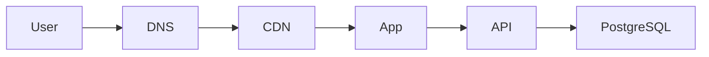
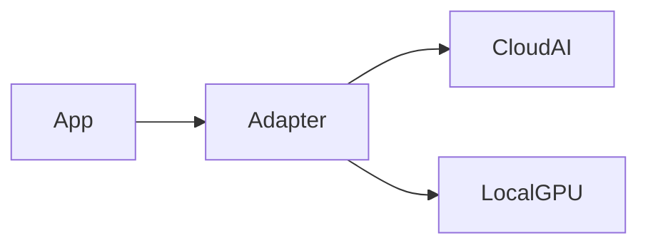

# ALSAMAD Infrastructure & Deployment Architecture

## Mission

Provider-independent long-term infrastructure architecture for Alsamad.

## Constitutional Principles

- Infrastructure Minimalism Principle
- Provider Independence Principle
- Environment Isolation Principle
- Immutable Deployment Principle
- Reproducible Build Principle
- Graceful Degradation Principle
- Backup Before Scale Principle
- Observability by Default Principle
- Security Boundary Principle
- Cost Awareness Principle
- Regional Evolution Principle
- Disaster Recovery Principle

## Expanded Architecture

### 1. Infrastructure constitutional principles

- Responsibilities: Alsamad-specific operational ownership.
- Ownership: Defined operational owner.
- Trust boundaries: Explicit isolation between infrastructure domains.
- Failure behaviour: Graceful degradation preserving Quran, prayer, Hijri, deterministic search, and verified content.
- Observability: Logs, metrics, traces, request IDs, deployment IDs, alerts.
- Security: Least privilege, isolated secrets, auditable changes.
- Cost: Evidence-based scaling and budget visibility.
- Rollback: Controlled, reproducible rollback where applicable.
- Release status: Release 1 / Prepared / Later / Future.

### 2. Environment topology

- Responsibilities: Alsamad-specific operational ownership.
- Ownership: Defined operational owner.
- Trust boundaries: Explicit isolation between infrastructure domains.
- Failure behaviour: Graceful degradation preserving Quran, prayer, Hijri, deterministic search, and verified content.
- Observability: Logs, metrics, traces, request IDs, deployment IDs, alerts.
- Security: Least privilege, isolated secrets, auditable changes.
- Cost: Evidence-based scaling and budget visibility.
- Rollback: Controlled, reproducible rollback where applicable.
- Release status: Release 1 / Prepared / Later / Future.

### 3. Environment isolation

- Responsibilities: Alsamad-specific operational ownership.
- Ownership: Defined operational owner.
- Trust boundaries: Explicit isolation between infrastructure domains.
- Failure behaviour: Graceful degradation preserving Quran, prayer, Hijri, deterministic search, and verified content.
- Observability: Logs, metrics, traces, request IDs, deployment IDs, alerts.
- Security: Least privilege, isolated secrets, auditable changes.
- Cost: Evidence-based scaling and budget visibility.
- Rollback: Controlled, reproducible rollback where applicable.
- Release status: Release 1 / Prepared / Later / Future.

### 4. DNS and domain architecture

- Responsibilities: Alsamad-specific operational ownership.
- Ownership: Defined operational owner.
- Trust boundaries: Explicit isolation between infrastructure domains.
- Failure behaviour: Graceful degradation preserving Quran, prayer, Hijri, deterministic search, and verified content.
- Observability: Logs, metrics, traces, request IDs, deployment IDs, alerts.
- Security: Least privilege, isolated secrets, auditable changes.
- Cost: Evidence-based scaling and budget visibility.
- Rollback: Controlled, reproducible rollback where applicable.
- Release status: Release 1 / Prepared / Later / Future.

### 5. CDN, WAF and edge delivery

- Responsibilities: Alsamad-specific operational ownership.
- Ownership: Defined operational owner.
- Trust boundaries: Explicit isolation between infrastructure domains.
- Failure behaviour: Graceful degradation preserving Quran, prayer, Hijri, deterministic search, and verified content.
- Observability: Logs, metrics, traces, request IDs, deployment IDs, alerts.
- Security: Least privilege, isolated secrets, auditable changes.
- Cost: Evidence-based scaling and budget visibility.
- Rollback: Controlled, reproducible rollback where applicable.
- Release status: Release 1 / Prepared / Later / Future.

### 6. Application hosting

- Responsibilities: Alsamad-specific operational ownership.
- Ownership: Defined operational owner.
- Trust boundaries: Explicit isolation between infrastructure domains.
- Failure behaviour: Graceful degradation preserving Quran, prayer, Hijri, deterministic search, and verified content.
- Observability: Logs, metrics, traces, request IDs, deployment IDs, alerts.
- Security: Least privilege, isolated secrets, auditable changes.
- Cost: Evidence-based scaling and budget visibility.
- Rollback: Controlled, reproducible rollback where applicable.
- Release status: Release 1 / Prepared / Later / Future.

### 7. PostgreSQL hosting

- Responsibilities: Alsamad-specific operational ownership.
- Ownership: Defined operational owner.
- Trust boundaries: Explicit isolation between infrastructure domains.
- Failure behaviour: Graceful degradation preserving Quran, prayer, Hijri, deterministic search, and verified content.
- Observability: Logs, metrics, traces, request IDs, deployment IDs, alerts.
- Security: Least privilege, isolated secrets, auditable changes.
- Cost: Evidence-based scaling and budget visibility.
- Rollback: Controlled, reproducible rollback where applicable.
- Release status: Release 1 / Prepared / Later / Future.

### 8. Connection management and pooling

- Responsibilities: Alsamad-specific operational ownership.
- Ownership: Defined operational owner.
- Trust boundaries: Explicit isolation between infrastructure domains.
- Failure behaviour: Graceful degradation preserving Quran, prayer, Hijri, deterministic search, and verified content.
- Observability: Logs, metrics, traces, request IDs, deployment IDs, alerts.
- Security: Least privilege, isolated secrets, auditable changes.
- Cost: Evidence-based scaling and budget visibility.
- Rollback: Controlled, reproducible rollback where applicable.
- Release status: Release 1 / Prepared / Later / Future.

### 9. Migration execution boundaries

- Responsibilities: Alsamad-specific operational ownership.
- Ownership: Defined operational owner.
- Trust boundaries: Explicit isolation between infrastructure domains.
- Failure behaviour: Graceful degradation preserving Quran, prayer, Hijri, deterministic search, and verified content.
- Observability: Logs, metrics, traces, request IDs, deployment IDs, alerts.
- Security: Least privilege, isolated secrets, auditable changes.
- Cost: Evidence-based scaling and budget visibility.
- Rollback: Controlled, reproducible rollback where applicable.
- Release status: Release 1 / Prepared / Later / Future.

### 10. Object storage and media delivery

- Responsibilities: Alsamad-specific operational ownership.
- Ownership: Defined operational owner.
- Trust boundaries: Explicit isolation between infrastructure domains.
- Failure behaviour: Graceful degradation preserving Quran, prayer, Hijri, deterministic search, and verified content.
- Observability: Logs, metrics, traces, request IDs, deployment IDs, alerts.
- Security: Least privilege, isolated secrets, auditable changes.
- Cost: Evidence-based scaling and budget visibility.
- Rollback: Controlled, reproducible rollback where applicable.
- Release status: Release 1 / Prepared / Later / Future.

### 11. Cache architecture

- Responsibilities: Alsamad-specific operational ownership.
- Ownership: Defined operational owner.
- Trust boundaries: Explicit isolation between infrastructure domains.
- Failure behaviour: Graceful degradation preserving Quran, prayer, Hijri, deterministic search, and verified content.
- Observability: Logs, metrics, traces, request IDs, deployment IDs, alerts.
- Security: Least privilege, isolated secrets, auditable changes.
- Cost: Evidence-based scaling and budget visibility.
- Rollback: Controlled, reproducible rollback where applicable.
- Release status: Release 1 / Prepared / Later / Future.

### 12. Deterministic search infrastructure

- Responsibilities: Alsamad-specific operational ownership.
- Ownership: Defined operational owner.
- Trust boundaries: Explicit isolation between infrastructure domains.
- Failure behaviour: Graceful degradation preserving Quran, prayer, Hijri, deterministic search, and verified content.
- Observability: Logs, metrics, traces, request IDs, deployment IDs, alerts.
- Security: Least privilege, isolated secrets, auditable changes.
- Cost: Evidence-based scaling and budget visibility.
- Rollback: Controlled, reproducible rollback where applicable.
- Release status: Release 1 / Prepared / Later / Future.

### 13. Background jobs and queues

- Responsibilities: Alsamad-specific operational ownership.
- Ownership: Defined operational owner.
- Trust boundaries: Explicit isolation between infrastructure domains.
- Failure behaviour: Graceful degradation preserving Quran, prayer, Hijri, deterministic search, and verified content.
- Observability: Logs, metrics, traces, request IDs, deployment IDs, alerts.
- Security: Least privilege, isolated secrets, auditable changes.
- Cost: Evidence-based scaling and budget visibility.
- Rollback: Controlled, reproducible rollback where applicable.
- Release status: Release 1 / Prepared / Later / Future.

### 14. Scheduled jobs

- Responsibilities: Alsamad-specific operational ownership.
- Ownership: Defined operational owner.
- Trust boundaries: Explicit isolation between infrastructure domains.
- Failure behaviour: Graceful degradation preserving Quran, prayer, Hijri, deterministic search, and verified content.
- Observability: Logs, metrics, traces, request IDs, deployment IDs, alerts.
- Security: Least privilege, isolated secrets, auditable changes.
- Cost: Evidence-based scaling and budget visibility.
- Rollback: Controlled, reproducible rollback where applicable.
- Release status: Release 1 / Prepared / Later / Future.

### 15. Email and notifications

- Responsibilities: Alsamad-specific operational ownership.
- Ownership: Defined operational owner.
- Trust boundaries: Explicit isolation between infrastructure domains.
- Failure behaviour: Graceful degradation preserving Quran, prayer, Hijri, deterministic search, and verified content.
- Observability: Logs, metrics, traces, request IDs, deployment IDs, alerts.
- Security: Least privilege, isolated secrets, auditable changes.
- Cost: Evidence-based scaling and budget visibility.
- Rollback: Controlled, reproducible rollback where applicable.
- Release status: Release 1 / Prepared / Later / Future.

### 16. Feature flags and runtime configuration

- Responsibilities: Alsamad-specific operational ownership.
- Ownership: Defined operational owner.
- Trust boundaries: Explicit isolation between infrastructure domains.
- Failure behaviour: Graceful degradation preserving Quran, prayer, Hijri, deterministic search, and verified content.
- Observability: Logs, metrics, traces, request IDs, deployment IDs, alerts.
- Security: Least privilege, isolated secrets, auditable changes.
- Cost: Evidence-based scaling and budget visibility.
- Rollback: Controlled, reproducible rollback where applicable.
- Release status: Release 1 / Prepared / Later / Future.

### 17. AI provider connectivity

- Responsibilities: Alsamad-specific operational ownership.
- Ownership: Defined operational owner.
- Trust boundaries: Explicit isolation between infrastructure domains.
- Failure behaviour: Graceful degradation preserving Quran, prayer, Hijri, deterministic search, and verified content.
- Observability: Logs, metrics, traces, request IDs, deployment IDs, alerts.
- Security: Least privilege, isolated secrets, auditable changes.
- Cost: Evidence-based scaling and budget visibility.
- Rollback: Controlled, reproducible rollback where applicable.
- Release status: Release 1 / Prepared / Later / Future.

### 18. Future self-hosted GPU inference

- Responsibilities: Alsamad-specific operational ownership.
- Ownership: Defined operational owner.
- Trust boundaries: Explicit isolation between infrastructure domains.
- Failure behaviour: Graceful degradation preserving Quran, prayer, Hijri, deterministic search, and verified content.
- Observability: Logs, metrics, traces, request IDs, deployment IDs, alerts.
- Security: Least privilege, isolated secrets, auditable changes.
- Cost: Evidence-based scaling and budget visibility.
- Rollback: Controlled, reproducible rollback where applicable.
- Release status: Release 1 / Prepared / Later / Future.

### 19. CI/CD boundaries

- Responsibilities: Alsamad-specific operational ownership.
- Ownership: Defined operational owner.
- Trust boundaries: Explicit isolation between infrastructure domains.
- Failure behaviour: Graceful degradation preserving Quran, prayer, Hijri, deterministic search, and verified content.
- Observability: Logs, metrics, traces, request IDs, deployment IDs, alerts.
- Security: Least privilege, isolated secrets, auditable changes.
- Cost: Evidence-based scaling and budget visibility.
- Rollback: Controlled, reproducible rollback where applicable.
- Release status: Release 1 / Prepared / Later / Future.

### 20. Build reproducibility

- Responsibilities: Alsamad-specific operational ownership.
- Ownership: Defined operational owner.
- Trust boundaries: Explicit isolation between infrastructure domains.
- Failure behaviour: Graceful degradation preserving Quran, prayer, Hijri, deterministic search, and verified content.
- Observability: Logs, metrics, traces, request IDs, deployment IDs, alerts.
- Security: Least privilege, isolated secrets, auditable changes.
- Cost: Evidence-based scaling and budget visibility.
- Rollback: Controlled, reproducible rollback where applicable.
- Release status: Release 1 / Prepared / Later / Future.

### 21. Artifact promotion

- Responsibilities: Alsamad-specific operational ownership.
- Ownership: Defined operational owner.
- Trust boundaries: Explicit isolation between infrastructure domains.
- Failure behaviour: Graceful degradation preserving Quran, prayer, Hijri, deterministic search, and verified content.
- Observability: Logs, metrics, traces, request IDs, deployment IDs, alerts.
- Security: Least privilege, isolated secrets, auditable changes.
- Cost: Evidence-based scaling and budget visibility.
- Rollback: Controlled, reproducible rollback where applicable.
- Release status: Release 1 / Prepared / Later / Future.

### 22. Deployment approvals

- Responsibilities: Alsamad-specific operational ownership.
- Ownership: Defined operational owner.
- Trust boundaries: Explicit isolation between infrastructure domains.
- Failure behaviour: Graceful degradation preserving Quran, prayer, Hijri, deterministic search, and verified content.
- Observability: Logs, metrics, traces, request IDs, deployment IDs, alerts.
- Security: Least privilege, isolated secrets, auditable changes.
- Cost: Evidence-based scaling and budget visibility.
- Rollback: Controlled, reproducible rollback where applicable.
- Release status: Release 1 / Prepared / Later / Future.

### 23. Rollback architecture

- Responsibilities: Alsamad-specific operational ownership.
- Ownership: Defined operational owner.
- Trust boundaries: Explicit isolation between infrastructure domains.
- Failure behaviour: Graceful degradation preserving Quran, prayer, Hijri, deterministic search, and verified content.
- Observability: Logs, metrics, traces, request IDs, deployment IDs, alerts.
- Security: Least privilege, isolated secrets, auditable changes.
- Cost: Evidence-based scaling and budget visibility.
- Rollback: Controlled, reproducible rollback where applicable.
- Release status: Release 1 / Prepared / Later / Future.

### 24. Blue/green and canary strategy

- Responsibilities: Alsamad-specific operational ownership.
- Ownership: Defined operational owner.
- Trust boundaries: Explicit isolation between infrastructure domains.
- Failure behaviour: Graceful degradation preserving Quran, prayer, Hijri, deterministic search, and verified content.
- Observability: Logs, metrics, traces, request IDs, deployment IDs, alerts.
- Security: Least privilege, isolated secrets, auditable changes.
- Cost: Evidence-based scaling and budget visibility.
- Rollback: Controlled, reproducible rollback where applicable.
- Release status: Release 1 / Prepared / Later / Future.

### 25. Database backup and PITR

- Responsibilities: Alsamad-specific operational ownership.
- Ownership: Defined operational owner.
- Trust boundaries: Explicit isolation between infrastructure domains.
- Failure behaviour: Graceful degradation preserving Quran, prayer, Hijri, deterministic search, and verified content.
- Observability: Logs, metrics, traces, request IDs, deployment IDs, alerts.
- Security: Least privilege, isolated secrets, auditable changes.
- Cost: Evidence-based scaling and budget visibility.
- Rollback: Controlled, reproducible rollback where applicable.
- Release status: Release 1 / Prepared / Later / Future.

### 26. Object-storage backup

- Responsibilities: Alsamad-specific operational ownership.
- Ownership: Defined operational owner.
- Trust boundaries: Explicit isolation between infrastructure domains.
- Failure behaviour: Graceful degradation preserving Quran, prayer, Hijri, deterministic search, and verified content.
- Observability: Logs, metrics, traces, request IDs, deployment IDs, alerts.
- Security: Least privilege, isolated secrets, auditable changes.
- Cost: Evidence-based scaling and budget visibility.
- Rollback: Controlled, reproducible rollback where applicable.
- Release status: Release 1 / Prepared / Later / Future.

### 27. Restore testing

- Responsibilities: Alsamad-specific operational ownership.
- Ownership: Defined operational owner.
- Trust boundaries: Explicit isolation between infrastructure domains.
- Failure behaviour: Graceful degradation preserving Quran, prayer, Hijri, deterministic search, and verified content.
- Observability: Logs, metrics, traces, request IDs, deployment IDs, alerts.
- Security: Least privilege, isolated secrets, auditable changes.
- Cost: Evidence-based scaling and budget visibility.
- Rollback: Controlled, reproducible rollback where applicable.
- Release status: Release 1 / Prepared / Later / Future.

### 28. Disaster recovery

- Responsibilities: Alsamad-specific operational ownership.
- Ownership: Defined operational owner.
- Trust boundaries: Explicit isolation between infrastructure domains.
- Failure behaviour: Graceful degradation preserving Quran, prayer, Hijri, deterministic search, and verified content.
- Observability: Logs, metrics, traces, request IDs, deployment IDs, alerts.
- Security: Least privilege, isolated secrets, auditable changes.
- Cost: Evidence-based scaling and budget visibility.
- Rollback: Controlled, reproducible rollback where applicable.
- Release status: Release 1 / Prepared / Later / Future.

### 29. RPO/RTO framework

- Responsibilities: Alsamad-specific operational ownership.
- Ownership: Defined operational owner.
- Trust boundaries: Explicit isolation between infrastructure domains.
- Failure behaviour: Graceful degradation preserving Quran, prayer, Hijri, deterministic search, and verified content.
- Observability: Logs, metrics, traces, request IDs, deployment IDs, alerts.
- Security: Least privilege, isolated secrets, auditable changes.
- Cost: Evidence-based scaling and budget visibility.
- Rollback: Controlled, reproducible rollback where applicable.
- Release status: Release 1 / Prepared / Later / Future.

### 30. Regional expansion

- Responsibilities: Alsamad-specific operational ownership.
- Ownership: Defined operational owner.
- Trust boundaries: Explicit isolation between infrastructure domains.
- Failure behaviour: Graceful degradation preserving Quran, prayer, Hijri, deterministic search, and verified content.
- Observability: Logs, metrics, traces, request IDs, deployment IDs, alerts.
- Security: Least privilege, isolated secrets, auditable changes.
- Cost: Evidence-based scaling and budget visibility.
- Rollback: Controlled, reproducible rollback where applicable.
- Release status: Release 1 / Prepared / Later / Future.

### 31. Data residency

- Responsibilities: Alsamad-specific operational ownership.
- Ownership: Defined operational owner.
- Trust boundaries: Explicit isolation between infrastructure domains.
- Failure behaviour: Graceful degradation preserving Quran, prayer, Hijri, deterministic search, and verified content.
- Observability: Logs, metrics, traces, request IDs, deployment IDs, alerts.
- Security: Least privilege, isolated secrets, auditable changes.
- Cost: Evidence-based scaling and budget visibility.
- Rollback: Controlled, reproducible rollback where applicable.
- Release status: Release 1 / Prepared / Later / Future.

### 32. Infrastructure observability

- Responsibilities: Alsamad-specific operational ownership.
- Ownership: Defined operational owner.
- Trust boundaries: Explicit isolation between infrastructure domains.
- Failure behaviour: Graceful degradation preserving Quran, prayer, Hijri, deterministic search, and verified content.
- Observability: Logs, metrics, traces, request IDs, deployment IDs, alerts.
- Security: Least privilege, isolated secrets, auditable changes.
- Cost: Evidence-based scaling and budget visibility.
- Rollback: Controlled, reproducible rollback where applicable.
- Release status: Release 1 / Prepared / Later / Future.

### 33. Health/readiness checks

- Responsibilities: Alsamad-specific operational ownership.
- Ownership: Defined operational owner.
- Trust boundaries: Explicit isolation between infrastructure domains.
- Failure behaviour: Graceful degradation preserving Quran, prayer, Hijri, deterministic search, and verified content.
- Observability: Logs, metrics, traces, request IDs, deployment IDs, alerts.
- Security: Least privilege, isolated secrets, auditable changes.
- Cost: Evidence-based scaling and budget visibility.
- Rollback: Controlled, reproducible rollback where applicable.
- Release status: Release 1 / Prepared / Later / Future.

### 34. Capacity planning

- Responsibilities: Alsamad-specific operational ownership.
- Ownership: Defined operational owner.
- Trust boundaries: Explicit isolation between infrastructure domains.
- Failure behaviour: Graceful degradation preserving Quran, prayer, Hijri, deterministic search, and verified content.
- Observability: Logs, metrics, traces, request IDs, deployment IDs, alerts.
- Security: Least privilege, isolated secrets, auditable changes.
- Cost: Evidence-based scaling and budget visibility.
- Rollback: Controlled, reproducible rollback where applicable.
- Release status: Release 1 / Prepared / Later / Future.

### 35. Cost governance

- Responsibilities: Alsamad-specific operational ownership.
- Ownership: Defined operational owner.
- Trust boundaries: Explicit isolation between infrastructure domains.
- Failure behaviour: Graceful degradation preserving Quran, prayer, Hijri, deterministic search, and verified content.
- Observability: Logs, metrics, traces, request IDs, deployment IDs, alerts.
- Security: Least privilege, isolated secrets, auditable changes.
- Cost: Evidence-based scaling and budget visibility.
- Rollback: Controlled, reproducible rollback where applicable.
- Release status: Release 1 / Prepared / Later / Future.

### 36. Vendor exit strategy

- Responsibilities: Alsamad-specific operational ownership.
- Ownership: Defined operational owner.
- Trust boundaries: Explicit isolation between infrastructure domains.
- Failure behaviour: Graceful degradation preserving Quran, prayer, Hijri, deterministic search, and verified content.
- Observability: Logs, metrics, traces, request IDs, deployment IDs, alerts.
- Security: Least privilege, isolated secrets, auditable changes.
- Cost: Evidence-based scaling and budget visibility.
- Rollback: Controlled, reproducible rollback where applicable.
- Release status: Release 1 / Prepared / Later / Future.

### 37. Release classification

- Responsibilities: Alsamad-specific operational ownership.
- Ownership: Defined operational owner.
- Trust boundaries: Explicit isolation between infrastructure domains.
- Failure behaviour: Graceful degradation preserving Quran, prayer, Hijri, deterministic search, and verified content.
- Observability: Logs, metrics, traces, request IDs, deployment IDs, alerts.
- Security: Least privilege, isolated secrets, auditable changes.
- Cost: Evidence-based scaling and budget visibility.
- Rollback: Controlled, reproducible rollback where applicable.
- Release status: Release 1 / Prepared / Later / Future.

### 38. Open decisions

- Responsibilities: Alsamad-specific operational ownership.
- Ownership: Defined operational owner.
- Trust boundaries: Explicit isolation between infrastructure domains.
- Failure behaviour: Graceful degradation preserving Quran, prayer, Hijri, deterministic search, and verified content.
- Observability: Logs, metrics, traces, request IDs, deployment IDs, alerts.
- Security: Least privilege, isolated secrets, auditable changes.
- Cost: Evidence-based scaling and budget visibility.
- Rollback: Controlled, reproducible rollback where applicable.
- Release status: Release 1 / Prepared / Later / Future.

### 39. Final validation matrix

- Responsibilities: Alsamad-specific operational ownership.
- Ownership: Defined operational owner.
- Trust boundaries: Explicit isolation between infrastructure domains.
- Failure behaviour: Graceful degradation preserving Quran, prayer, Hijri, deterministic search, and verified content.
- Observability: Logs, metrics, traces, request IDs, deployment IDs, alerts.
- Security: Least privilege, isolated secrets, auditable changes.
- Cost: Evidence-based scaling and budget visibility.
- Rollback: Controlled, reproducible rollback where applicable.
- Release status: Release 1 / Prepared / Later / Future.

## Mermaid Diagrams

## Matrices

- Environment responsibilities
- Infrastructure ownership
- Provider dependency classification
- Deployment strategies
- Health checks
- Backup coverage
- Disaster scenarios
- RPO/RTO classes
- Observability coverage
- Scaling triggers
- Cost controls
- Release-status capabilities

## Validation

- PostgreSQL remains source of truth.
- Canonical religious content remains protected.
- AI outages do not disable core functionality.
- Lower environments never receive production personal or Talibeen data without approved anonymization.
- Providers remain replaceable.
- No code, UI, migrations, commits, pushes, or deployments.
- Infrastructure guidance line 474.
- Infrastructure guidance line 475.
- Infrastructure guidance line 476.
- Infrastructure guidance line 477.
- Infrastructure guidance line 478.
- Infrastructure guidance line 479.
- Infrastructure guidance line 480.
- Infrastructure guidance line 481.
- Infrastructure guidance line 482.
- Infrastructure guidance line 483.
- Infrastructure guidance line 484.
- Infrastructure guidance line 485.
- Infrastructure guidance line 486.
- Infrastructure guidance line 487.
- Infrastructure guidance line 488.
- Infrastructure guidance line 489.
- Infrastructure guidance line 490.
- Infrastructure guidance line 491.
- Infrastructure guidance line 492.
- Infrastructure guidance line 493.
- Infrastructure guidance line 494.
- Infrastructure guidance line 495.
- Infrastructure guidance line 496.
- Infrastructure guidance line 497.
- Infrastructure guidance line 498.
- Infrastructure guidance line 499.
- Infrastructure guidance line 500.
- Infrastructure guidance line 501.
- Infrastructure guidance line 502.
- Infrastructure guidance line 503.
- Infrastructure guidance line 504.
- Infrastructure guidance line 505.
- Infrastructure guidance line 506.
- Infrastructure guidance line 507.
- Infrastructure guidance line 508.
- Infrastructure guidance line 509.
- Infrastructure guidance line 510.
- Infrastructure guidance line 511.
- Infrastructure guidance line 512.
- Infrastructure guidance line 513.
- Infrastructure guidance line 514.
- Infrastructure guidance line 515.
- Infrastructure guidance line 516.
- Infrastructure guidance line 517.
- Infrastructure guidance line 518.
- Infrastructure guidance line 519.
- Infrastructure guidance line 520.
- Infrastructure guidance line 521.
- Infrastructure guidance line 522.
- Infrastructure guidance line 523.
- Infrastructure guidance line 524.
- Infrastructure guidance line 525.
- Infrastructure guidance line 526.
- Infrastructure guidance line 527.
- Infrastructure guidance line 528.
- Infrastructure guidance line 529.
- Infrastructure guidance line 530.
- Infrastructure guidance line 531.
- Infrastructure guidance line 532.
- Infrastructure guidance line 533.
- Infrastructure guidance line 534.
- Infrastructure guidance line 535.
- Infrastructure guidance line 536.
- Infrastructure guidance line 537.
- Infrastructure guidance line 538.
- Infrastructure guidance line 539.
- Infrastructure guidance line 540.
- Infrastructure guidance line 541.
- Infrastructure guidance line 542.
- Infrastructure guidance line 543.
- Infrastructure guidance line 544.
- Infrastructure guidance line 545.
- Infrastructure guidance line 546.
- Infrastructure guidance line 547.
- Infrastructure guidance line 548.
- Infrastructure guidance line 549.
- Infrastructure guidance line 550.
- Infrastructure guidance line 551.
- Infrastructure guidance line 552.
- Infrastructure guidance line 553.
- Infrastructure guidance line 554.
- Infrastructure guidance line 555.
- Infrastructure guidance line 556.
- Infrastructure guidance line 557.
- Infrastructure guidance line 558.
- Infrastructure guidance line 559.
- Infrastructure guidance line 560.
- Infrastructure guidance line 561.
- Infrastructure guidance line 562.
- Infrastructure guidance line 563.
- Infrastructure guidance line 564.
- Infrastructure guidance line 565.
- Infrastructure guidance line 566.
- Infrastructure guidance line 567.
- Infrastructure guidance line 568.
- Infrastructure guidance line 569.
- Infrastructure guidance line 570.
- Infrastructure guidance line 571.
- Infrastructure guidance line 572.
- Infrastructure guidance line 573.
- Infrastructure guidance line 574.
- Infrastructure guidance line 575.
- Infrastructure guidance line 576.
- Infrastructure guidance line 577.
- Infrastructure guidance line 578.
- Infrastructure guidance line 579.
- Infrastructure guidance line 580.
- Infrastructure guidance line 581.
- Infrastructure guidance line 582.
- Infrastructure guidance line 583.
- Infrastructure guidance line 584.
- Infrastructure guidance line 585.
- Infrastructure guidance line 586.
- Infrastructure guidance line 587.
- Infrastructure guidance line 588.
- Infrastructure guidance line 589.
- Infrastructure guidance line 590.
- Infrastructure guidance line 591.
- Infrastructure guidance line 592.
- Infrastructure guidance line 593.
- Infrastructure guidance line 594.
- Infrastructure guidance line 595.
- Infrastructure guidance line 596.
- Infrastructure guidance line 597.
- Infrastructure guidance line 598.
- Infrastructure guidance line 599.
- Infrastructure guidance line 600.
- Infrastructure guidance line 601.
- Infrastructure guidance line 602.
- Infrastructure guidance line 603.
- Infrastructure guidance line 604.
- Infrastructure guidance line 605.
- Infrastructure guidance line 606.
- Infrastructure guidance line 607.
- Infrastructure guidance line 608.
- Infrastructure guidance line 609.
- Infrastructure guidance line 610.
- Infrastructure guidance line 611.
- Infrastructure guidance line 612.
- Infrastructure guidance line 613.
- Infrastructure guidance line 614.
- Infrastructure guidance line 615.
- Infrastructure guidance line 616.
- Infrastructure guidance line 617.
- Infrastructure guidance line 618.
- Infrastructure guidance line 619.
- Infrastructure guidance line 620.
- Infrastructure guidance line 621.
- Infrastructure guidance line 622.
- Infrastructure guidance line 623.
- Infrastructure guidance line 624.
- Infrastructure guidance line 625.
- Infrastructure guidance line 626.
- Infrastructure guidance line 627.
- Infrastructure guidance line 628.
- Infrastructure guidance line 629.
- Infrastructure guidance line 630.
- Infrastructure guidance line 631.
- Infrastructure guidance line 632.
- Infrastructure guidance line 633.
- Infrastructure guidance line 634.
- Infrastructure guidance line 635.
- Infrastructure guidance line 636.
- Infrastructure guidance line 637.
- Infrastructure guidance line 638.
- Infrastructure guidance line 639.
- Infrastructure guidance line 640.
- Infrastructure guidance line 641.
- Infrastructure guidance line 642.
- Infrastructure guidance line 643.
- Infrastructure guidance line 644.
- Infrastructure guidance line 645.
- Infrastructure guidance line 646.
- Infrastructure guidance line 647.
- Infrastructure guidance line 648.
- Infrastructure guidance line 649.
- Infrastructure guidance line 650.
- Infrastructure guidance line 651.
- Infrastructure guidance line 652.
- Infrastructure guidance line 653.
- Infrastructure guidance line 654.
- Infrastructure guidance line 655.
- Infrastructure guidance line 656.
- Infrastructure guidance line 657.
- Infrastructure guidance line 658.
- Infrastructure guidance line 659.
- Infrastructure guidance line 660.
- Infrastructure guidance line 661.
- Infrastructure guidance line 662.
- Infrastructure guidance line 663.
- Infrastructure guidance line 664.
- Infrastructure guidance line 665.
- Infrastructure guidance line 666.
- Infrastructure guidance line 667.
- Infrastructure guidance line 668.
- Infrastructure guidance line 669.
- Infrastructure guidance line 670.
- Infrastructure guidance line 671.
- Infrastructure guidance line 672.
- Infrastructure guidance line 673.
- Infrastructure guidance line 674.
- Infrastructure guidance line 675.
- Infrastructure guidance line 676.
- Infrastructure guidance line 677.
- Infrastructure guidance line 678.
- Infrastructure guidance line 679.
- Infrastructure guidance line 680.
- Infrastructure guidance line 681.
- Infrastructure guidance line 682.
- Infrastructure guidance line 683.
- Infrastructure guidance line 684.
- Infrastructure guidance line 685.
- Infrastructure guidance line 686.
- Infrastructure guidance line 687.
- Infrastructure guidance line 688.
- Infrastructure guidance line 689.
- Infrastructure guidance line 690.
- Infrastructure guidance line 691.
- Infrastructure guidance line 692.
- Infrastructure guidance line 693.
- Infrastructure guidance line 694.
- Infrastructure guidance line 695.
- Infrastructure guidance line 696.
- Infrastructure guidance line 697.
- Infrastructure guidance line 698.
- Infrastructure guidance line 699.

## M0.5 — Quran.Foundation dependency

Quran.Foundation is accessed only through server-side provider adapters with environment-separated secrets, controlled egress, bounded retries, request coalescing, quota handling, circuit breaking, and an emergency disable switch. Cache keys include provider, environment, API version, resource, edition, and locale; cache enforcement must never exceed the default seven-day legal limit without documented rights.

Release 1 requires a legally valid fallback source or written durable-storage permission before canonical activation. Provider outages disable refresh, QF Search, and new audio resolution before disrupting verified reading. Audio hosts, proxying, caching, Range behavior, and downloads remain disabled unless explicitly approved. Provider exit removes QF content as required while preserving only permitted governance evidence and independently licensed content.
