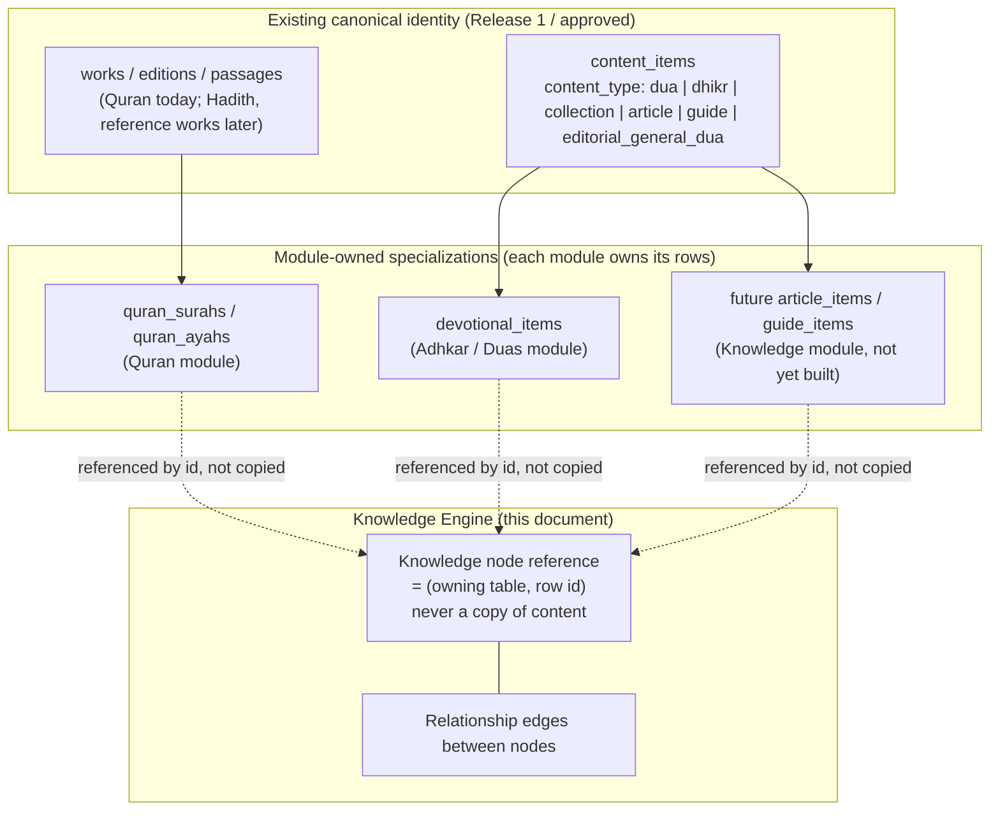
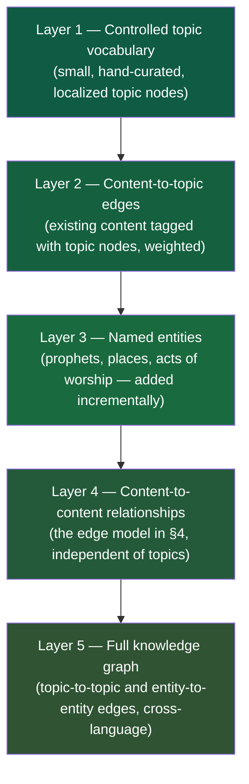
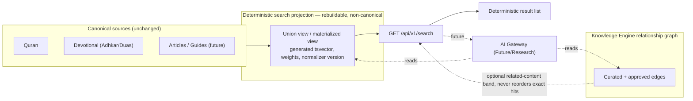
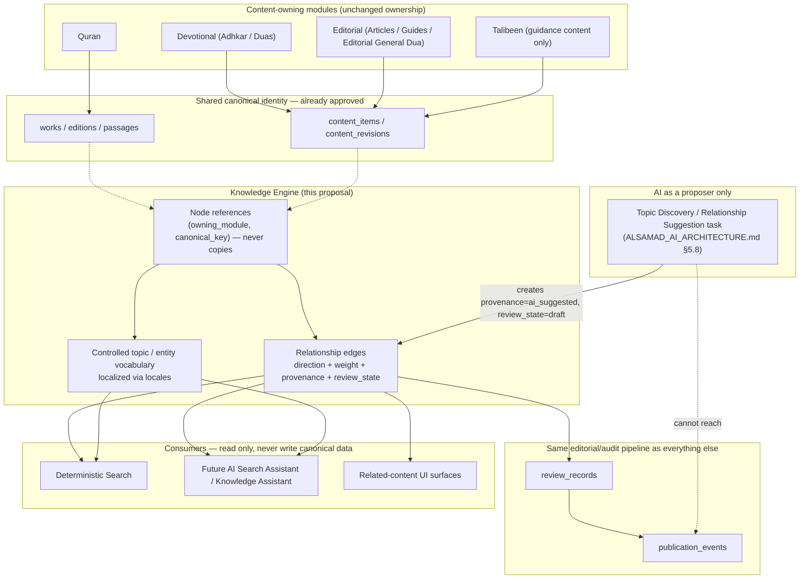

# Alsamad — Knowledge Engine Architecture

**Status:** Proposed architecture review; documentation only. Not approved for implementation.

**Governed phase status:** `KE-1` — the schema-free, in-memory entity/identity/relationship-shape and deterministic search-matching unification for Quran and Adhkar described in §16 Phase 1 — is implemented at `e073879` under `REG-0014` and remains runtime-inert. `REG-0022`/`ADR-0009` are the current governing sequencing authority for Phase 2's unchanged later-additive `topics` and `content_topics` package described in §6.2–§6.3 and `ALSAMAD_DATABASE_ARCHITECTURE.md` §10.1. Delivery is split into `KE-2A` (`topics`; corrected implementation authorization under `REG-0024`/supplemental `ADR-0010`, implementation NOT STARTED) followed by `KE-2B` (`content_topics`; implementation NOT STARTED / BLOCKED pending KE-2A COMPLETE and physical `devotional_items`, and not implementation-authorized). `REG-0023` is historical/Superseded. Historical/Superseded `ADR-0007` §§1–3 remain binding only through `ADR-0009`'s incorporation by reference. KE-2B still requires its own later Governance Unit 2 crossing, and no migration number is assigned to either unit. Phase 3 onward, Duas, and every other module's participation remain proposed only and are not approved for implementation. The overall documentation-only status otherwise continues to govern this document as a whole.

**Milestone:** M7.0 — Knowledge Engine Architecture (UI/product delivery track). This is an architecture-track document, distinct from the Database Architecture's own M0–M12 migration roadmap; it introduces no new migration number and authorizes no migration.

**Authoritative references:** `ALSAMAD_PRODUCT_ARCHITECTURE_V1.md` (§ "Alsamad Knowledge Engine", § "Talibeen Al-Halal"), `ALSAMAD_DATABASE_ARCHITECTURE.md`, `ALSAMAD_AI_ARCHITECTURE.md`, `ALSAMAD_API_ARCHITECTURE.md`, `ALSAMAD_SAKINAH_DESIGN_SYSTEM.md`, `UNRESOLVED_DESIGN_DECISIONS.md`.

**Relationship to existing documents:** This document does not restate or override the Database, AI, or API architectures. It is the missing connective layer between them: the Product Architecture already names the Knowledge Engine's _vision_ (unified search, cross-knowledge results, a knowledge graph); the Database Architecture already reserves the _identity primitives_ it will run on (`works`, `content_items`, `source_references`); the AI Architecture already governs how AI may _touch_ it (retrieval, never authorship). This document defines the _relationship, metadata, and consumption model_ that ties those three together into one system, and reviews what the current codebase already does that either matches or must be unified into it.

---

## 0. What this document does and does not authorize

**This document defines:**

- what the Knowledge Engine is and the problems it solves;
- how Quran, Adhkar, Duas, Articles, Guides, and Marriage Journey (Talibeen Al-Halal) connect through it;
- the relationship model (directional, bidirectional, weighted) and its tradeoffs;
- the metadata, tag, entity, topic, and knowledge-graph model and their tradeoffs;
- how deterministic search and future AI retrieval consume it;
- how localization, source attribution, and editorial/verified/AI-generated separation work inside it;
- proposed future APIs (contract shape only);
- performance, indexing, and caching strategy at a conceptual level;
- a final recommended architecture with phased adoption.

**This document does not authorize:**

- application code, UI implementation, or component design;
- database tables, columns, or migrations of any kind;
- changes to any existing module (Quran, Adhkar, Duas, homepage, import harness);
- activation of semantic search, embeddings, or runtime AI;
- a specific vendor, library, or search engine choice;
- a commit, push, or deployment.

Every proposal below is additive to the approved 30-table Release 1 catalog and to the Prepared/Later/Future classifications already defined in `ALSAMAD_DATABASE_ARCHITECTURE.md` §1 and §10. Nothing here reclassifies a Prepared, Later, or Future capability as Release 1.

---

## 1. What is the Knowledge Engine?

The Knowledge Engine is **not a new content module**. It owns no religious text, no dua, no article body. It is the **relationship, retrieval, and discovery layer** that sits above every content-owning module and answers one question consistently, everywhere in the product: _"given this piece of knowledge, what else in Alsamad is genuinely, honestly related to it?"_

Concretely, it is three things:

1. **A relationship graph** connecting stable canonical identities (an ayah, a dua, a dhikr, an article, a guide topic, a Talibeen guidance page) that already exist as rows in their owning modules' tables — never a duplicate copy of their content.
2. **A retrieval contract** — the same deterministic-search-first, evidence-before-generation contract already defined in `ALSAMAD_AI_ARCHITECTURE.md` §2.6 and `ALSAMAD_API_ARCHITECTURE.md` §12 — extended to read across modules instead of one module at a time.
3. **A consumption boundary** — the one place Search, the future AI Search Assistant, and future recommendation surfaces are allowed to read cross-module knowledge from, so that no two features invent two different answers to "what is related to this ayah."

It is explicitly the module named in `ALSAMAD_API_ARCHITECTURE.md` §5 resource-ownership table today, with zero Release 1 tables:

> `AI answers, semantic retrieval, Knowledge Graph | AI/Knowledge Engine | Future/Research`

This document turns that one row into a concrete architecture, while keeping its Release-1 footprint at zero physical tables, exactly as already promised.

### 1.1 What the Knowledge Engine is not

- It is not a new source of truth. Every fact it surfaces is owned, verified, and published by an existing module (Quran, Devotional, Editorial, future Hadith, future Articles/Guides, future Talibeen).
- It is not a religious authority. It never grades, verifies, or authenticates content — it only records that a relationship _exists_ and who curated it.
- It is not the search engine's storage. It is the graph and contract search _reads through_; the deterministic search projection described in `ALSAMAD_DATABASE_ARCHITECTURE.md` §6 remains a separate, disposable read model.
- It is not an AI product. AI is one _consumer_ of the Knowledge Engine (§8), not its architecture.

---

## 2. What problems does it solve?

| Problem observed today                                                                                                                                                                                                                                                                           | Why it happens                                                                                                                                                                                                                                               | What the Knowledge Engine changes                                                                                                                                                                                                                                             |
| ------------------------------------------------------------------------------------------------------------------------------------------------------------------------------------------------------------------------------------------------------------------------------------------------ | ------------------------------------------------------------------------------------------------------------------------------------------------------------------------------------------------------------------------------------------------------------ | ----------------------------------------------------------------------------------------------------------------------------------------------------------------------------------------------------------------------------------------------------------------------------- |
| Each module (Quran M5.4, Adhkar, Duas) independently reimplemented the same shape: a three-state content-availability model, a `source/trust` metadata record, a category taxonomy, and a pure search-over-labels function.                                                                      | There was no shared relationship/metadata layer, so every module's foundation milestone had to invent its own local version.                                                                                                                                 | One shared **content-state and source-metadata contract** (§6) that every module's read abstraction can implement once, instead of re-deriving it per module.                                                                                                                 |
| "Related duas," "related adhkar," and "related articles" do not exist anywhere in the product yet, even though the Product Architecture's Knowledge Engine vision explicitly promises them (a search for _Patience_ should surface Quran, Hadith, duas, adhkar, and articles together).          | Relationships were never modeled as data — each page's "related" section (where it exists at all, e.g. the Quran reader's future related-content slot) would otherwise have to be hand-wired per content pair, which does not scale past a handful of items. | A single **relationship edge model** (§4–§5) that any module can query without hand-authored per-page links.                                                                                                                                                                  |
| Search today is, and must remain, per-corpus and deterministic (Quran search, dua search, adhkar search each独立). The product vision asks for **one** search across all of them.                                                                                                                | Each module owns its own table shape; there was no shared, stable "knowledge unit" identity to build a cross-corpus index over.                                                                                                                              | A **thin, read-only knowledge-unit projection** (§7) that every module contributes rows to, which cross-module search and, later, cross-module AI retrieval both read — without becoming a second source of truth.                                                            |
| Editorial content (Editorial General Dua today; future Talibeen guidance, future articles) risks visually or structurally blending with verified religious content as more content types are added over the years.                                                                               | Nothing outside the Devotional module currently enforces the "never mix them" rule at the relationship layer — a future "related content" feature could silently link an editorial page as if it were equally authoritative.                                 | The relationship edge itself carries **both endpoints' verification class**, so the graph can never present an editorial node as if it were canonical, and rendering rules become mechanical rather than per-feature judgment calls (§11).                                    |
| Nothing today prepares for AI-assisted discovery (e.g. "show me content related to this verse") without either (a) letting AI invent relationships, or (b) requiring every relationship to be hand-typed by an editor forever.                                                                   | No architecture yet distinguishes _editor-curated_ relationships from _AI-suggested_ relationships that still require approval.                                                                                                                              | A **provenance field on every edge** — `curated` vs `ai_suggested` — so AI can propose links at scale while `ALSAMAD_AI_ARCHITECTURE.md`'s Human Authority Principle (§2.1) and Canonical Truth Principle (§2.17) remain mechanically enforced, not just written policy (§8). |
| Longevity: today's four modules (Quran, Adhkar, Duas, homepage) will be joined by Articles, Guides, Talibeen, Prayer Times, Hijri Calendar, Daily Journey, User Library, and an AI Assistant over "many years." A design coupled to today's four modules would need a rewrite for each addition. | Nothing yet defines the _shape_ a future module must conform to in order to participate in relationships and unified search.                                                                                                                                 | A **module-agnostic participation contract** (§3.3) — any future module that owns a `content_items`-backed identity automatically becomes graph- and search-eligible with zero Knowledge Engine schema change.                                                                |

---

## 3. How does it connect Quran, Adhkar, Duas, Articles, and Guides?

### 3.1 The identity layer already exists — this is the central finding of this review

`ALSAMAD_DATABASE_ARCHITECTURE.md` §5.2 already defines exactly the identity backbone a knowledge engine needs, and it is **already approved, already in the Release 1 catalog, and already partially implemented in this repository's schema**:

- `works` / `editions` / `passages` / `passage_texts` — the canonical identity for anything with a fixed textual structure (the Quran today; Hadith collections, guide "books," and reference works later — `works.work_type` already includes `reference_work`).
- `content_items` / `content_revisions` — the canonical identity for anything published as a discrete unit (a dua, a dhikr, a collection, and — critically — `content_items.content_type` **already includes `article` and `guide`** in the approved vocabulary, and `content_items.owning_module` **already includes the literal value `knowledge`** alongside `devotional` and `editorial`).
- `source_references` — a row that cites a `content_revision` against a `work`/`edition`/`passage`. This is, structurally, already a directed, typed graph edge: _(content revision) —[reference_role]→ (work/edition/passage)_.

This means **Articles and Guides need no new identity table**. They are additive rows under the same eight Content Integrity tables Duas and Adhkar are already modeled to use (`ALSAMAD_DATABASE_ARCHITECTURE.md` §8: "Dua or dhikr detail" already lists `content_items`, `content_revisions`, `devotional_items`, `content_translations`, `source_references"; an "Article/guide detail" row would list the same four tables minus `devotional_items`, since an article is not a devotional item). The Knowledge Engine does not need to invent a new "knowledge unit" table — it needs to **reference `content_items.id` directly** as its universal node identity.

### 3.2 One canonical node identity, four kinds of node today



A **knowledge node** is never a new copy of content. It is a stable pointer — `(owning_module, canonical_key)` — to a row that already exists in its owning module: a `quran_ayahs` row, a `devotional_items` row, and (once built) an article/guide row under `content_items`. This is the same discipline the Database Architecture already applies to `source_references` (§5.2.9: it cites a work/edition/passage, it never stores a second copy of the cited text).

### 3.3 The module participation contract

Any module — existing or future — becomes eligible to participate in the Knowledge Engine by satisfying three conditions, none of which require touching that module's own schema beyond what `ALSAMAD_DATABASE_ARCHITECTURE.md` already asks of it:

1. It owns a stable, immutable canonical identifier for the unit being related (already true for `quran_ayahs.canonical_key`, `content_items.canonical_key`, and — per §5.1 — extendable to any future locale-scoped or geography-scoped identity).
2. It exposes that identifier's **publication state** (already true everywhere: `publication_state` on every content table).
3. It exposes that identifier's **verification/authenticity class** (already true: `content_revisions.verification_state`, and per the Adhkar/Duas foundations already built in this codebase, a parallel `authenticity`/`kind: authentic | editorial` field at the UI layer).

A future module (Prayer Times, Hijri Calendar, Daily Journey, User Library) that has **no** durable canonical content — Prayer Times and Hijri Calendar are explicitly derived/configuration-driven per `ALSAMAD_DATABASE_ARCHITECTURE.md` §5.6 and §7.2 — simply has no nodes to contribute. That is correct and expected: the Knowledge Engine relates _knowledge_, not every feature in the product. Prayer Times and Hijri Calendar remain **consumers** of the Knowledge Engine (e.g., "adhkar related to this prayer") without ever becoming node _owners_ themselves.

### 3.4 Connecting today's four modules concretely

| Module            | Node source                                                                                                                 | Verification class carried on the node                                                                                                                          |
| ----------------- | --------------------------------------------------------------------------------------------------------------------------- | --------------------------------------------------------------------------------------------------------------------------------------------------------------- |
| Quran             | `quran_ayahs` (via `passages`/`works`)                                                                                      | Always canonical — Quran is never editorial.                                                                                                                    |
| Adhkar            | `devotional_items` (per the Adhkar Foundation's UI-layer `AdhkarContentStatus`/source model already built in this codebase) | `authentic` (sourced from Quran/Sunnah/verified collection) — Adhkar has no editorial variant by product definition.                                            |
| Duas              | `devotional_items`                                                                                                          | `authentic` **or** `editorial`, per the Duas Foundation's `DuaKind` already built in this codebase — the exact distinction this document must never blur (§11). |
| Articles / Guides | future `content_items` rows, `content_type = article \| guide`, `owning_module = knowledge`                                 | `editorial` (staff-authored) or `reference` (citing verified sources), per the same review workflow as Editorial General Dua.                                   |

---

## 4. How should relationships work?

### 4.1 The relationship is a first-class, minimal edge — not a merged document

A relationship is a row that says: _node A relates to node B, in this way, curated by this process, with this confidence._ It never merges, summarizes, or duplicates either node's content. This mirrors `ALSAMAD_DATABASE_ARCHITECTURE.md`'s own `source_references` pattern exactly — the Knowledge Engine's edge table is architecturally a generalized `source_references`, not a new invention.

Conceptual shape (illustrative only — **not a schema proposal**):

```
knowledge_edge:
  from_node_ref        (owning_module, canonical_key)
  to_node_ref           (owning_module, canonical_key)
  relationship_type     enum: cites | explains | is_related_topic | is_editorial_reflection_on | ...
  direction              directional | bidirectional   (see 4.2)
  weight                  0.0–1.0, nullable            (see 4.3)
  provenance             curated | ai_suggested         (see 8.4)
  curator_ref             editorial_users.id, nullable  (required if provenance = curated)
  review_state            draft | approved | published | withdrawn  (same lifecycle vocabulary as content_revisions)
  created_at / updated_at
```

### 4.2 Directional or bidirectional?

**Both — the direction is a property of the relationship type, not a global rule.**

| Relationship type                                             | Direction                                                                                                                                                      | Why                                                                                                                                                                                             |
| ------------------------------------------------------------- | -------------------------------------------------------------------------------------------------------------------------------------------------------------- | ----------------------------------------------------------------------------------------------------------------------------------------------------------------------------------------------- |
| Article **cites** ayah / dua / hadith                         | Directional (article → source)                                                                                                                                 | An article depends on its source; the ayah does not depend on the article. This is exactly `source_references.reference_role`, generalized.                                                     |
| Ayah **is topically related to** dua                          | Bidirectional                                                                                                                                                  | "This ayah relates to this dua about patience" is symmetric — if A relates to B, B relates to A. Storing it once and querying both directions avoids duplicate, potentially-contradictory rows. |
| Editorial reflection **is inspired by / reflects on** an ayah | Directional (editorial → source), and additionally **must never be traversed in reverse into "this ayah's related content" without a visible editorial label** | This is the mechanism that prevents editorial content from silently attaching itself to canonical content as if it were equally authoritative — see §11.3.                                      |
| Guide **is a marriage-guidance companion to** a dua           | Directional (guide → dua), one-way only                                                                                                                        | Talibeen/marriage content may reference devotional content for support; devotional content must never surface Talibeen content as if it were part of its religious meaning (§14).               |

**Recommendation:** model direction as an explicit column (`directional` / `bidirectional`), not as two separate tables and not as a global "always bidirectional" simplification. A global bidirectional-only model would force every citation-style relationship (article cites ayah) to also imply the reverse (ayah "cites" article), which is factually wrong and exactly the kind of "everything looks the same" failure this milestone's mission warns against for Authentic vs Editorial separation.

### 4.3 Weighted or unweighted?

**Weighted, but weight is advisory metadata for ranking — never a determinant of what is shown as "verified."**

- A curated edge's weight defaults to `1.0` (a human said this is related) and may be lowered by an editor to de-prioritize a weaker connection without deleting it.
- An AI-suggested edge (§8.4) carries a **confidence score**, which is stored in the same `weight` field but is meaningless until an editor promotes the edge to `curated` — exactly mirroring `ALSAMAD_DATABASE_ARCHITECTURE.md`'s existing rule that a `content_revision` cannot publish from an `unverified` state.
- Weight affects **ordering** within a "related content" list. It never affects whether content is shown as authentic vs editorial (that is the `to_node`'s own verification class, read at display time, never inferred from the edge).

### 4.4 The mission's own example, modeled

```mermaid
flowchart LR
  Ayah["Quran ayah<br/>(canonical)"] -->|is_related_topic, bidirectional, weight 0.9, curated| Dua["Authentic dua<br/>(canonical)"]
  Dua -->|is_related_topic, bidirectional, weight 0.8, curated| Dhikr["Adhkar item<br/>(canonical)"]
  Article["Article<br/>(editorial)"] -->|cites, directional, curated| Ayah
  Article -->|explains, directional, curated| Dua
  Guide["Marriage guidance article<br/>(editorial, Talibeen-adjacent)"] -->|is_related_topic, directional, curated| Article
  AISug["AI-suggested edge<br/>(provenance = ai_suggested, review_state = draft)"] -.->|pending editorial review| Guide

  classDef canonical fill:#0f5b43,color:#fff,stroke:#083d2d
  classDef editorial fill:#9b742b,color:#fff,stroke:#6b5220
  classDef pending stroke-dasharray: 5 5
  class Ayah,Dua,Dhikr canonical
  class Article,Guide editorial
  class AISug pending
```



Reading this graph: a user reading the ayah can be shown the related dua and dhikr as equally trustworthy (both canonical, solid edges, high weight). The article is reachable from the ayah only through a **directional, clearly labeled "cites" edge** — the UI renders it in an "Articles about this topic" section with the editorial badge already mandated for Editorial General Dua, never inside the ayah's own canonical content area. The marriage guidance is reachable only by _drilling into_ the article, two hops from the ayah — it is never presented as if the Quran "points to" Talibeen. The AI-suggested edge is dashed/pending: it exists in the graph for editor review but is invisible to end users until approved.

---

## 5. Should relationships be directional, bidirectional, weighted? — Recommendation

This is answered concretely in §4.2–§4.3. Summary recommendation: **a single edge table with an explicit `direction` enum and an advisory `weight`/`confidence` column**, not three separate systems. This is the smallest model that correctly expresses every example in this milestone's mission without collapsing distinctions the mission explicitly asks us to preserve (Authentic vs Editorial, canonical vs guidance).

---

## 6. How should metadata be stored?

### 6.1 Two different kinds of metadata must not be merged

The Adhkar and Duas foundations already built in this codebase each independently arrived at the same nine-field "source and trust" shape (source type, source title, collection, reference, authenticity/grading, reviewer, attribution, notes, verification date). That convergence is strong evidence this is the _right_ shared shape — and strong evidence it should stop being reinvented per module.

| Metadata kind                                                                                                                   | Example                                                                                                   | Where it belongs                                                                                                                                                                                                                                                                                                                                                |
| ------------------------------------------------------------------------------------------------------------------------------- | --------------------------------------------------------------------------------------------------------- | --------------------------------------------------------------------------------------------------------------------------------------------------------------------------------------------------------------------------------------------------------------------------------------------------------------------------------------------------------------- |
| **Provenance/trust metadata** — describes _where a specific piece of content came from_                                         | Source type, collection, reference locator, authenticity status, reviewer, attribution, verification date | Owned per content row, already modeled by `source_references` (canonical) and by each module's UI-layer source-metadata shape (devotional). **Recommendation:** promote the repeated Adhkar/Duas shape into one shared, provider-independent TypeScript contract reused by every module's read layer — an application-layer unification, not a database change. |
| **Discovery/classification metadata** — describes _what a piece of content is about_, for the purpose of finding related things | Tags, topics, entities, category                                                                          | This is the Knowledge Engine's own concern (§7), modeled as edges to shared topic/entity nodes (§6.3), never as free-text columns duplicated per module.                                                                                                                                                                                                        |

### 6.2 Tags vs. entities vs. topics vs. full knowledge graph — tradeoff analysis

| Approach                                                               | What it is                                                                                                                                             | Strengths                                                                                                                                                                      | Weaknesses                                                                                                                                                                                                                           | Verdict                                                                                             |
| ---------------------------------------------------------------------- | ------------------------------------------------------------------------------------------------------------------------------------------------------ | ------------------------------------------------------------------------------------------------------------------------------------------------------------------------------ | ------------------------------------------------------------------------------------------------------------------------------------------------------------------------------------------------------------------------------------ | --------------------------------------------------------------------------------------------------- |
| **Free-text tags**                                                     | An unstructured string per content item (`"patience"`, `"صبر"`)                                                                                        | Trivial to add; no schema; editors can tag anything immediately                                                                                                                | No canonical identity — "patience," "Patience," and "صبر" are three unrelated strings; cannot be localized, merged, or reasoned about; cannot support "show everything about Patience" across languages without manual synonym lists | Insufficient alone for a platform meant to last "many years" and support unlimited languages.       |
| **Controlled topic vocabulary**                                        | A small, curated, versioned list of topic nodes (e.g., "Patience," "Marriage," "Forgiveness"), each with its own stable id and per-locale display name | Solves the localization problem tags cannot; small enough to curate by hand for years; matches the Product Architecture's own "Patience" example exactly                       | Does not model _entities_ (a named prophet, a specific place, a specific narrator) — a topic list alone cannot answer "show me everything about Prophet Yusuf"                                                                       | Necessary, but not sufficient alone.                                                                |
| **Entities**                                                           | A stable node for a _named thing_ — a prophet, a companion, a place, an act of worship — distinct from an abstract topic                               | Enables "everything about [named entity]" queries the Product Architecture's Knowledge Graph section explicitly asks for (People, Prophets, Places, Concepts, Acts of worship) | Requires editorial curation discipline to avoid duplicate entities ("Yusuf" vs "Joseph" vs "يوسف")                                                                                                                                   | Needed for the product vision, introduced incrementally, entity-by-entity, never bulk-generated.    |
| **Full knowledge graph (topics + entities + typed edges + inference)** | Everything above, plus edges _between_ topics/entities themselves, and possibly graph-traversal/inference queries                                      | Most expressive; matches the long-term Product Architecture vision fully                                                                                                       | Most expensive to govern; risks becoming exactly the "giant unconstrained polymorphic" structure `ALSAMAD_DATABASE_ARCHITECTURE.md` §2.1 and §13 explicitly forbid if built ahead of proven need                                     | The _target shape_, reached by growing the simpler pieces below — never built wholesale on day one. |

**Recommendation — a layered model, each layer independently useful and each layer additive to the last:**



This directly follows `ALSAMAD_DATABASE_ARCHITECTURE.md` §10's own instruction for the Knowledge Graph: _"Add nodes and edges as projections over stable canonical identifiers; promote only independently curated relations to durable state."_ Layers 1–2 alone already satisfy this milestone's mission's minimum bar (tags/topics exist, content connects to them). Layers 3–5 are explicitly _later_, added only when a real editorial workflow proves the need — never spun up speculatively.

### 6.3 Where does this metadata physically live?

Following the Schema Minimalism Principle (`ALSAMAD_DATABASE_ARCHITECTURE.md` §2.1), current sequencing authority `REG-0022`/`ADR-0009` governs Phase 2 as `KE-2A` followed by `KE-2B`. Historical/Superseded `ADR-0007` §§1–3 remain binding only through `ADR-0009`'s incorporation by reference and specify exactly:

- A small **topics** table (UUIDv7 id, immutable canonical key, locale-key-validated localized names, lifecycle and human approval evidence) — a _lookup table_, exactly the kind §2.1 permits once a vocabulary becomes independently managed.
- One **content_topics** edge table with a topic FK and exactly one real canonical endpoint FK: `quran_ayahs.id` or an authenticated Adhkar-only `devotional_items.id`. The latter is trigger-validated through `content_items` as `owning_module = 'devotional'` and `content_type = 'dhikr'`. Weight remains advisory; curator/reviewer identity references `editorial_users`.
- **Entities** and **content-to-content relationships** as separate, later additive tables of the same shape, introduced only when Articles/Guides/Hadith give the graph enough real nodes to connect.

The first bullet is the `KE-2A` unit; the second is the later `KE-2B` unit. Both are governance-approved for later, non-Release-1 implementation only. `REG-0024`/supplemental `ADR-0010` supersede historical `REG-0023`, satisfy KE-2A's corrected Governance Unit 2 crossing, and authorize implementation to begin in a separate future execution, but `KE-2A` implementation remains NOT STARTED. `KE-2B` remains not implementation-authorized, requires its own later crossing, and is NOT STARTED / BLOCKED pending KE-2A COMPLETE and physical `devotional_items`. Each unit is separately atomic and receives its migration number mechanically only at implementation time; no migration number is assigned here. Exact executable schema is authoritative in `ALSAMAD_DATABASE_ARCHITECTURE.md` §10.1. The split does not alter the frozen 30-table Release-1 catalog, the substantive model, or any existing canonical owner. The third bullet and every later layer remain unauthorized.

---

## 7. How should Search consume this system?

Search does not gain new tables or a new architecture — it gains a **wider read surface**.

`ALSAMAD_API_ARCHITECTURE.md` §12 already defines the deterministic search contract: `GET /api/v1/search?q=&corpus=&locale=&source=&category=&cursor=&limit=`, reading canonical owners through a rebuildable view. The Knowledge Engine extends this exactly as the Product Architecture's "Unified Search" section already promises, without changing the contract's nature:

1. **Today (Release 1, already the case):** the search view unions `quran_ayah_texts`, `devotional_items` + `content_translations`, and (per this session's Adhkar/Duas foundations) their in-application equivalents. One query, one ranking, one result shape — already true.
2. **Extension 1 — corpus growth:** as Articles, Guides, and later Hadith gain their own `content_items` rows, they union into the same view by construction (§3.1) — no new search architecture, only new rows in an existing union.
3. **Extension 2 — "cross knowledge results":** a query like "Patience" returns grouped results _by corpus_ (Quran, Duas, Adhkar, Articles) in one response, using the `category`/`corpus` filter already in the API contract — the Knowledge Engine graph (§4) is consulted only to populate an optional "related" band beneath the primary hits, never to reorder or replace exact-match results. Exact/canonical matches always precede graph-derived suggestions, exactly as `ALSAMAD_API_ARCHITECTURE.md` §12 already mandates ("Exact source/canonical matches precede fuzzy matches").
4. **Extension 3 (Future/Research, unchanged from existing AI Architecture):** semantic search and the AI Search Assistant read the _same_ corpus and the _same_ graph through the AI Gateway's Retrieval Orchestration domain (`ALSAMAD_AI_ARCHITECTURE.md` §4.1, §6) — they are additional _consumers_, not an additional _source_.



Search never writes to the graph. The graph never becomes a second search index. This separation is what keeps search "deterministic, source-aware, and derived from canonical content" (`ALSAMAD_DATABASE_ARCHITECTURE.md` §13) even as the graph grows in sophistication behind it.

---

## 8. How should future AI consume this system?

This question is already answered in exhaustive, authoritative detail by `ALSAMAD_AI_ARCHITECTURE.md` (2,500+ lines: Constitutional Principles §2, Retrieval-Augmented Generation §6, Religious Safety §10). This document does not restate that architecture. It states precisely how the Knowledge Engine **plugs into** it, because that document was written before this graph existed to plug in.

### 8.1 The one rule this document exists to enforce mechanically

> _"AI reads. Humans curate. AI never becomes source of truth."_

This is not new policy — it is `ALSAMAD_AI_ARCHITECTURE.md` §2.17's Canonical Truth Principle, restated for this milestone. The Knowledge Engine enforces it structurally, not just procedurally, through one field already introduced in §4.1: **`provenance`**.

| `provenance`   | Who created the edge                                                                                                | Visible to end users?                                  | Can it be cited as evidence?                                                                                                                                    |
| -------------- | ------------------------------------------------------------------------------------------------------------------- | ------------------------------------------------------ | --------------------------------------------------------------------------------------------------------------------------------------------------------------- |
| `curated`      | A human editor, through the same review pipeline as `content_revisions` (`review_records`, `publication_events`)    | Yes, once `review_state = published`                   | Yes                                                                                                                                                             |
| `ai_suggested` | An AI Task Contract (§4.1 of the AI Architecture — e.g. "Topic Discovery," §5.8) running as a batch/offline process | **No — never**, until a human promotes it to `curated` | **No, never** — an `ai_suggested` edge is a draft proposal, exactly like the AI-assisted editorial drafts already governed by `ALSAMAD_AI_ARCHITECTURE.md` §3.3 |

An `ai_suggested` edge that has not been promoted **cannot appear in any user-facing "related content" surface, cannot be returned by search, and cannot be retrieved as RAG context** for the AI Search Assistant to cite. It exists purely as an editorial worklist item — the Knowledge Engine's equivalent of `content_revisions.publication_state = 'draft'`. This is the same mechanism, reused, not a new one.

### 8.2 AI as a retrieval consumer (the common case)

For the Knowledge Assistant / AI Search Assistant (`ALSAMAD_AI_ARCHITECTURE.md` §5.1–§5.2), the Knowledge Engine is simply a richer, graph-aware corpus for the existing Retrieval Orchestration pipeline (§6.2 of the AI Architecture, steps 4–13): exact retrieval and lexical retrieval already read the union view (§7 above); when the graph is mature enough, "cross knowledge" retrieval additionally walks **published, curated** edges to widen the evidence set before ranking. Every citation the model is allowed to reference still resolves to a real, published, owning-module row — never to an edge or a topic node directly. Topics and edges _widen what evidence is considered_; they are never themselves quoted as evidence.

### 8.3 AI as a topic/entity discovery assistant (§5.8 of the AI Architecture, restated for this graph)

`ALSAMAD_AI_ARCHITECTURE.md` §5.8 already states: _"AI may suggest emerging clusters, missing taxonomy relationships, or content gaps. It may not create authoritative topics or knowledge-graph relations without editorial review."_ Applied here: AI may run offline over the published corpus and propose `ai_suggested` edges or candidate topic nodes for the editorial team's queue. It may never insert a `curated`, `published` edge directly. There is no code path in this design that allows it to.

### 8.4 What this means for the "AI never becomes source of truth" test in practice

Ask, for any Knowledge Engine capability: _"if every AI system on earth vanished tomorrow, does anything break?"_ Per the AI Degradation Principle (`ALSAMAD_AI_ARCHITECTURE.md` §2.18), the answer must be **no**. Under this design:

- Deterministic search: unaffected (§7 — reads only canonical content and curated edges).
- "Related content" bands: unaffected (only curated, published edges render).
- The editorial worklist of suggested edges: frozen, but it was never user-facing.
- The AI Search Assistant: falls back to deterministic search, exactly per the existing RAG fallback contract (`ALSAMAD_AI_ARCHITECTURE.md` §6.11).

---

## 9. How should localization work?

The Knowledge Engine must not invent a second localization system. Two localization concerns already exist in this codebase and in the approved architecture, and they must stay separate:

| Concern                                                                                              | Existing mechanism                                                                                                                                                                                            | Knowledge Engine's role                                                                                                                                                                                                                                                                                                        |
| ---------------------------------------------------------------------------------------------------- | ------------------------------------------------------------------------------------------------------------------------------------------------------------------------------------------------------------- | ------------------------------------------------------------------------------------------------------------------------------------------------------------------------------------------------------------------------------------------------------------------------------------------------------------------------------ |
| **UI chrome localization** (button labels, section headings, status copy)                            | The `copy` object in `src/lib/i18n.ts`, keyed by `Locale` (`"ar" \| "en"`), already extended to Adhkar/Duas without any database change.                                                                      | None — this remains purely an application-layer concern, unrelated to the graph.                                                                                                                                                                                                                                               |
| **Content localization** (an ayah's translation, a dua's translation, an article's language edition) | `locales` (`ALSAMAD_DATABASE_ARCHITECTURE.md` §5.1.1 — already unlimited-language by design, with `fallback_locale_id` chains) + `content_translations` (§5.4) + `quran_translation_editions`/`texts` (§5.3). | The Knowledge Engine's **nodes and edges are locale-neutral**. A relationship between an ayah and a dua is true regardless of which language the user is reading in — exactly as `works`/`content_items` canonical identity is already locale-neutral per §5.2.3/§5.2.7 ("A work is language-independent canonical identity"). |
| **Topic/entity display names** (§6.2)                                                                | New, small — but modeled identically to `locales`: one canonical topic id, N localized display-name rows, with the same fallback-chain discipline already proven for `locales.fallback_locale_id`.            | Topics are curated once; their _names_ are translated, never their _identity_. "Patience," "الصبر," "Sabar" (Indonesian), and "Sabır" (Turkish) are four display names for one topic node — never four topic nodes.                                                                                                            |

This is precisely why Indonesian and Turkish (named in the mission) require **zero graph redesign** when added: the `locales` table already supports unlimited languages by architecture (`ALSAMAD_DATABASE_ARCHITECTURE.md` §5.1: "unlimited-language by architecture"), and because nodes/edges are locale-neutral, adding a language means adding rows to `locales`, `content_translations`, and topic-display-name tables — never touching a single edge.

Cross-language discovery (a Turkish query finding Arabic canonical content) is explicitly a **search-layer** concern (§7), resolved through reviewed translations and cross-language topic mappings — the graph enables it by keeping topics language-neutral, but does not itself perform translation or matching.

---

## 10. How should source attribution work?

Attribution is not reinvented here — it is **inherited**, not duplicated. Every node the Knowledge Engine points to already carries its own attribution obligation in its owning module:

- Quran: edition, translator, license, attribution text (`editions`, `licenses`, `quran_translation_editions`).
- Devotional (Adhkar/Duas): the source/trust metadata shape already built in this codebase's Adhkar and Duas foundations (source type, collection, reference, reviewer, attribution, verification date), destined for `devotional_items`/`source_references` once activated.
- Articles/Guides: `source_references` rows citing whatever they draw from, exactly like any other `content_revision`.

**The Knowledge Engine's own attribution obligation is narrower and specific to it: attributing the _relationship itself_.** An edge's `curator_ref` (§4.1) records which editor (or which AI task, pending review) asserted "these two things are related." This is small, cheap, and exactly mirrors `review_records`' existing pattern of recording _who_ made _which_ decision, append-only, auditable.

**Rule:** rendering a related-content list must never require the client to guess attribution by re-deriving it from the target node. The API response for a related-content query (§12) must include enough of the target's own attribution summary (source type, verification class) inline, so that a client can render the correct badge (§11) without a second round-trip that could race with a withdrawal.

---

## 11. How should editorial content differ from verified religious content? (and how does this survive at graph scale)

This is the mission's most emphasized requirement, and it is also the requirement most at risk of erosion as the platform grows — a "related content" feature is exactly the kind of surface where the distinction quietly blurs over years of feature additions if it is not enforced structurally. Three mechanisms, layered:

### 11.1 The distinction is carried by the _node_, not inferred

Every node the graph points to already carries (per its owning module) an explicit classification: Quran is always canonical; Adhkar is always `authentic`; a Dua or a future Article/Guide carries `authentic | editorial` (or, for Talibeen, a distinct non-religious classification — §14). The graph **reads** this classification at render time; it never stores its own copy that could drift out of sync with the source of truth.

### 11.2 The distinction is carried by the _edge direction_ (§4.2)

An editorial node may **cite** a canonical node (directional, editorial → canonical). A canonical node's own "related content" is never automatically populated with everything that cites it — that would let any approved article silently attach itself to, say, an ayah's primary reading page. Instead:

- The ayah's own page may show a **curated, bidirectional, `is_related_topic`** edge to another canonical item (dua, dhikr) — same-trust-tier content only.
- Editorial content that cites the ayah appears in a **separate, clearly labeled "Articles about this topic" section**, reachable from the ayah's page but visually and structurally distinct — the same separation already enforced today between a dua's canonical reading and its "Related duas" list, extended to cross-module content.

### 11.3 The distinction is carried by _mandatory rendering rules_, mechanically triggered by the node's own classification

This is not new invention — it is the existing rule already implemented in this repository's Duas Foundation (`EditorialDisclosure` component: editorial badge, editorial explanation, "Not from Quran or Sunnah," Alsamad attribution — always rendered together, never conditionally omitted) **applied as a graph-traversal rule**: any UI that renders a related-content list must check each target node's classification and apply that exact disclosure, every time, regardless of which module or which feature is doing the rendering. Concretely: the Knowledge Engine API response (§12) returns the node's classification as a required field, never an optional one — a client cannot render a related-content card without knowing whether to show the editorial badge, which removes the possibility of a future feature "forgetting" to check.

### 11.4 AI-generated content is a third, even more restricted tier

Per `ALSAMAD_AI_ARCHITECTURE.md` §3.2 (Runtime output status) and §10.1, AI output is _never_ canonical and _never_ automatically editorial — it is ephemeral unless a governed workflow captures it as a **draft**. Applied to the graph: an `ai_suggested` edge (§8.1) is not a third content classification competing with authentic/editorial — it is a _pending state_ of the edge itself, invisible until a human reclassifies it as `curated`. AI never gets to assert "this is editorial" or "this is authentic" on a node; it can only propose that an edge might exist, for a human to judge and label.

| Tier                                    | Who asserts it                                                          | Can it be shown to end users?         | Badge shown                                                                                                                              |
| --------------------------------------- | ----------------------------------------------------------------------- | ------------------------------------- | ---------------------------------------------------------------------------------------------------------------------------------------- |
| Verified/authentic religious content    | Owning module's review pipeline (religious review, source verification) | Yes                                   | None needed — this is the default, unmarked state, exactly as Quran/Adhkar are today.                                                    |
| Editorial content                       | Owning module's editorial review                                        | Yes, always with mandatory disclosure | Editorial badge + explanation + "not from Quran/Sunnah" + Alsamad attribution, unconditionally (§11.3).                                  |
| AI-suggested relationship (not content) | An AI task, pending human review                                        | **No**                                | N/A — not user-facing until promoted, at which point it inherits whichever badge its _promoted, human-reviewed_ classification requires. |

---

## 12. Proposed future APIs (contract shape only — no implementation)

Following `ALSAMAD_API_ARCHITECTURE.md`'s existing conventions exactly (resource-oriented REST, `/api/v1`, cursor pagination, `include` for bounded expansion, capability-based authorization):

```
GET  /api/v1/knowledge/nodes/{owning_module}/{canonical_key}/related
     ?relationship_type=&locale=&limit=&cursor=
     → { data: [ { to_node, relationship_type, direction, weight,
                   verification_class, editorial_disclosure_required,
                   review_state } ], page, meta }

GET  /api/v1/knowledge/topics
     ?locale=&q=
     → controlled topic vocabulary, localized display names (§6.2)

GET  /api/v1/knowledge/topics/{topic_id}/content
     ?corpus=&locale=&cursor=&limit=
     → cross-corpus content tagged with a topic (the "Patience" example, §4.4)

GET  /api/v1/search
     ?q=&corpus=&locale=&source=&category=&include=related
     → unchanged existing contract (§7); `include=related` optionally attaches
       a bounded related-content band per hit, sourced from published edges only

POST /api/v1/admin/knowledge/edges                       [capability: content.relationship.create]
POST /api/v1/admin/knowledge/edges/{id}/reviews           [capability: content.religious.review or content.editorial.review]
POST /api/v1/admin/knowledge/edges/{id}/publication-events [capability: content.publish]
POST /api/v1/admin/knowledge/edges/{id}/withdraw          [capability: content.withdraw.emergency]
```

This mirrors the existing admin-mutation pattern exactly (`POST .../revisions`, `POST .../reviews`, `POST .../publication-events` in `ALSAMAD_API_ARCHITECTURE.md` §4.1) rather than inventing a new mutation style. `POST /api/v1/admin/knowledge/edges/suggestions` (AI-origin only, always creating `provenance = ai_suggested`, `review_state = draft`) would be the single write path available to any future AI Gateway task — it cannot reach the `reviews`/`publication-events` endpoints, which remain human-capability-gated exactly like every other publication path in the platform.

All error handling, idempotency, ETags, and localization headers follow the existing contract in `ALSAMAD_API_ARCHITECTURE.md` §6–§16 unchanged — the Knowledge Engine introduces no new protocol behavior.

---

## 13. Performance: indexing, caching, scalability

### 13.1 Indexing

- **Node lookup** is a single indexed lookup by `(owning_module, canonical_key)` — the same access pattern every module's canonical key already supports today (`ix_content_items` equivalents, `UNIQUE (work_id, surah_number)`, etc.). No new index strategy is required for node resolution.
- **Edge traversal** ("what relates to X") is indexed on `(from_node, review_state)` and, for the bidirectional case, a symmetric index on `(to_node, review_state)` so a bidirectional edge is discoverable from either endpoint in one index scan rather than a runtime `OR`.
- **Topic membership** ("everything tagged Patience") is indexed on `(topic_id, review_state)`, identical in shape to `quran_structural_markers`' existing range-index pattern.

None of this requires a graph database. A relational adjacency-list model with the indexes above comfortably serves a graph of the size this product will realistically reach in years, not months — thousands to low millions of edges, not billions. Introducing a specialized graph database would violate `ALSAMAD_DATABASE_ARCHITECTURE.md` §2.1 (no speculative infrastructure before proven need) and §12 ("no premature partitioning ... speculative integration table").

### 13.2 Caching

Three cache tiers, matching the three data temperatures already implicit in the model:

| Data                                                  | Change frequency                                                                                             | Cache strategy                                                                                                                                                                                                                       |
| ----------------------------------------------------- | ------------------------------------------------------------------------------------------------------------ | ------------------------------------------------------------------------------------------------------------------------------------------------------------------------------------------------------------------------------------ |
| Canonical content (ayahs, published devotional items) | Effectively immutable once published (`ALSAMAD_DATABASE_ARCHITECTURE.md` §2.4: published rows are immutable) | Long-TTL / CDN-cacheable by canonical URL, exactly as already true today.                                                                                                                                                            |
| Published, curated edges and topic assignments        | Changes only through editorial review — infrequent                                                           | Cache per node with invalidation on the specific edge's `publication_events`, mirroring how content corrections already propagate (§5.2.10 of the DB architecture: "withdrawal ... transactionally changes ... published rows").     |
| Search/related-content response composition           | Depends on locale, filters, and pagination — high query variety                                              | Response-level caching keyed by the same normalizer/ranking-version discipline already mandated for search (`ALSAMAD_API_ARCHITECTURE.md` §12: "same corpus, normalizer, ranking version, query, and filters yield the same order"). |

The **deterministic search projection remains a rebuildable view/materialized view**, exactly as `ALSAMAD_DATABASE_ARCHITECTURE.md` §6 already mandates — the Knowledge Engine does not change this, it only adds more source tables the view unions over, and (later) an optional join against the published-edges index for the "related" band.

### 13.3 Scalability over "many years"

- **Horizontal growth by module, not by graph redesign:** each new module (Hadith, Articles, Talibeen-adjacent guidance) adds nodes by adding rows to its own tables and, separately, edges through the same admin API — the edge table's shape never changes to accommodate a new content type, because it never stores content, only references (§4.1).
- **Graph size stays bounded by editorial capacity, not by content volume:** because every edge requires curation or reviewed AI-suggestion-then-promotion (§8.1), the graph grows at the rate humans can responsibly review it — which is a _feature_, not a limitation, given the mission's own "AI never becomes source of truth" requirement. It also means query performance degrades gracefully: the graph will always be orders of magnitude smaller than the raw content corpus.
- **Read replicas and partitioning remain deferred, per the existing principle:** `ALSAMAD_DATABASE_ARCHITECTURE.md` §2.1/§12 already forbid premature partitioning; nothing about this design requires it sooner than the rest of the schema would.

---

## 14. Marriage Journey (Talibeen Al-Halal) as a first-class citizen — without mixing it with religious sources

Talibeen Al-Halal is explicitly **not** a religious content module — `ALSAMAD_PRODUCT_ARCHITECTURE_V1.md` states it plainly: _"Talibeen Al-Halal is a premium Islamic marriage service ... It is not a dating platform."_ It is a product experience (profiles, matching, guided communication, a Personal Marriage Advisor) governed by its own, separately approved release track, with its own privacy-first schema per `ALSAMAD_DATABASE_ARCHITECTURE.md` §10 ("Add an isolated privacy-first schema after identity is approved ... keep profiles, discovery projections, introductions, conversations, blocks, and retention within the module").

"First-class citizen inside the Knowledge Engine" therefore means something specific and bounded:

1. **Talibeen's editorial/guidance content (not user profiles) may participate as nodes.** A published guidance article — "How to approach a wali conversation," "Family involvement in marriage" — is `content_items`-backed exactly like any other article (§3.1), `owning_module = knowledge` or a Talibeen-specific equivalent, `content_type = guide`. This content can be related to devotional content (a dua for good decisions) through the same edge model as any article.
2. **User profiles, matches, conversations, and introductions never become nodes.** They are private, per-user, and structurally excluded from the graph entirely — the Knowledge Engine has no concept of "this user" or "this match," only of published, public knowledge units. This is a hard boundary, not a policy note: the node participation contract (§3.3) requires a _publication state_, which private user data structurally does not have.
3. **The direction is always guidance-cites-devotional, never devotional-features-Talibeen.** Per §4.2/§11.2, a Talibeen guidance article may cite a dua about trust in Allah; the dua's own canonical page never surfaces "start your marriage journey" as if it were a religious recommendation. This preserves exactly the separation the mission asks for: Talibeen becomes discoverable _through_ the Knowledge Engine's normal editorial-content pathways, without the Knowledge Engine ever implying that seeking marriage guidance is part of a verse's or a dua's religious meaning.
4. **The Personal Marriage Advisor (AI, Approved Later Module per `ALSAMAD_AI_ARCHITECTURE.md` §5.3) consumes the same retrieval contract as any other AI capability** (§8) — it may retrieve published Talibeen guidance and, where curated edges exist, related devotional content for support, under the same evidence-before-generation and human-escalation rules as every other AI capability. It gains no special bypass.

In short: Talibeen's _product experience_ stays fully isolated in its own module, exactly as already decided; Talibeen's _published knowledge content_ is a normal citizen of the graph, subject to the same editorial/AI/citation rules as an article about patience — never elevated to religious-source status, never hidden from discovery either.

---

## 15. Tradeoff analysis and final recommended architecture

### 15.1 Summary of the key tradeoffs decided above

| Decision                   | Chosen approach                                                                                             | Rejected alternative                                                        | Why rejected                                                                                                                                                                         |
| -------------------------- | ----------------------------------------------------------------------------------------------------------- | --------------------------------------------------------------------------- | ------------------------------------------------------------------------------------------------------------------------------------------------------------------------------------ |
| Node storage               | Reference existing canonical identities by `(owning_module, canonical_key)`                                 | A new "knowledge unit" table duplicating every content type                 | Duplication risks drift from the real source of truth and violates the Schema Minimalism Principle.                                                                                  |
| Relationship direction     | Per-edge-type explicit direction (directional or bidirectional)                                             | Always bidirectional (simpler)                                              | Would falsely imply canonical content "points to" editorial content, breaking the Authentic vs Editorial separation.                                                                 |
| Relationship confidence    | Advisory weight/confidence, never authoritative                                                             | No weighting (flat list)                                                    | Loses the ability to rank "strongly related" above "loosely related" as the graph grows past a handful of edges per node — needed for years-long scale.                              |
| Taxonomy                   | Layered: controlled topics → entities → full graph, built incrementally                                     | Full knowledge graph up front                                               | Premature complexity the mission's own "years, not today" framing does not require immediately, and which the Database Architecture's minimalism principle explicitly warns against. |
| Taxonomy                   | Layered model (above)                                                                                       | Free-text tags only                                                         | Cannot be localized or deduplicated across languages — fails the explicit Indonesian/Turkish requirement.                                                                            |
| Search                     | Extend the existing deterministic view; graph is an optional enrichment, never a reorder                    | Build a separate "Knowledge Engine search" parallel to deterministic search | Would create two competing sources of ranking truth, explicitly forbidden by the Database Architecture's search philosophy.                                                          |
| AI relationship authorship | AI may only _suggest_ (`ai_suggested`, draft), never publish an edge                                        | Allow AI to auto-publish high-confidence edges                              | Directly violates the mission's "AI never becomes source of truth" requirement and the existing Canonical Truth Principle.                                                           |
| Editorial distinction      | Carried on the node (existing classification) + enforced at every rendering surface via required API fields | Carried only in UI convention, feature by feature                           | Already proven fragile at feature-count scale — exactly what this milestone's mission warns will happen "over many years" without structural enforcement.                            |
| Talibeen integration       | Guidance content only, as normal editorial nodes; profiles/matches excluded from the graph entirely         | Full Talibeen integration including user data                               | Would violate Talibeen's own approved privacy-first isolation and conflate private user data with public knowledge.                                                                  |
| Storage technology         | Relational adjacency-list edges over existing PostgreSQL schema                                             | Dedicated graph database                                                    | Graph is small enough (editorially curated, not content-volume-bound) that a specialized engine would be premature infrastructure, forbidden by the minimalism principle.            |

### 15.2 Final recommended architecture (one diagram)



**Recommendation:** adopt this layered model as the target architecture, implement nothing yet, and treat §6.2's five layers as the governed order of future, separately-approved implementation milestones — each one a small, additive, reviewable schema unit exactly in the style of the existing M3/M4/M5 database milestones, never a single large "Knowledge Graph" migration.

---

## 16. Phased adoption path (informational — no authorization implied)

| Phase   | What it adds                                                                                                                                                                                                                                                                                                                                                                                                      | New Release-1-style tables (illustrative, not authorized) |
| ------- | ----------------------------------------------------------------------------------------------------------------------------------------------------------------------------------------------------------------------------------------------------------------------------------------------------------------------------------------------------------------------------------------------------------------- | --------------------------------------------------------- |
| 0 (now) | This document; no schema change                                                                                                                                                                                                                                                                                                                                                                                   | 0                                                         |
| 1       | Application-layer unification of the Adhkar/Duas/Quran source-metadata shape into one shared contract                                                                                                                                                                                                                                                                                                             | 0 — TypeScript/application refactor only                  |
| 2       | **Governance approved under `REG-0022`/`ADR-0009`; only KE-2A implementation-authorized under corrected `REG-0024`/supplemental `ADR-0010` (`REG-0023` historical/Superseded).** `KE-2A`: controlled topic vocabulary, authorized to begin only in a separate future execution, implementation NOT STARTED. Then `KE-2B`: content-to-topic assignments for Quran ayahs and authenticated Adhkar items only, not implementation-authorized and implementation NOT STARTED / BLOCKED pending KE-2A COMPLETE and physical `devotional_items`. Historical/Superseded `ADR-0007` §§1–3 bind only through ADR-0009 incorporation. Draft may precede owner eligibility, but approval and every later read fail closed against current canonical-owner publication/verification eligibility; both units remain later-additive/non-Release-1, separately atomic, runtime-inert, seed-free, and unnumbered until implementation time; KE-2B still requires its own later Governance Unit 2 crossing | 2 total (`topics`, then `content_topics`)                 |
| 3       | Articles/Guides land as `content_items` rows (already-approved vocabulary, §3.1)                                                                                                                                                                                                                                                                                                                                  | 0 — additive rows only                                    |
| 4       | Content-to-content relationship edges (§4), curated only, no AI suggestion yet                                                                                                                                                                                                                                                                                                                                    | 1 (knowledge_edges)                                       |
| 5       | AI-suggested edges (`provenance = ai_suggested`) feeding the same editorial review queue                                                                                                                                                                                                                                                                                                                          | 0 — reuses phase 4's table with existing values           |
| 6       | Entities layer, Talibeen guidance participation (§14)                                                                                                                                                                                                                                                                                                                                                             | 0 — additive rows and edges only                          |
| 7+      | Semantic search / AI Search Assistant as consumers (Future/Research, gated by `ALSAMAD_AI_ARCHITECTURE.md` in full)                                                                                                                                                                                                                                                                                               | 0 — consumer-side only                                    |

Every phase after Phase 2 adds **zero or one** table, consistent with every prior milestone in this codebase's actual history (M3 added 2, M4 added 8, M5 added 6 — always additive, always justified by a shipping journey). This phasing is offered as evidence the design is incrementally buildable, not as a request to begin any phase.

---

## 17. Validation checklist

- The Knowledge Engine owns no content; every node is a reference into an existing or future owning module's canonical identity.
- Authentic and editorial content remain distinguishable at every graph-traversal surface, mechanically (§11), not by per-feature convention.
- AI may only propose relationships (`ai_suggested`, draft); only a human-reviewed `curated`/`published` edge is ever user-visible or citable — consistent with `ALSAMAD_AI_ARCHITECTURE.md`'s Canonical Truth and Human Authority Principles.
- Search remains deterministic-first; the graph enriches results, it never reorders exact/canonical matches ahead of it.
- Localization uses the existing `locales`/`content_translations` mechanism; nodes and edges remain locale-neutral, supporting unlimited future languages including Indonesian and Turkish without graph redesign.
- Marriage Journey (Talibeen Al-Halal) participates only through published guidance content; private profile, match, and conversation data are structurally excluded from the graph.
- No proposal in this document adds a physical table, migration, or code change; every schema-shaped illustration is explicitly marked as such.
- Every mechanism proposed reuses an existing, approved pattern from the Database, API, or AI architecture (`source_references`, `review_records`/`publication_events`, the REST admin-mutation convention, the RAG retrieval pipeline) rather than inventing a parallel one.
- This document contains no SQL, no migration, no application code, and no deployment authorization.
