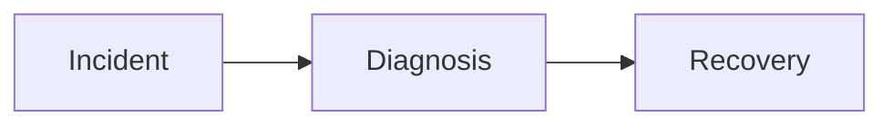
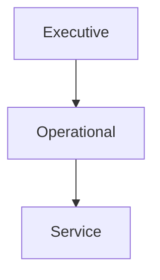
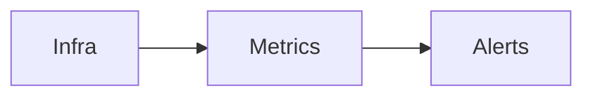

# ALSAMAD Observability & Monitoring Architecture

Provider-independent long-term observability architecture aligned with the Product, Database, Admin, AI, API, Security, Sakinah Design System, and Infrastructure architectures.

## Mission

Define monitoring, telemetry, diagnostics, alerting, operational insight, and health architecture.

## Constitutional Principles

- Observability by Default Principle
- Evidence Before Assumption Principle
- Minimal Sensitive Data Principle
- Privacy-Preserving Telemetry Principle
- Actionable Alert Principle
- No Silent Failure Principle
- Human Diagnosis Principle
- Correlation Principle
- Cost-Aware Telemetry Principle
- Provider Independence Principle

## 1. Observability Philosophy

- Responsibilities: Alsamad-specific operational ownership.
- Ownership: Defined accountable operational role.
- Trust boundaries documented.
- Failure behaviour and degraded mode defined.
- Observability requirements include logs, metrics, traces, events.
- Security and privacy requirements apply.
- Release status identified.

## 2. Signals

- Responsibilities: Alsamad-specific operational ownership.
- Ownership: Defined accountable operational role.
- Trust boundaries documented.
- Failure behaviour and degraded mode defined.
- Observability requirements include logs, metrics, traces, events.
- Security and privacy requirements apply.
- Release status identified.

## 3. Health Architecture

- Responsibilities: Alsamad-specific operational ownership.
- Ownership: Defined accountable operational role.
- Trust boundaries documented.
- Failure behaviour and degraded mode defined.
- Observability requirements include logs, metrics, traces, events.
- Security and privacy requirements apply.
- Release status identified.

## 4. Readiness & Liveness

- Responsibilities: Alsamad-specific operational ownership.
- Ownership: Defined accountable operational role.
- Trust boundaries documented.
- Failure behaviour and degraded mode defined.
- Observability requirements include logs, metrics, traces, events.
- Security and privacy requirements apply.
- Release status identified.

## 5. Public Status Model

- Responsibilities: Alsamad-specific operational ownership.
- Ownership: Defined accountable operational role.
- Trust boundaries documented.
- Failure behaviour and degraded mode defined.
- Observability requirements include logs, metrics, traces, events.
- Security and privacy requirements apply.
- Release status identified.

## 6. Request Correlation IDs

- Responsibilities: Alsamad-specific operational ownership.
- Ownership: Defined accountable operational role.
- Trust boundaries documented.
- Failure behaviour and degraded mode defined.
- Observability requirements include logs, metrics, traces, events.
- Security and privacy requirements apply.
- Release status identified.

## 7. Distributed Tracing

- Responsibilities: Alsamad-specific operational ownership.
- Ownership: Defined accountable operational role.
- Trust boundaries documented.
- Failure behaviour and degraded mode defined.
- Observability requirements include logs, metrics, traces, events.
- Security and privacy requirements apply.
- Release status identified.

## 8. Structured Logging

- Responsibilities: Alsamad-specific operational ownership.
- Ownership: Defined accountable operational role.
- Trust boundaries documented.
- Failure behaviour and degraded mode defined.
- Observability requirements include logs, metrics, traces, events.
- Security and privacy requirements apply.
- Release status identified.

## 9. Metrics Architecture

- Responsibilities: Alsamad-specific operational ownership.
- Ownership: Defined accountable operational role.
- Trust boundaries documented.
- Failure behaviour and degraded mode defined.
- Observability requirements include logs, metrics, traces, events.
- Security and privacy requirements apply.
- Release status identified.

## 10. Business Metrics

- Responsibilities: Alsamad-specific operational ownership.
- Ownership: Defined accountable operational role.
- Trust boundaries documented.
- Failure behaviour and degraded mode defined.
- Observability requirements include logs, metrics, traces, events.
- Security and privacy requirements apply.
- Release status identified.

## 11. Editorial Metrics

- Responsibilities: Alsamad-specific operational ownership.
- Ownership: Defined accountable operational role.
- Trust boundaries documented.
- Failure behaviour and degraded mode defined.
- Observability requirements include logs, metrics, traces, events.
- Security and privacy requirements apply.
- Release status identified.

## 12. Quran Integrity Monitoring

- Responsibilities: Alsamad-specific operational ownership.
- Ownership: Defined accountable operational role.
- Trust boundaries documented.
- Failure behaviour and degraded mode defined.
- Observability requirements include logs, metrics, traces, events.
- Security and privacy requirements apply.
- Release status identified.

## 13. AI Monitoring

- Responsibilities: Alsamad-specific operational ownership.
- Ownership: Defined accountable operational role.
- Trust boundaries documented.
- Failure behaviour and degraded mode defined.
- Observability requirements include logs, metrics, traces, events.
- Security and privacy requirements apply.
- Release status identified.

## 14. AI Cost Monitoring

- Responsibilities: Alsamad-specific operational ownership.
- Ownership: Defined accountable operational role.
- Trust boundaries documented.
- Failure behaviour and degraded mode defined.
- Observability requirements include logs, metrics, traces, events.
- Security and privacy requirements apply.
- Release status identified.

## 15. AI Safety Monitoring

- Responsibilities: Alsamad-specific operational ownership.
- Ownership: Defined accountable operational role.
- Trust boundaries documented.
- Failure behaviour and degraded mode defined.
- Observability requirements include logs, metrics, traces, events.
- Security and privacy requirements apply.
- Release status identified.

## 16. API Monitoring

- Responsibilities: Alsamad-specific operational ownership.
- Ownership: Defined accountable operational role.
- Trust boundaries documented.
- Failure behaviour and degraded mode defined.
- Observability requirements include logs, metrics, traces, events.
- Security and privacy requirements apply.
- Release status identified.

## 17. Database Monitoring

- Responsibilities: Alsamad-specific operational ownership.
- Ownership: Defined accountable operational role.
- Trust boundaries documented.
- Failure behaviour and degraded mode defined.
- Observability requirements include logs, metrics, traces, events.
- Security and privacy requirements apply.
- Release status identified.

## 18. Cache Monitoring

- Responsibilities: Alsamad-specific operational ownership.
- Ownership: Defined accountable operational role.
- Trust boundaries documented.
- Failure behaviour and degraded mode defined.
- Observability requirements include logs, metrics, traces, events.
- Security and privacy requirements apply.
- Release status identified.

## 19. Search Monitoring

- Responsibilities: Alsamad-specific operational ownership.
- Ownership: Defined accountable operational role.
- Trust boundaries documented.
- Failure behaviour and degraded mode defined.
- Observability requirements include logs, metrics, traces, events.
- Security and privacy requirements apply.
- Release status identified.

## 20. Background Job Monitoring

- Responsibilities: Alsamad-specific operational ownership.
- Ownership: Defined accountable operational role.
- Trust boundaries documented.
- Failure behaviour and degraded mode defined.
- Observability requirements include logs, metrics, traces, events.
- Security and privacy requirements apply.
- Release status identified.

## 21. Queue Monitoring

- Responsibilities: Alsamad-specific operational ownership.
- Ownership: Defined accountable operational role.
- Trust boundaries documented.
- Failure behaviour and degraded mode defined.
- Observability requirements include logs, metrics, traces, events.
- Security and privacy requirements apply.
- Release status identified.

## 22. Backup Monitoring

- Responsibilities: Alsamad-specific operational ownership.
- Ownership: Defined accountable operational role.
- Trust boundaries documented.
- Failure behaviour and degraded mode defined.
- Observability requirements include logs, metrics, traces, events.
- Security and privacy requirements apply.
- Release status identified.

## 23. Restore Verification

- Responsibilities: Alsamad-specific operational ownership.
- Ownership: Defined accountable operational role.
- Trust boundaries documented.
- Failure behaviour and degraded mode defined.
- Observability requirements include logs, metrics, traces, events.
- Security and privacy requirements apply.
- Release status identified.

## 24. Infrastructure Monitoring

- Responsibilities: Alsamad-specific operational ownership.
- Ownership: Defined accountable operational role.
- Trust boundaries documented.
- Failure behaviour and degraded mode defined.
- Observability requirements include logs, metrics, traces, events.
- Security and privacy requirements apply.
- Release status identified.

## 25. CDN Monitoring

- Responsibilities: Alsamad-specific operational ownership.
- Ownership: Defined accountable operational role.
- Trust boundaries documented.
- Failure behaviour and degraded mode defined.
- Observability requirements include logs, metrics, traces, events.
- Security and privacy requirements apply.
- Release status identified.

## 26. Security Monitoring

- Responsibilities: Alsamad-specific operational ownership.
- Ownership: Defined accountable operational role.
- Trust boundaries documented.
- Failure behaviour and degraded mode defined.
- Observability requirements include logs, metrics, traces, events.
- Security and privacy requirements apply.
- Release status identified.

## 27. Authentication Monitoring

- Responsibilities: Alsamad-specific operational ownership.
- Ownership: Defined accountable operational role.
- Trust boundaries documented.
- Failure behaviour and degraded mode defined.
- Observability requirements include logs, metrics, traces, events.
- Security and privacy requirements apply.
- Release status identified.

## 28. Authorization Monitoring

- Responsibilities: Alsamad-specific operational ownership.
- Ownership: Defined accountable operational role.
- Trust boundaries documented.
- Failure behaviour and degraded mode defined.
- Observability requirements include logs, metrics, traces, events.
- Security and privacy requirements apply.
- Release status identified.

## 29. Audit Monitoring

- Responsibilities: Alsamad-specific operational ownership.
- Ownership: Defined accountable operational role.
- Trust boundaries documented.
- Failure behaviour and degraded mode defined.
- Observability requirements include logs, metrics, traces, events.
- Security and privacy requirements apply.
- Release status identified.

## 30. Privacy-safe Analytics

- Responsibilities: Alsamad-specific operational ownership.
- Ownership: Defined accountable operational role.
- Trust boundaries documented.
- Failure behaviour and degraded mode defined.
- Observability requirements include logs, metrics, traces, events.
- Security and privacy requirements apply.
- Release status identified.

## 31. Alert Architecture

- Responsibilities: Alsamad-specific operational ownership.
- Ownership: Defined accountable operational role.
- Trust boundaries documented.
- Failure behaviour and degraded mode defined.
- Observability requirements include logs, metrics, traces, events.
- Security and privacy requirements apply.
- Release status identified.

## 32. Alert Routing

- Responsibilities: Alsamad-specific operational ownership.
- Ownership: Defined accountable operational role.
- Trust boundaries documented.
- Failure behaviour and degraded mode defined.
- Observability requirements include logs, metrics, traces, events.
- Security and privacy requirements apply.
- Release status identified.

## 33. Incident Timeline

- Responsibilities: Alsamad-specific operational ownership.
- Ownership: Defined accountable operational role.
- Trust boundaries documented.
- Failure behaviour and degraded mode defined.
- Observability requirements include logs, metrics, traces, events.
- Security and privacy requirements apply.
- Release status identified.

## 34. Operational Dashboards

- Responsibilities: Alsamad-specific operational ownership.
- Ownership: Defined accountable operational role.
- Trust boundaries documented.
- Failure behaviour and degraded mode defined.
- Observability requirements include logs, metrics, traces, events.
- Security and privacy requirements apply.
- Release status identified.

## 35. SLO / SLA / Error Budget Philosophy

- Responsibilities: Alsamad-specific operational ownership.
- Ownership: Defined accountable operational role.
- Trust boundaries documented.
- Failure behaviour and degraded mode defined.
- Observability requirements include logs, metrics, traces, events.
- Security and privacy requirements apply.
- Release status identified.

## 36. Capacity Monitoring

- Responsibilities: Alsamad-specific operational ownership.
- Ownership: Defined accountable operational role.
- Trust boundaries documented.
- Failure behaviour and degraded mode defined.
- Observability requirements include logs, metrics, traces, events.
- Security and privacy requirements apply.
- Release status identified.

## 37. Cost Monitoring

- Responsibilities: Alsamad-specific operational ownership.
- Ownership: Defined accountable operational role.
- Trust boundaries documented.
- Failure behaviour and degraded mode defined.
- Observability requirements include logs, metrics, traces, events.
- Security and privacy requirements apply.
- Release status identified.

## 38. Regional Monitoring

- Responsibilities: Alsamad-specific operational ownership.
- Ownership: Defined accountable operational role.
- Trust boundaries documented.
- Failure behaviour and degraded mode defined.
- Observability requirements include logs, metrics, traces, events.
- Security and privacy requirements apply.
- Release status identified.

## 39. Future Multi-region Monitoring

- Responsibilities: Alsamad-specific operational ownership.
- Ownership: Defined accountable operational role.
- Trust boundaries documented.
- Failure behaviour and degraded mode defined.
- Observability requirements include logs, metrics, traces, events.
- Security and privacy requirements apply.
- Release status identified.

## 40. Open Decisions

- Responsibilities: Alsamad-specific operational ownership.
- Ownership: Defined accountable operational role.
- Trust boundaries documented.
- Failure behaviour and degraded mode defined.
- Observability requirements include logs, metrics, traces, events.
- Security and privacy requirements apply.
- Release status identified.

## 41. Final Validation

- Responsibilities: Alsamad-specific operational ownership.
- Ownership: Defined accountable operational role.
- Trust boundaries documented.
- Failure behaviour and degraded mode defined.
- Observability requirements include logs, metrics, traces, events.
- Security and privacy requirements apply.
- Release status identified.

## Mermaid Diagrams

## Matrices

- Metrics ownership
- Dashboard ownership
- Alert severity
- Log retention
- Metric retention
- Tracing retention
- Operational KPIs
- Business KPIs
- Release status

## Release Classification

### Release 1

Core health, telemetry, alerts, dashboards, PostgreSQL, AI safety visibility.

### Prepared

Advanced tracing, synthetic monitoring, queue visibility.

### Approved Later Module

Regional monitoring, Talibeen monitoring, subscription monitoring.

### Future / Research

Multi-region analytics, predictive diagnostics.

## Open Decisions

- Telemetry provider
- Tracing backend
- Metrics backend
- Status page
- Alerting provider
- Incident tooling
- Retention periods

## Validation

- Aligned with all referenced architectures.
- Quran publication integrity monitored.
- Religious review, correction and withdrawal workflows observable.
- AI outages observable without breaking core platform.
- No code, UI, migrations, commits, pushes or deployments.
- Observability architecture guidance 443.
- Observability architecture guidance 444.
- Observability architecture guidance 445.
- Observability architecture guidance 446.
- Observability architecture guidance 447.
- Observability architecture guidance 448.
- Observability architecture guidance 449.
- Observability architecture guidance 450.
- Observability architecture guidance 451.
- Observability architecture guidance 452.
- Observability architecture guidance 453.
- Observability architecture guidance 454.
- Observability architecture guidance 455.
- Observability architecture guidance 456.
- Observability architecture guidance 457.
- Observability architecture guidance 458.
- Observability architecture guidance 459.
- Observability architecture guidance 460.
- Observability architecture guidance 461.
- Observability architecture guidance 462.
- Observability architecture guidance 463.
- Observability architecture guidance 464.
- Observability architecture guidance 465.
- Observability architecture guidance 466.
- Observability architecture guidance 467.
- Observability architecture guidance 468.
- Observability architecture guidance 469.
- Observability architecture guidance 470.
- Observability architecture guidance 471.
- Observability architecture guidance 472.
- Observability architecture guidance 473.
- Observability architecture guidance 474.
- Observability architecture guidance 475.
- Observability architecture guidance 476.
- Observability architecture guidance 477.
- Observability architecture guidance 478.
- Observability architecture guidance 479.
- Observability architecture guidance 480.
- Observability architecture guidance 481.
- Observability architecture guidance 482.
- Observability architecture guidance 483.
- Observability architecture guidance 484.
- Observability architecture guidance 485.
- Observability architecture guidance 486.
- Observability architecture guidance 487.
- Observability architecture guidance 488.
- Observability architecture guidance 489.
- Observability architecture guidance 490.
- Observability architecture guidance 491.
- Observability architecture guidance 492.
- Observability architecture guidance 493.
- Observability architecture guidance 494.
- Observability architecture guidance 495.
- Observability architecture guidance 496.
- Observability architecture guidance 497.
- Observability architecture guidance 498.
- Observability architecture guidance 499.
- Observability architecture guidance 500.
- Observability architecture guidance 501.
- Observability architecture guidance 502.
- Observability architecture guidance 503.
- Observability architecture guidance 504.
- Observability architecture guidance 505.
- Observability architecture guidance 506.
- Observability architecture guidance 507.
- Observability architecture guidance 508.
- Observability architecture guidance 509.
- Observability architecture guidance 510.
- Observability architecture guidance 511.
- Observability architecture guidance 512.
- Observability architecture guidance 513.
- Observability architecture guidance 514.
- Observability architecture guidance 515.
- Observability architecture guidance 516.
- Observability architecture guidance 517.
- Observability architecture guidance 518.
- Observability architecture guidance 519.
- Observability architecture guidance 520.
- Observability architecture guidance 521.
- Observability architecture guidance 522.
- Observability architecture guidance 523.
- Observability architecture guidance 524.
- Observability architecture guidance 525.
- Observability architecture guidance 526.
- Observability architecture guidance 527.
- Observability architecture guidance 528.
- Observability architecture guidance 529.
- Observability architecture guidance 530.
- Observability architecture guidance 531.
- Observability architecture guidance 532.
- Observability architecture guidance 533.
- Observability architecture guidance 534.
- Observability architecture guidance 535.
- Observability architecture guidance 536.
- Observability architecture guidance 537.
- Observability architecture guidance 538.
- Observability architecture guidance 539.
- Observability architecture guidance 540.
- Observability architecture guidance 541.
- Observability architecture guidance 542.
- Observability architecture guidance 543.
- Observability architecture guidance 544.
- Observability architecture guidance 545.
- Observability architecture guidance 546.
- Observability architecture guidance 547.
- Observability architecture guidance 548.
- Observability architecture guidance 549.
- Observability architecture guidance 550.
- Observability architecture guidance 551.
- Observability architecture guidance 552.
- Observability architecture guidance 553.
- Observability architecture guidance 554.
- Observability architecture guidance 555.
- Observability architecture guidance 556.
- Observability architecture guidance 557.
- Observability architecture guidance 558.
- Observability architecture guidance 559.
- Observability architecture guidance 560.
- Observability architecture guidance 561.
- Observability architecture guidance 562.
- Observability architecture guidance 563.
- Observability architecture guidance 564.
- Observability architecture guidance 565.
- Observability architecture guidance 566.
- Observability architecture guidance 567.
- Observability architecture guidance 568.
- Observability architecture guidance 569.
- Observability architecture guidance 570.
- Observability architecture guidance 571.
- Observability architecture guidance 572.
- Observability architecture guidance 573.
- Observability architecture guidance 574.
- Observability architecture guidance 575.
- Observability architecture guidance 576.
- Observability architecture guidance 577.
- Observability architecture guidance 578.
- Observability architecture guidance 579.
- Observability architecture guidance 580.
- Observability architecture guidance 581.
- Observability architecture guidance 582.
- Observability architecture guidance 583.
- Observability architecture guidance 584.
- Observability architecture guidance 585.
- Observability architecture guidance 586.
- Observability architecture guidance 587.
- Observability architecture guidance 588.
- Observability architecture guidance 589.
- Observability architecture guidance 590.
- Observability architecture guidance 591.
- Observability architecture guidance 592.
- Observability architecture guidance 593.
- Observability architecture guidance 594.
- Observability architecture guidance 595.
- Observability architecture guidance 596.
- Observability architecture guidance 597.
- Observability architecture guidance 598.
- Observability architecture guidance 599.
- Observability architecture guidance 600.
- Observability architecture guidance 601.
- Observability architecture guidance 602.
- Observability architecture guidance 603.
- Observability architecture guidance 604.
- Observability architecture guidance 605.
- Observability architecture guidance 606.
- Observability architecture guidance 607.
- Observability architecture guidance 608.
- Observability architecture guidance 609.
- Observability architecture guidance 610.
- Observability architecture guidance 611.
- Observability architecture guidance 612.
- Observability architecture guidance 613.
- Observability architecture guidance 614.
- Observability architecture guidance 615.
- Observability architecture guidance 616.
- Observability architecture guidance 617.
- Observability architecture guidance 618.
- Observability architecture guidance 619.
- Observability architecture guidance 620.
- Observability architecture guidance 621.
- Observability architecture guidance 622.
- Observability architecture guidance 623.
- Observability architecture guidance 624.
- Observability architecture guidance 625.
- Observability architecture guidance 626.
- Observability architecture guidance 627.
- Observability architecture guidance 628.
- Observability architecture guidance 629.
- Observability architecture guidance 630.
- Observability architecture guidance 631.
- Observability architecture guidance 632.
- Observability architecture guidance 633.
- Observability architecture guidance 634.
- Observability architecture guidance 635.
- Observability architecture guidance 636.
- Observability architecture guidance 637.
- Observability architecture guidance 638.
- Observability architecture guidance 639.
- Observability architecture guidance 640.
- Observability architecture guidance 641.
- Observability architecture guidance 642.
- Observability architecture guidance 643.
- Observability architecture guidance 644.
- Observability architecture guidance 645.
- Observability architecture guidance 646.
- Observability architecture guidance 647.
- Observability architecture guidance 648.
- Observability architecture guidance 649.

## M0.5 — Quran.Foundation monitoring

Release 1 monitors bounded-cardinality Quran.Foundation latency, availability, quota consumption, `429`/`Retry-After`, authentication failures, token refresh, schema drift, checksum mismatch, deletion/withdrawal signals, cache legal age, catalog freshness, circuit state, audio resolution/playback failure, and any Prepared OAuth health check. Alerts identify the affected capability and edition without logging tokens, private notes, full user payloads, unnecessary Quran bodies, or raw search queries.

The readiness gate proves that QF failure preserves legally valid Quran navigation and text, Search falls back locally, audio fails text-first, and the provider can be disabled without changing public contracts.
