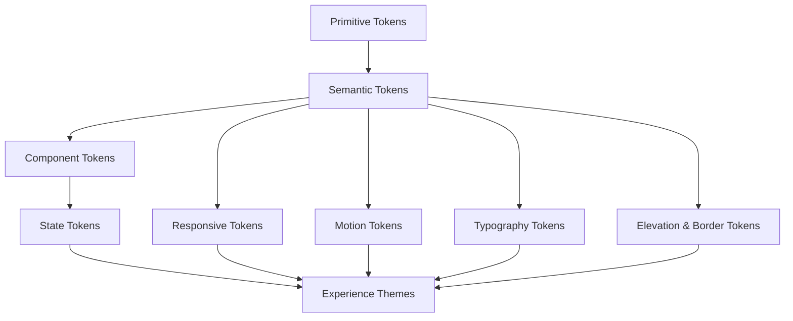
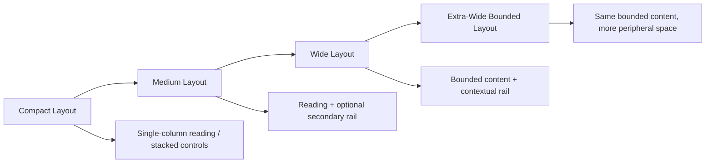
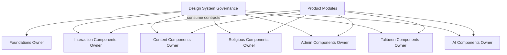
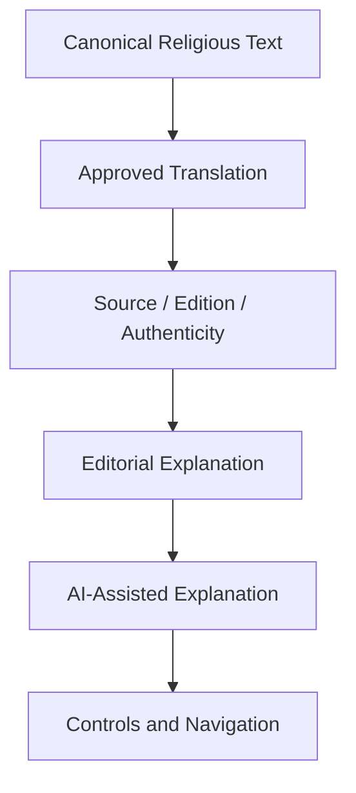
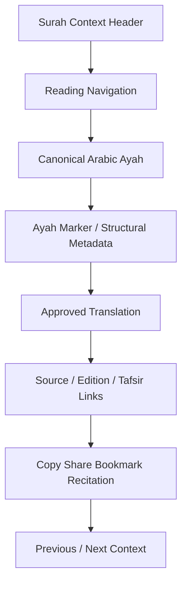
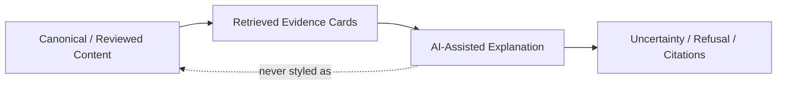
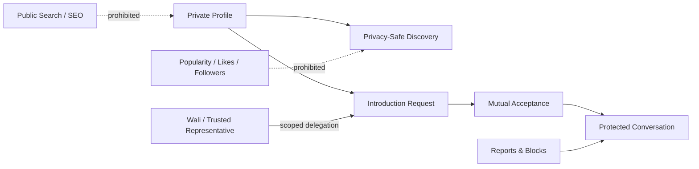
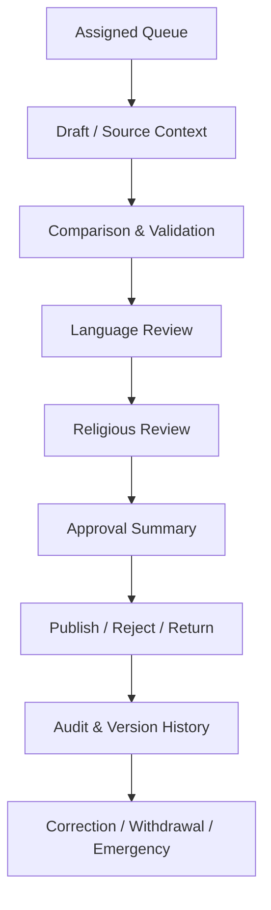

# Alsamad — Sakīnah Design System Architecture

**Version:** 1.0 — Long-term visual, interaction, accessibility, and interface architecture  
**Status:** Proposed architecture baseline  
**Scope:** Public experiences, Quran reading, devotional content, prayer and Hijri, search, future AI, separately feature-gated Talibeen governance, administration, print, PWA, and future native applications
**Implementation stance:** Technology-independent; this document defines design contracts, not code, UI files, components, or assets

The Sakīnah Design System is the permanent design language of Alsamad. It exists to make religious content clear, dignified, accessible, calm, trustworthy, and globally usable.

This document must be interpreted together with:

- `ALSAMAD_PRODUCT_ARCHITECTURE_V1.md`
- `ALSAMAD_DATABASE_ARCHITECTURE.md`
- `ALSAMAD_ADMIN_ARCHITECTURE.md`
- `ALSAMAD_AI_ARCHITECTURE.md`
- `ALSAMAD_API_ARCHITECTURE.md`
- `ALSAMAD_SECURITY_ARCHITECTURE.md`

Where presentation convenience conflicts with religious content integrity, accessibility, privacy, security, governance, or canonical truth, those higher-order requirements prevail.

## 1. Mission, Scope, and Design Objectives

### 1.1 Mission

Design a coherent visual and interaction architecture that can operate for decades across languages, scripts, regions, devices, and future protocols without becoming visually noisy, commercially manipulative, culturally narrow, or dependent on a specific frontend technology.

### 1.2 Primary objectives

1. Protect the primacy and readability of canonical religious content.
2. Make Quran, dua, adhkar, prayer, and Hijri journeys calm and interruption-free.
3. Present provenance, authenticity, review, correction, and editorial state clearly.
4. Treat Arabic, RTL, and mixed-direction content as first-class.
5. Support unlimited languages and regional contexts.
6. Make accessibility a release gate.
7. Prevent engagement mechanics from distorting worship or religious learning.
8. Preserve visual consistency across public, administrative, AI, Talibeen, print, PWA, and native surfaces.
9. Keep the system maintainable through stable tokens, component ownership, documented states, and deprecation.
10. Allow graceful operation on low-end devices, weak networks, reduced-motion settings, and AI/provider outages.

### 1.3 Non-goals

This architecture does not:

- approve a final logo;
- select exact values beyond the bounded Phase-1 visual foundation approved later in REG-0018;
- distribute or license fonts;
- choose a component library;
- choose CSS technology;
- create UI components;
- create application code;
- authorize Talibeen implementation, fold Talibeen into frozen Core Release 1, or authorize subscriptions or future AI;
- replace content, API, security, admin, or AI governance.

## 2. Design Constitutional Principles

These are permanent architectural rules.

### 2.1 Sakīnah Principle

Every interface should reduce agitation and support attentive use. Sakīnah is expressed through clarity, rhythm, restraint, respectful language, predictable behavior, and freedom from pressure.

### 2.2 Clarity Before Decoration Principle

Decoration is permitted only when it supports hierarchy, comprehension, cultural respect, or emotional calm. Decorative complexity must never obscure content or action.

### 2.3 Religious Content Primacy Principle

Canonical religious content is the visual center of relevant experiences. Supporting controls, translations, commentary, metadata, and navigation remain subordinate.

### 2.4 Human Before Engagement Principle

Design optimizes for human understanding, dignity, and completion of legitimate tasks—not session length, compulsive return, or artificial engagement.

### 2.5 Trust Through Consistency Principle

Repeated patterns, stable terminology, predictable placement, and consistent state presentation build trust. Similar actions must look and behave similarly.

### 2.6 Accessibility by Default Principle

Accessibility is part of every token, component, layout, workflow, and release decision from the beginning.

### 2.7 RTL and LTR Equality Principle

RTL is not a mirrored adaptation of an LTR system. Both directions receive equal design quality, testing, and ownership.

### 2.8 Global Localization Principle

No language or locale is visually secondary. Layout, typography, spacing, direction, expansion, and fallback are designed for unlimited localization.

### 2.9 Progressive Disclosure Principle

The interface presents the minimum information required for the current task, with deeper detail available without hiding critical trust or safety information.

### 2.10 Motion with Purpose Principle

Motion explains cause, relationship, state, or orientation. Motion never pressures, distracts, gamifies worship, or blocks comprehension.

### 2.11 Content Density Discipline Principle

Density follows task context. Public reading is spacious; administrative workflows may be denser but remain legible, scannable, and predictable.

### 2.12 Mobile-First Principle

Mobile First, Desktop Excellent. The phone experience is the permanent reference implementation for every screen, component, interaction, navigation flow, and reading experience — not an implicit afterthought to a desktop design. Every journey is authored for constrained screens and touch first, then expanded to larger canvases; desktop receives additional space, never additional complexity, and must never become the design reference. This reflects an expected audience of approximately 85–95% mobile (predominantly Android and iPhone) and 5–15% desktop. See §43 for the device-architecture contract and §43.1 for the associated design-review rule.

### 2.12.1 Thumb-First Navigation

Primary actions remain reachable one-handed. Destinations, controls, and reading actions that a user reaches for repeatedly are placed within comfortable thumb range on a phone, not merely visible on screen.

### 2.12.2 Reading-First Layout

Especially Quran reading: the reading surface, not surrounding chrome, is the visual and interaction center of the experience on every screen size.

### 2.12.3 Minimal Chrome

Content always outranks interface in visual priority. Navigation, toolbars, and controls recede so that religious and devotional content remains dominant.

### 2.12.4 Fast Interaction

Users should never wait for unnecessary transitions. Perceived responsiveness on mobile hardware and networks is a design requirement, not solely an engineering one.

### 2.12.5 Progressive Enhancement, Not Progressive Complexity

Desktop gains additional space. It never gains additional complexity, additional required steps, or a competing information architecture relative to mobile.

### 2.13 Performance-Aware Design Principle

Visual richness must respect loading, rendering, battery, bandwidth, SEO, and low-end device constraints.

### 2.14 Design Token Ownership Principle

Every token category has one accountable owner. Token meaning may not be redefined independently by components or product modules.

### 2.15 Graceful Degradation Principle

If advanced styling, JavaScript, media, AI, animation, or a provider is unavailable, the user still receives a usable, readable, truthful experience.

### 2.16 No Dark Pattern Principle

The system prohibits deceptive hierarchy, hidden costs, forced consent, obstructed cancellation, disguised advertising, ambiguous destructive actions, and manipulated defaults.

### 2.17 No Addictive Interaction Principle

No infinite feeds, streak pressure, worship scores, public popularity, variable reward loops, compulsive notifications, or engagement traps.

### 2.18 Design Replaceability Principle

Rendering technology, component library, CSS system, icon library, documentation platform, and native framework must be replaceable without changing the semantic design language.

### 2.19 Component Ownership Principle

Each component family has exactly one owning design-system domain. Product modules consume components and variants but do not fork their meaning silently.

### 2.20 Visual Integrity Principle

Visual treatment must accurately reflect canonical, editorial, AI-assisted, private, withdrawn, under-review, and verified states.

### 2.21 Calm Degradation Principle

Degraded states must remain composed, explanatory, and useful. Failure must not become visual chaos or aggressive urgency.

### 2.22 No Silent Interaction Change Principle

Meaningful changes to interaction, state, navigation, or destructive behavior require explicit versioning, documentation, review, and migration where necessary.

## 3. Sakīnah Design Philosophy

### 3.1 Meaning in product design

Sakīnah means tranquility with awareness—not emptiness, coldness, or decorative minimalism. The interface should help the user slow down enough to understand, read, reflect, decide, and act safely.

### 3.2 Desired qualities

The system should feel:

- calm;
- spacious;
- dignified;
- readable;
- focused;
- warm;
- trustworthy;
- modern;
- non-commercial;
- non-addictive.

### 3.3 Prohibited tendencies

Avoid:

- visual noise;
- endless feeds;
- aggressive urgency;
- manipulative notifications;
- excessive gradients;
- decorative religious symbolism without functional meaning;
- gamified worship;
- engagement traps;
- exaggerated claims;
- fear-based messaging;
- interface chrome competing with Quran text;
- promotional interruptions inside religious reading;
- fake scarcity or countdowns;
- visual conflation of AI output with canonical truth.

### 3.4 Calmness is measurable

Sakīnah quality is evaluated through:

- reading interruption count;
- task completion clarity;
- unexpected motion count;
- cognitive load;
- contrast and readability;
- notification necessity;
- destructive-action clarity;
- accessibility outcomes;
- error recovery;
- content-to-chrome ratio;
- performance on weak networks.

## 4. Design-System Architecture

The design system has five architectural layers:

1. **Foundations:** principles, tokens, typography, color, spacing, direction, motion, accessibility.
2. **Primitives:** technology-independent interaction and layout concepts.
3. **Components:** stable reusable interface contracts.
4. **Patterns:** workflows composed from components.
5. **Experiences:** Quran, devotional, prayer, search, AI, Talibeen, admin, print, and native surfaces.

Product experiences may compose lower layers but must not redefine them locally without design-system review.

## 5. Token Hierarchy

### 5.1 Primitive tokens

Raw design scales without product meaning:

- neutral color steps;
- candidate hue steps;
- spacing units;
- raw font sizes;
- line-height ratios;
- radius steps;
- border widths;
- shadow levels;
- duration values;
- easing curves;
- opacity steps;
- z-index bands;
- breakpoint thresholds.

### 5.2 Semantic tokens

Meaning-based roles:

- surface-default;
- surface-subtle;
- text-primary;
- text-secondary;
- border-default;
- focus-ring;
- status-success;
- content-verified;
- content-editorial;
- content-ai-assisted;
- privacy-sensitive;
- action-primary;
- action-destructive.

### 5.3 Component tokens

Scoped roles:

- button-primary-background;
- quran-ayah-text;
- dua-source-border;
- dialog-elevation;
- admin-queue-row-selected;
- talibeen-private-card-surface.

### 5.4 State tokens

- default;
- hover;
- active;
- selected;
- focus-visible;
- disabled;
- loading;
- success;
- warning;
- danger;
- under-review;
- archived;
- withdrawn;
- privacy-sensitive;
- security-hold.

### 5.5 Ownership

Primitive and semantic tokens are owned by the Sakīnah Design System. Component tokens are owned by their component family. Experience themes may alias semantic tokens but cannot change state meaning.

## 6. Token Naming Conventions

Technology-independent token names follow:

`category.role.variant.state.mode.scale`

Examples:

- `color.text.primary.default.light`
- `color.content.verified.foreground.dark`
- `space.layout.gutter.mobile`
- `type.quran.body.large`
- `radius.surface.card.default`
- `motion.duration.feedback.short`
- `border.focus.strong`
- `elevation.dialog.modal`
- `opacity.state.disabled`
- `z.overlay.dialog`
- `breakpoint.layout.compact`

Rules:

- names describe meaning, not appearance;
- no component references primitive hex values directly;
- no token encodes a vendor or framework;
- direction-sensitive spacing uses logical start/end semantics;
- deprecated tokens retain documented aliases during migration;
- token changes include contrast, RTL, performance, and print review.

## 7. Brand and Visual Identity Architecture

### 7.1 Identity scope

The brand system must eventually define:

- primary wordmark;
- symbol;
- Arabic rendering;
- Latin rendering;
- combined lockups;
- app icon;
- favicon;
- social preview templates;
- watermark rules;
- monochrome variants;
- light and dark variants.

### 7.2 Decision boundary

No final logo, symbol, calligraphy, or brand asset is invented by this document. REG-0018 governs only the Phase-1 semantic product palette; brand assets still require a separate approved identity process.

### 7.3 Requirements

- Arabic and Latin lockups receive equal quality.
- Clear space is derived from a stable logo feature.
- Minimum sizes are defined for screen and print.
- Monochrome versions remain recognizable.
- Dark and light variants preserve contrast.
- App icons avoid small unreadable text.
- Watermarks never obscure Quran text or imply ownership over canonical scripture.
- Social previews use truthful page metadata and do not sensationalize religious content.

### 7.4 Prohibited treatments

- stretching;
- rotation;
- unapproved recoloring;
- gradients applied without approval;
- glow effects;
- decorative animation;
- placing the logo over unreadable imagery;
- combining the logo with unapproved religious symbols;
- using the symbol as a replacement for verification or authenticity metadata.

## 8. Color-System Architecture

REG-0018 freezes the Phase-1 visual direction as **Quiet Editorial Sanctuary**: calm, contemporary, premium, spiritually respectful, editorial, highly readable, and restrained. Islamic identity is expressed primarily through typography, proportion, reading dignity, source transparency, restrained geometry, and content hierarchy. The foundation reduces visible containers rather than turning every semantic object into a decorated card. Ornamental overload, generic mosque or crescent decoration, gold-on-black luxury clichés, repeated background patterns, ordinary-section gradients, and shadows on every card are prohibited.

### 8.1 Selection criteria

The final palette must be:

- calm rather than high-arousal;
- accessible in light and dark modes;
- compatible with Arabic diacritics;
- color-blind safe;
- print-aware;
- distinct enough for state recognition;
- culturally respectful without relying on stereotypical “Islamic” color assumptions.

### 8.2 Semantic color roles

The Phase-1 values are authoritative:

| Semantic role         | Light     | Dark      | Governed use                                                       |
| --------------------- | --------- | --------- | ------------------------------------------------------------------ |
| Canvas                | `#F8FBF9` | `#07130F` | quiet page background; most sections remain unframed               |
| Principal surface     | `#FFFFFF` | `#0D1D17` | principal content and reading structure                            |
| Grouped tonal surface | `#EEF5F1` | `#14271F` | related secondary information before border/elevation              |
| Text primary          | `#10231B` | `#F3F7F4` | main readable content                                              |
| Text secondary        | `#617168` | `#A2B0A8` | supporting text that still passes applicable contrast              |
| Primary emerald       | `#0F5B43` | `#68BC98` | primary action, selected navigation, progress, restrained identity |
| Strong emerald        | `#083D2D` | `#91D3B4` | governed emphasis/interaction state                                |
| Soft emerald          | `#DCECE5` | `#173D2E` | selected and grouped states                                        |
| Muted gold            | `#9B742B` | `#D3AE62` | rare trust/source/ceremonial emphasis and focus; not generic links |
| Structural border     | `#DBE6E0` | `#263C33` | grouping, controls, and separators                                 |
| Danger                | `#B42318` | `#FF8A80` | actual destructive or error state only                             |

Color communicates hierarchy, never authenticity by itself. Decorative gradients are exceptional rather than a default section treatment. Every status retains text and at least one additional non-color channel.

| Role               | Purpose                              | Must not imply             |
| ------------------ | ------------------------------------ | -------------------------- |
| Brand primary      | identity and primary action          | religious authenticity     |
| Neutral surfaces   | reading and structure                | inactivity                 |
| Text primary       | main readable content                | status                     |
| Verified religious | approved provenance state            | universal religious ruling |
| Editorial content  | editorial authorship                 | authenticated Sunnah       |
| AI-assisted        | machine-assisted explanation         | canonical truth            |
| Under review       | non-public workflow state            | failure                    |
| Archived           | retained historical state            | deletion                   |
| Withdrawn          | no longer publicly authoritative     | erasure                    |
| Privacy-sensitive  | protected information                | danger by itself           |
| Admin warning      | operational attention                | public urgency             |
| Danger             | destructive/security-critical action | ordinary error             |

### 8.3 Modes

**Light mode:** calm neutral background, high-legibility text, restrained brand accents.  
**Dark mode:** low-glare surfaces without reducing contrast or Arabic diacritic clarity.  
**High contrast:** stronger borders, focus, text separation, and reduced reliance on subtle surfaces.  
**Print:** removes decorative backgrounds and maps status to text, border, and pattern.  
**Quran night reading:** reading-focused, low-glare, separate from generic dark theme if needed.

### 8.4 Contrast

- Normal text targets WCAG AA minimum; important reading content should exceed minimum where practical.
- Quranic Arabic and diacritics require visual testing beyond numeric contrast.
- Large text must not be treated as large merely to avoid stronger contrast.
- Focus indicators require clear contrast against adjacent surfaces.
- Disabled states remain readable enough to identify function.

### 8.5 No color-only meaning

Every state uses at least one additional channel:

- text label;
- icon;
- border/pattern;
- position;
- semantic heading;
- announced status.

## 9. Typography Architecture

### 9.1 Typography families

The architecture distinguishes:

- Quranic Arabic;
- general Arabic UI;
- Arabic editorial;
- Latin UI and editorial;
- Urdu and Perso-Arabic scripts;
- transliteration;
- metadata;
- code/technical values;
- prayer times and numeric displays;
- print typography.

### 9.2 Quranic Arabic

Quranic text requires:

- suitable Quran font;
- complete shaping;
- diacritic support;
- verse-mark support;
- stable glyph metrics;
- tested line breaking;
- no unsuitable UI font fallback;
- licensing suitable for web, PWA, print, and future native use;
- integrity testing across browsers and operating systems.

### 9.3 General Arabic

General Arabic UI must support:

- clear modern Arabic forms;
- punctuation and mixed-direction text;
- numbers;
- bold/weight availability;
- long labels;
- Arabic localization without condensed emergency fonts.

Typography Phase 1 binds Arabic user-interface typography to **Noto Sans Arabic `NotoSansArabic-v2.013`**, limited to weights 400–800 at default width for current normal and emphasized UI values. It binds long-form/general devotional Arabic reading, including committed Adhkar reading surfaces, to the regular 400 instance of **Noto Naskh Arabic `NotoNaskhArabic-v2.021`**. The authoritative sources are the exact official variable TTFs in those tagged releases; production delivery uses deterministic, unsubsetted WOFF2 derivatives `NotoSansArabic[wdth,wght]-v2.013.woff2` and `NotoNaskhArabic[wght]-v2.021.woff2` produced only through the pinned REG-0017 toolchain. Arabic UI falls back to `Tahoma, Arial, sans-serif`; devotional reading falls back to `serif`. Both derived assets must retain SIL OFL 1.1 treatment, be locally delivered, and have the complete archive → source TTF → pinned conversion toolchain → derived WOFF2 checksum provenance chain recorded. No runtime third-party font request is permitted.

Phase 1 permits no subsetting, glyph or axis removal, family/metadata editing, table pruning, hint removal, or custom optimization. Adoption requires two clean conversions with identical output hashes, preservation checks for variable and Arabic shaping/layout tables, and representative Arabic/tashkeel shaping comparison. Expected WOFF2 container-level table ordering, `head` flag, and applicable `DSIG` differences are not independently corruption.

These are separate presentation roles. A distinct `--font-quran` role exists but remains intentionally unbound in Phase 1. Noto Naskh Arabic is approved only for general/devotional reading and must not become an implicit canonical Quran font or fallback. No Quran binary or Quran typography activation is authorized until the exact canonical source/script and edition, representative Uthmani/waqf/annotation corpus, combining-mark and superscript-alif behavior, line breaking, cross-browser/OS shaping, exact font/version, licensing, and presentation approval all pass their separate gate.

### 9.4 Future languages

Typography must support English, Norwegian, Indonesian, Urdu, Turkish, Malay, and unlimited future languages through script-aware fallback stacks.

### 9.5 Type scale

Use semantic roles rather than page-specific sizes:

- display;
- page title;
- section title;
- subsection;
- body;
- reading body;
- Quran body;
- metadata;
- label;
- caption;
- technical;
- prayer-time display.

The scale uses fluid or responsive rules within bounded minimum and maximum values.

### 9.6 Line height and width

- Quran line height accounts for diacritics and verse marks.
- Arabic body text receives sufficient vertical space.
- General reading width targets a comfortable line length rather than full viewport width.
- Transliteration is not forced into the same metrics as Arabic.
- Admin dense text may use reduced spacing but never clipped diacritics.

### 9.7 Font loading

- Define performance budgets.
- Use subsets only when they preserve required glyphs.
- Prevent invisible Quran text.
- Fallback metrics should reduce layout shift.
- Variable fonts are allowed only after browser, shaping, and performance validation.
- Unauthorized font files are prohibited.

### 9.8 Accessibility scaling

Text resizing and browser zoom must not break layout, hide controls, or clip Quran text up to required accessibility targets.

## 10. Typography Matrix

| Content                 | Primary typographic priority           | Secondary priority                  | Prohibited                            |
| ----------------------- | -------------------------------------- | ----------------------------------- | ------------------------------------- |
| Quran Arabic            | fidelity, diacritics, calm reading     | responsive size, stable line breaks | generic UI font                       |
| Translation             | readability, language-appropriate font | alignment with ayah                 | visually competing with Arabic        |
| Dua/Adhkar Arabic       | clarity and source relation            | repetition context                  | decorative script reducing legibility |
| UI labels               | speed and clarity                      | compactness                         | ornate display font                   |
| Editorial article       | long-form comfort                      | hierarchy                           | excessive width                       |
| Prayer times            | numeric clarity                        | timezone/context                    | ambiguous digits                      |
| Transliteration         | pronunciation clarity                  | language notes                      | styling as canonical Arabic           |
| Admin source comparison | glyph accuracy                         | dense scanning                      | clipping or diff by color only        |

## 11. Spacing and Layout Architecture

### 11.1 Spacing scale

Use a consistent base scale with semantic aliases:

The Phase-1 foundation uses a 4px base and common steps `8, 12, 16, 24, 32, 48, 64`. These steps do not make the largest section gap a universal page default; later bounded page units map them to content-sensitive rhythm aliases.

- inline-tight;
- inline-default;
- control-gap;
- card-padding;
- section-gap;
- reading-paragraph-gap;
- page-gutter;
- admin-dense-row;
- modal-padding.

### 11.2 Page gutters

Gutters adapt by layout class, not device brand. Safe-area insets are respected on mobile.

### 11.3 Content widths

- Quran reading width is optimized for Arabic line structure.
- Editorial reading width avoids long lines.
- Search/results may use wider structured layouts.
- Admin tables use available width with controlled density.
- Wide screens do not stretch reading content indefinitely.

### 11.4 Vertical rhythm

Heading, paragraph, metadata, source, and action spacing follow a repeatable rhythm. Religious text receives breathing room around supporting UI.

### 11.5 Sticky regions

Sticky controls are allowed for reading/navigation or admin action context when they:

- do not cover content;
- remain keyboard reachable;
- respect safe areas;
- collapse on small screens;
- do not create persistent promotional pressure.

## 12. Responsive Grid System

### Grid classes

- **Compact:** small phones and narrow embedded contexts.
- **Medium:** large phones and tablets.
- **Wide:** laptops and desktop.
- **Extra-wide:** large displays with maximum content bounds.

### Specialized grids

- Reading grid.
- Quran parallel-text grid.
- Search-result grid.
- Topic-hub card grid.
- Admin queue grid.
- Admin comparison grid.
- Dashboard grid.
- Talibeen guided-profile grid.

Breakpoints are selected from content pressure and interaction needs, not named after device manufacturers.

## 13. Surface, Border, Radius, and Elevation Architecture

### 13.1 Surface hierarchy

1. Page canvas.
2. Reading surface.
3. Subtle grouped surface.
4. Interactive card.
5. Floating surface.
6. Modal/blocking surface.
7. Security-critical or high-trust surface.

For the public Phase-1 foundation these map to canvas/unframed content, principal content or reading surface, grouped tonal surface, interactive card, floating overlay, feature surface, and status/source surface where required. Canvas sections receive no default border or shadow. Reading surfaces are flat or minimally outlined. Grouped information uses tonal separation first. Interactive cards use subtle border/tone state changes. Floating overlays may use controlled elevation for real layer separation. Feature size or radius does not automatically imply a strong shadow, and bordered-card-inside-bordered-card composition is avoided.

### 13.2 Flat versus elevated

Public religious reading favors flat surfaces and subtle separation. Elevation is reserved for temporary layers, interactive overlays, and clear hierarchy.

The required order of preference is **tonal separation → border → shadow**. Shadows are rare, soft, and purposeful. Informational and reading content receives no default hover lift; interactive desktop cards prefer border or tone before translation/elevation.

### 13.3 Borders

Borders communicate grouping, state, focus, or integrity. They are preferred over heavy shadows in dense or dark layouts.

### 13.4 Radii

The authoritative Phase-1 scale is `12px` for controls, `20px` for standard cards/surfaces, and `32px` for feature or modal surfaces only when scale and hierarchy warrant it. Square/technical treatment remains available where semantically necessary. Fully rounded pills are limited to genuinely compact pill-shaped filters, selections, statuses, or similar controls; ordinary cards, links, metadata, and navigation items do not become pills by default.

Religious content cards should not resemble entertainment tiles through excessive rounding or glossy effects.

### 13.5 Focus outlines

Focus is never removed without an equally visible replacement.

### 13.6 Prohibited visual treatment

Decorative glassmorphism, blur-heavy cards, low-contrast translucent text, and layered shadows are prohibited when they reduce readability or performance.

## 14. Iconography Architecture

### 14.1 Style

- consistent stroke or fill system;
- simple geometry;
- recognizable at small sizes;
- direction-aware variants;
- optical alignment;
- no unnecessary decorative detail.

### 14.2 Categories

- navigation;
- status;
- religious content;
- prayer/Qibla;
- privacy/security;
- AI disclosure;
- admin workflow;
- media;
- common action.

### 14.3 Direction-aware icons

Back, forward, next, previous, reply, undo, redo, and breadcrumb icons adapt to writing direction. Universal symbols such as play/pause are reviewed separately.

### 14.4 Religious symbols

Use only when accurate, respectful, and necessary. A symbol never substitutes for content category, authenticity, or source metadata.

### 14.5 Label rules

Critical actions, destructive actions, publication, withdrawal, privacy, and security controls cannot be icon-only.

## 15. Illustration and Imagery Architecture

### 15.1 Philosophy

Imagery supports orientation, warmth, education, and cultural breadth. It does not romanticize, stereotype, or commercialize worship.

### 15.2 People

When people are shown:

- represent diverse cultures and ages;
- preserve dignity and modesty;
- avoid tokenistic stereotypes;
- avoid implying sectarian, political, racial, or national exclusivity;
- use consented/licensed sources.

### 15.3 Islamic art references

Geometric patterns and calligraphic references may be used sparingly. They must not:

- imitate Quran text decoratively;
- create false sacred authority;
- reduce legibility;
- become a cultural cliché;
- imply one regional style represents Islam globally.

### 15.4 Performance and accessibility

- responsive derivatives;
- explicit dimensions;
- alt text;
- captions where context matters;
- lazy loading outside critical reading;
- reduced imagery in low-bandwidth mode.

### 15.5 Prohibited imagery

Sectarian propaganda, political endorsement, sensational fear imagery, casual dating imagery in Talibeen, and decorative sacred text without content purpose.

## 16. Motion System

### 16.0 Mobile-first motion priority

The motion system prioritizes mobile performance first: every transition is validated for low-end Android hardware and weak networks before any desktop refinement is added. Desktop may add light decorative depth only (for example a subtle parallax or hover affordance); it must never introduce motion that mobile lacks for comprehension, and it must never become the primary motion reference.

### 16.1 Motion purposes

Motion may:

- show origin/destination;
- preserve spatial orientation;
- confirm state change;
- explain expansion/collapse;
- indicate bounded loading;
- draw attention to a newly available result.

### 16.2 Duration scale

Semantic categories:

- immediate feedback;
- short transition;
- standard transition;
- complex spatial transition;
- slow ambient motion, rarely allowed.

### 16.3 Easing

Use predictable easing. Avoid spring effects that feel playful in high-trust or religious workflows unless proven appropriate.

### 16.4 Reduced motion

Reduced-motion settings remove:

- parallax;
- large translations;
- repeated pulsing;
- auto-animated counters;
- unnecessary streaming cursor effects.

State must remain understandable without animation.

### 16.5 Experience-specific motion

- Quran navigation: subtle orientation, never page-flipping spectacle by default.
- Prayer transitions: quiet state update, no urgency animation.
- Search suggestions: immediate and stable.
- AI streaming: optional, interruptible, and not used to imply confidence.
- Admin workflow: restrained confirmation and clear transition.
- Talibeen: no reward animation for matches, likes, or attention.

## 17. Accessibility Architecture

### 17.1 Target

WCAG 2.2 AA is the minimum release target unless a stricter requirement is approved. Religious reading should pursue higher readability where feasible.

### 17.2 Keyboard

All interactive elements are keyboard reachable in logical order. Composite widgets follow established keyboard patterns.

### 17.3 Focus

Focus is visible, not color-only, and preserved through route transitions, dialogs, drawers, and validation.

### 17.4 Semantics

Use correct landmarks, headings, lists, tables, forms, buttons, links, and status regions. Generic clickable containers are prohibited when semantic controls exist.

### 17.5 Screen readers

- meaningful labels;
- language changes marked;
- Quran references announced coherently;
- verification and source states included;
- decorative icons hidden;
- live updates bounded and non-disruptive.

### 17.6 Forms

Every field has a persistent label. Errors identify the field and remediation. Required/optional state is explicit.

### 17.7 Text and zoom

Support browser zoom and text scaling without horizontal page scrolling for ordinary reading and forms, subject to unavoidable data tables.

### 17.8 Touch targets

Touch accessibility is primary, consistent with the Mobile-First Principle. Primary controls meet accessible target sizing and spacing, specifically:

- minimum touch target size sufficient for reliable one-handed use;
- comfortable spacing between adjacent controls to prevent mis-taps;
- gesture safety: no destructive or irreversible action is triggerable by an accidental swipe, long-press, or edge gesture without confirmation;
- primary actions kept within comfortable thumb reach on one-handed phone use;
- reduced-motion behavior respected identically on touch and pointer input;
- full keyboard support is preserved on desktop alongside touch and screen-reader support.

### 17.9 Cognitive accessibility

- plain language;
- predictable placement;
- limited simultaneous choices;
- progressive disclosure;
- clear recovery;
- no time pressure unless required and extendable.

### 17.10 Dyslexia-friendly options

Future reading preferences may support alternate spacing, line height, font choices, and reduced justification without presenting one font as universally “dyslexia-proof.”

### 17.11 Arabic diacritics

Font, line height, clipping, selection, highlighting, and zoom are tested specifically with dense diacritics.

### 17.12 Release gate

Accessibility failures in core journeys block release.

## 18. Accessibility Validation Matrix

| Area              | Automated | Manual keyboard | Screen reader | RTL | Zoom/Text scale |      Release gate |
| ----------------- | --------: | --------------: | ------------: | --: | --------------: | ----------------: |
| Global navigation |       yes |             yes |           yes | yes |             yes |               yes |
| Quran reading     |   partial |             yes |           yes | yes |             yes |               yes |
| Dua/Adhkar        |   partial |             yes |           yes | yes |             yes |               yes |
| Prayer/Hijri      |       yes |             yes |           yes | yes |             yes |               yes |
| Search            |       yes |             yes |           yes | yes |             yes |               yes |
| Forms             |       yes |             yes |           yes | yes |             yes |               yes |
| Admin review      |       yes |             yes |           yes | yes |             yes |               yes |
| AI answer         |   partial |             yes |           yes | yes |             yes | yes when released |
| Talibeen          |   partial |             yes |           yes | yes |             yes | yes when released |

## 19. RTL and LTR Architecture

### 19.1 Logical layout

Use inline-start/end and block-start/end concepts. Components must not hardcode left/right for layout meaning.

### 19.2 Bidirectional text

Mixed Arabic, Latin, URLs, numbers, references, and transliteration require isolation and explicit direction where needed.

### 19.3 Punctuation and numbers

Test:

- Arabic and Latin digits;
- ranges;
- dates;
- ayah references;
- parenthetical source references;
- punctuation around mixed script.

### 19.4 Component behavior

- breadcrumbs follow reading direction;
- pagination previous/next semantics adapt;
- forms align labels and help text naturally;
- tables preserve numeric readability;
- sidebars appear according to experience and direction;
- comparison views preserve source and target orientation intentionally;
- icons adapt only when meaning is directional.

### 19.5 Quran references

Surah and ayah references use stable, readable formatting and direction isolation.

### 19.6 Admin editing

Arabic text editing and source comparison must support correct cursor movement, selection, line wrapping, and diff presentation.

## 20. Global Localization Architecture

### 20.1 Unlimited-language assumption

Every component assumes labels may expand, contract, wrap, use a different script, or change direction.

### 20.2 Text expansion

Controls cannot depend on short English labels. Fixed-width buttons and tabs are avoided unless wrapping/overflow is defined.

### 20.3 Pluralization and grammar

Counts and messages use locale-aware grammar, not string concatenation.

### 20.4 Dates and calendars

Gregorian, Hijri, local date formats, timezone, and regional adjustments are presented explicitly.

### 20.5 Numbers and currencies

Number and currency formats follow locale and market context. Canonical identifiers remain unchanged.

### 20.6 Untranslated content

Fallback states disclose:

- requested locale unavailable;
- fallback locale used;
- translation under review;
- partially translated interface;
- canonical source language.

No silent language substitution for religious translations.

### 20.7 Localization ownership

Language teams own approved terminology and translation review. Components own layout resilience.

## 21. Component Ownership Model

Ownership rules:

- Foundations own tokens, typography, color, spacing, direction, motion, accessibility.
- Interaction owner owns buttons, inputs, dialogs, menus, and common states.
- Religious component owner owns Quran, dua, source, authenticity, and review presentation.
- Admin owner owns workflow-dense patterns.
- AI owner owns disclosure, citations, refusal, memory, and uncertainty.
- Talibeen owner owns privacy-safe relationship patterns.
- Product modules may request variants but cannot fork core accessibility or state semantics.

## 22. Core Component Contract Template

Every component definition must include:

1. Purpose.
2. Non-purpose and prohibited use.
3. Anatomy.
4. Variants.
5. Sizes/density.
6. States.
7. Content rules.
8. Accessibility semantics.
9. Keyboard behavior.
10. RTL behavior.
11. Mobile behavior, then tablet behavior, then desktop behavior, defined in that order — mobile is authored first and desktop is documented as its expansion, not as an independent definition.
12. Loading/error/empty behavior.
13. Token dependencies.
14. Security/privacy considerations.
15. Analytics limits.
16. Release status.
17. Owner.
18. Deprecation path.

## 23. Action Components

### Buttons

**Purpose:** trigger an explicit action.  
**Variants:** primary, secondary, quiet, danger, link-like, icon-with-label.  
**States:** default, hover, focus, active, pending, disabled, success/error result.  
**Rules:** one primary action per decision region; destructive actions require clear wording; no ambiguous “Continue” when the next effect is sensitive.  
**RTL:** icon placement follows semantic direction.  
**Prohibited:** fake urgency, disabled controls without explanation, using visual hierarchy to coerce consent.

### Links

Links navigate; buttons act. External links are identified where useful. Source links are clearly distinguished from editorial actions.

### Button groups

Used only for closely related actions. Destructive and primary actions are visually separated.

## 24. Form-Control Components

### Inputs and textareas

Persistent labels, clear descriptions, locale-aware direction, safe character handling, and field-level errors.

### Selects and comboboxes

Use native or accessible patterns. Searchable comboboxes require clear no-result states and keyboard behavior.

### Checkboxes, radios, switches

- Checkbox: independent selection.
- Radio: one of a set.
- Switch: immediate binary setting only when immediate effect is appropriate.

### Sliders

Avoid for exact religious, privacy, or financial values where direct input is clearer.

### Date/time inputs

Display calendar/timezone context and support locale formats without losing canonical values.

### Sensitive fields

Explain purpose, visibility, retention, and consequences before collection.

### File upload

Prepared/future. Requires file type, size, privacy, scan state, progress, cancellation, and failure recovery.

## 25. Navigation Components

### Global navigation

- restrained item count;
- clear current location;
- account/admin separated;
- mobile drawer with focus management;
- no hidden critical functions.

### Navigation philosophy

Mobile is the primary navigation model; desktop navigation expands the same information architecture without changing it. A bottom navigation bar is the primary candidate pattern for core mobile destinations (illustratively Home, Quran, Search, Journey, Profile once Talibeen Al-Halal ships) and remains under evaluation pending device testing; see `UNRESOLVED_DESIGN_DECISIONS.md` item 7 and `ALSAMAD_PRODUCT_ARCHITECTURE_V1.md` §5.1 for the current Release 1 destination set. Any bottom navigation must:

- hold no more than five destinations;
- keep every destination reachable one-handed within thumb reach;
- remain visible without consuming the reading surface;
- respect safe-area insets;
- expand naturally into a desktop header without altering destination meaning or order.

### Breadcrumbs

Human-readable, canonical, direction-aware, and not a replacement for page titles.

### Tabs

Used for peer views, not workflow steps. Labels remain visible; overflow behavior is defined.

### Pagination

Supports previous/next, page context when appropriate, keyboard use, and RTL direction.

### Menus

Actions grouped by meaning. Destructive actions separated. Menus cannot hide required trust metadata.

### Command palette

Prepared/future for power navigation and admin use. It must not expose unauthorized commands or become the only access path.

## 26. Disclosure and Overlay Components

### Accordion

Used for optional details, FAQ, or progressive disclosure. Critical warnings are not collapsed by default.

### Dialog

Used for focused decisions. Focus is trapped appropriately, title/description announced, escape behavior defined, destructive confirmation explicit.

### Sheet/drawer

Used for contextual mobile navigation or secondary detail. Must not obscure irreversible state.

### Popover

Short contextual information; not a container for critical workflows.

### Tooltip

Supplemental only. Essential labels cannot exist only in tooltips.

### Banner

Persistent contextual state such as withdrawn content, regional uncertainty, security hold, or AI outage.

### Toast

Transient confirmation for non-critical results. Errors requiring action must remain visible in the page.

## 27. Data-Display Components

### Cards

Cards group related content. Card surfaces are not automatically fully clickable when nested actions exist.

### Badges and chips

Badges express compact status. Chips express filters/selections. Verification, editorial, AI, private, and withdrawn badges use text plus color/icon.

Status, category, badge, filter, navigation state, compact action, and source/trust metadata are separate semantic roles even when they share a spacing or radius token. Status communicates state; category classifies content; badge identifies compact provenance or identity; filter is interactive selection; navigation state communicates current location; compact action remains visibly actionable; source/trust metadata carries provenance and may use scarce gold. They must not collapse into one generic pill treatment.

### Tables

- semantic headers;
- responsive strategy;
- row actions keyboard accessible;
- no color-only diffs;
- sticky headers used carefully;
- mobile fallback may transform into grouped records.

### Lists

Use lists for ordered or unordered semantic collections. Quran ayahs and search results preserve canonical ordering rules.

### Progress

Represents bounded progress only. Worship completion must not become competitive or manipulative.

### Skeletons

Match approximate content structure without creating false content or excessive animation.

## 28. Feedback and State Components

States:

- loading;
- empty;
- partial;
- success;
- warning;
- error;
- offline;
- stale;
- unavailable;
- unauthorized;
- under review;
- withdrawn;
- archived;
- AI unavailable;
- provider unavailable;
- low confidence;
- security hold.

Every state answers:

1. What happened?
2. Is content/action safe?
3. Is data preserved?
4. What can the user do next?
5. Is retry appropriate?
6. Is support or human review required?

Security and religious-integrity states persist until resolved; they are not transient toasts.

## 29. Religious Content Hierarchy

Visual priority follows the hierarchy. AI explanation never receives the typography, surface, or verification treatment of canonical text.

## 30. Religious Content Components

### Quran Ayah

**Anatomy:** canonical Arabic, ayah marker, optional translation, source/edition context, actions.  
**Priority:** Arabic dominates.  
**Rules:** no truncation by default; search highlighting must not alter canonical text; controls remain visually secondary.

### Surah Header

Name, number, approved metadata, context, navigation. Decorative calligraphy is optional and cannot reduce readability.

### Quran Translation

Clearly attributed to translation work and language. Never styled as canonical Arabic.

### Source Reference

Structured, inspectable, copyable, direction-safe, and visually connected to the claim it supports.

### Hadith Card

Approved Later Module. Must show collection/source, grading/authenticity, reference, language, and review state.

### Authenticity Grade

Text label plus explanation path. Color alone prohibited.

### Dua Card

Arabic text, translation, transliteration if available, source/authenticity or editorial label, context, repetition guidance, actions.

### Editorial General Dua Label

Prominent and consistent. It must not resemble “authenticated Sunnah” verification.

### Verification State

Verified, under review, archived, withdrawn, editorial, or unknown states use explicit labels.

### Correction History

Shows that a correction occurred, effective revision, date, reason category, and prior version access where policy permits.

### Recitation Controls

Accessible play/pause, speed, progress, source/reciter, loading, and unavailable states. No autoplay by default.

### Copy/share/print

Actions preserve source and category context. Sharing cannot strip editorial or AI disclosure.

## 31. Quran Reading Anatomy

The anatomy may simplify by reading mode, but canonical Arabic remains primary.

## 32. Quran Reading Experience

### Mobile-first reading requirements

The Quran Reader is primarily a mobile reading experience and is designed and validated on phones first:

- one-handed reading;
- comfortable typography at a legible default size;
- large touch targets for verse actions and navigation;
- minimal distractions in and around the reading surface;
- reading controls kept within thumb reach;
- uninterrupted reading flow, with no promotional or unrelated interruption.

Desktop may add a surah/navigation sidebar, a wider reading column, and keyboard shortcuts, but must preserve — not replace — this same reading experience.

### Index

Supports surah order, names, numbers, revelation metadata if approved, juz/page navigation, search, and recent/bookmarked state where accounts exist.

### Surah page

- calm title area;
- reading controls outside the text flow;
- stable ayah anchors;
- no ads or promotions;
- no unrelated recommendation interruptions.

### Reading modes

- Arabic only;
- translation;
- parallel;
- line-by-line;
- distraction-free;
- low-bandwidth;
- print.

### Font sizing and diacritics

Users may adjust Quran size within safe bounds. Diacritics must remain unclipped and readable.

### Verse numbers and markers

Use approved markers and accessible text alternatives. Sajdah markers require clear explanation.

### Navigation

Juz, hizb, page, surah, and ayah navigation must preserve reading orientation and not depend on gestures only.

### Search highlights

Highlights remain temporary presentation. They must not change copied canonical text.

### Progress and bookmarks

Private and optional. Progress is not social, scored, or streak-based.

### Print

Includes canonical context, source/edition, page breaks, and no promotional chrome.

## 33. Duas and Adhkar Experience

### Collection pages

Group by approved context and source, not popularity alone.

### Detail page

Order:

1. content category and verification;
2. Arabic text;
3. translation;
4. transliteration if approved;
5. source/authenticity or editorial label;
6. repetition guidance;
7. audio;
8. actions.

### Authenticated versus editorial

Authenticated-source presentation and Editorial General Dua presentation must remain visually distinct across cards, detail pages, search, copy, print, and share previews.

### Repetition guidance

May support personal counting without public scoring, streaks, leaderboards, or moral pressure.

### Completed state

Quiet acknowledgement only. No confetti, points, ranking, or guilt language.

### Morning/evening context

Time context is informative, not coercive. Missed timing does not trigger shame-based messaging.

## 34. Prayer and Hijri Experience

### Current and next prayer

Show current status, next prayer, time, location context, timezone, and method. Urgency is restrained.

### Full schedule

Includes Fajr, sunrise, Dhuhr, Asr, Maghrib, Isha, and approved additional calculations such as midnight or last third.

### Disclosure

Calculation method, madhhab-dependent setting, high-latitude rule, and manual/regional adjustment are inspectable.

### Location

Use the minimum necessary location. Allow city/area selection and one-time coordinate use without hidden retention.

### Hijri

Show calculated or authority-adjusted state and region. Avoid presenting one regional date as globally universal.

### Events and conversion

Calendar and conversion interfaces show source/method and ambiguity.

### Offline/degraded

Last known schedule may be shown with timestamp and warning. Never imply fresh calculation when offline.

### Qibla

Future. Must disclose sensor limitations and calibration uncertainty.

## 35. Search and Knowledge Engine UI

### Deterministic search

Deterministic results are the default trusted retrieval surface.

### Anatomy

- query field;
- instant suggestions;
- filters;
- exact matches;
- grouped results;
- source/category/language;
- highlighted terms;
- empty/no-result guidance.

### Ranking presentation

Do not present popularity as religious authority.

### Topic hubs and entity pages

Group explicit relationships and verified content. Avoid keyword-stuffed link clouds.

### Future semantic search

Semantic results must preserve source, category, and uncertainty.

### AI answer boundary

AI explanation appears in a separate, disclosed region after or beside deterministic evidence, never replacing it.

### Saved searches

Prepared/future, opt-in, private, and user-controlled.

## 36. AI / Canonical Content Boundary

Rules:

- Canonical text uses the established religious content surface.
- AI uses a distinct disclosure, icon/label, and surface.
- Citations link to inspectable evidence.
- Confidence is not expressed as false precision.
- Refusal and insufficient-evidence states are normal outcomes.
- Streaming may be interrupted.
- Provider outage degrades to deterministic content.
- Memory controls are visible and user-controlled.

## 37. AI Interface Architecture

### Disclosure

State that the response is AI-assisted. Do not imply a scholar, mufti, or revealed authority.

### Citations

Citations are visible near claims, inspectable, and validated against canonical resources.

### Confidence and uncertainty

Use clear language:

- supported by cited sources;
- insufficient evidence;
- conflicting sources;
- requires human religious review.

Avoid percentages unless a validated metric has meaningful user interpretation.

### Refusal

Refusal explains the boundary and offers safe next steps, such as viewing sources or seeking qualified human guidance.

### Privacy

Before sensitive input, explain storage and memory behavior. Long-term memory is opt-in.

### Feedback

Feedback captures usefulness/safety without inviting users to “vote” canonical truth.

### Human escalation

Administrative and religious workflows can route to authorized reviewers. Public users receive appropriate guidance without promising unavailable support.

## 38. Talibeen Privacy Boundary

### Design principles

- dignity;
- seriousness;
- privacy;
- no swipe culture;
- no likes/followers;
- no popularity ranking;
- no addictive feed;
- no public indexing of private Talibeen marriage profiles or sensitive discovery projections;
- no design implication that a private profile is a public SEO page;
- a separate public Talibeen SEO/content layer may exist only after explicit SEO/Security/Privacy/Roadmap authority and must expose no private profile or identity; `REG-0025` authorizes no such implementation;
- no casual dating visual language.

### Onboarding

Guided, transparent, reversible, and clear about visibility, family/wali participation, subscription status, and safety.

### Profiles

Visibility is controlled. Contact details remain protected. Location is coarse. Sensitive fields explain audience and purpose.

### Compatibility themes

Presented as values and preferences, not deterministic compatibility scores or rankings.

### Introduction

Requests have clear consent and expiry. Mutual acceptance is required before protected communication.

### Conversation safety

Report, block, privacy, retention, moderator access, and delegated-access rules are visible.

### Exit With Dignity

Closure is calm and complete, without retention pressure, public celebration, or manipulative reactivation.

## 39. Admin Workflow UI

### Admin density

Admin UI may be denser but must preserve:

- stable columns;
- explicit status;
- keyboard navigation;
- Arabic readability;
- source comparison;
- review ownership;
- safe bulk operations;
- clear destructive actions.

### Operational dashboard

Shows actionable queues, risk, health, and ownership. Avoid vanity metrics.

### Review screens

Keep source, canonical text, translation, proposed change, diff, review history, and decision controls visible without overwhelming the reviewer.

### Bulk operations

Allowed only for operations that remain safe in bulk. Publication or withdrawal of high-integrity content may require item-level review.

### Emergency operations

Use distinct high-trust surfaces, recent authentication, reason, scope, effect preview, and persistent audit confirmation.

## 40. Form Architecture

### Labels and descriptions

Persistent labels. Descriptions explain purpose, format, visibility, and retention where relevant.

### Validation

- validate on submit and at helpful points;
- do not clear user input;
- field errors plus summary for long forms;
- server validation remains authoritative;
- error language is specific and non-blaming.

### Required and optional

Explicit text, not color or asterisk alone.

### Progressive disclosure

Reveal advanced settings when needed. Never hide security, privacy, cost, or publication consequences.

### Autosave and draft recovery

Admin long forms may autosave drafts with visible state, version, conflict handling, and recovery.

### Destructive actions

Use exact verbs, consequence summary, affected resources, rollback availability, and required authentication.

### Multi-step flows

Show progress, allow safe back navigation, preserve data, and summarize before final action.

### Mobile keyboards

Use input modes appropriate to email, numeric, date, URL, and search.

### Locale-aware inputs

Direction, calendar, number, and punctuation follow field meaning, not merely page direction.

## 41. Content Design and Microcopy

### Voice

- calm;
- clear;
- respectful;
- non-judgmental;
- non-manipulative;
- religiously careful;
- globally understandable.

### Buttons

Use explicit verbs: “Publish approved revision,” “Withdraw content,” “Save draft,” “Open source.”

### Errors

Explain what failed, whether data is safe, and the next step.

### Confirmations

Confirm meaningful results without celebration that trivializes worship or high-trust work.

### Empty states

Explain why empty, whether it is expected, and the relevant next action.

### Privacy notices

State what is collected, why, who can see it, and how long it is retained.

### Religious uncertainty

Use precise language such as:

- “Source verification is incomplete.”
- “This content is editorial.”
- “This date may vary by region.”
- “The available evidence is insufficient for an AI answer.”

### Prohibited tone

- guilt-based worship language;
- fear-based subscription prompts;
- shame for missed routines;
- exaggerated religious reward;
- casual certainty in disputed matters;
- engagement language such as “Don’t lose your streak.”

## 42. Dark Mode and Theming

### Themes

- light;
- dark;
- system;
- high contrast;
- Quran reading;
- Quran night reading;
- print;
- future approved sub-product themes.

### Rules

- Theme changes semantic tokens, not content meaning.
- Dark mode preserves diacritics, focus, source labels, and status distinctions.
- Quran themes cannot hide review or source state.
- High contrast may reduce decorative imagery and shadows.
- Future sub-products cannot override constitutional design principles.
- Phase-1 dark mode uses the frozen REG-0018 low-glare palette and relies primarily on tonal separation and borders, not stronger shadows or glow. It preserves focus, source/status distinction, Arabic readability, and diacritic clarity.

## 43. Responsive and Device Architecture

Supported contexts:

- small phones;
- large phones;
- tablets;
- laptops;
- desktops;
- wide displays;
- touch;
- keyboard;
- screen reader;
- print;
- PWA;
- future native apps.

### Principles

- the phone experience is authored first and is the permanent design reference; desktop is an expansion of it, never a redefinition;
- do not shrink desktop layouts;
- prioritize one-handed core actions on compact screens;
- keep reading width bounded on large screens;
- preserve keyboard and pointer efficiency on desktop;
- adapt tables and comparisons intentionally;
- respect safe areas;
- do not require hover;
- maintain useful server-rendered content without client JavaScript where feasible.

### 43.1 Design review rule

A feature passes design review only when it is exceptional on mobile and excellent on desktop. A feature that is exceptional on desktop but merely acceptable on mobile fails review; the reverse relationship is not required and is the expected default. This rule applies to every screen, component, interaction, navigation flow, and reading experience across the ecosystem, including Talibeen Al-Halal. Future UI milestones must explicitly record their mobile-first status, using wording such as "Designed Mobile First. Desktop Expanded." in their objective or acceptance criteria.

### 43.2 PWA and native-app feel

ALSAMAD's installable PWA foundation (Release 1 scope; see `ALSAMAD_PRODUCT_ARCHITECTURE_V1.md` §4) should feel indistinguishable from a native mobile application, not a browser tab. Design targets:

- fast launch from the home-screen icon;
- an offline shell that degrades calmly rather than showing a browser error;
- smooth, native-like screen and navigation transitions within the motion budgets in §16;
- native-like navigation patterns (for example bottom navigation per §25) rather than desktop-web chrome shrunk to fit a phone;
- installability with a clear, non-intrusive install affordance;
- minimal browser-chrome feeling: address bars, tab UI, and other browser furniture recede as much as the platform allows.

These are product-design targets for the PWA experience only. The underlying service-worker, caching, and offline-data behavior remain owned by the Infrastructure and deployment module per `ALSAMAD_IMPLEMENTATION_ROADMAP.md`'s module ownership matrix, and this section does not define or authorize that technical implementation.

## 44. Performance-Aware UI Architecture

### Phones-first measurement

Performance is measured on phones first. Home/Today, Quran, Search, the reader, Daily Ayah, prayer times, and accessibility are all evaluated against low-end Android and weak-network conditions as the primary profile, for every route. Desktop optimization never compensates for slow mobile performance, and a design does not pass review on the strength of desktop metrics alone.

### Rendering

Public religious and editorial content should be server-rendered or statically deliverable where compatible with freshness and security.

### Progressive enhancement

Core reading and navigation work without heavy client hydration.

### Budgets

Define budgets for:

- font files;
- critical CSS;
- client JavaScript;
- images;
- animation;
- third-party scripts;
- media;
- route transition.

### Fonts

Quran fidelity is essential, but loading strategy must avoid blocking all content indefinitely.

### Images

Reserve layout space and provide responsive sources.

### Low-end devices

Avoid blur-heavy effects, large client state, excessive observers, and continuous animation.

### Weak networks

Support low-bandwidth and offline reading for approved cached content where security and licensing allow.

### Core Web Vitals

Layout stability, input responsiveness, and content paint are design review inputs, not engineering-only metrics.

## 45. SEO and Semantic Markup

### Semantic content

Use correct article, navigation, main, section, heading, list, table, figure, and form semantics.

### Visible content

No hidden SEO-only text. Structured data must reflect visible truth.

### Reading order

DOM and visual order remain coherent in RTL/LTR and responsive layouts.

### Source metadata

Source, edition, author/translator, verification, and publication state are visible where relevant.

### Links

Accessible names describe destination. Canonical internal links do not rely on raw IDs.

### Images

Alt text communicates function/content, not keyword stuffing.

### Print/read modes

Remain index-safe and avoid duplicate canonical confusion.

## 46. Print and Export Architecture

### Print targets

- Quran pages;
- dua/adhkar;
- prayer calendar;
- editorial article;
- admin review summary;
- approved private export.

### Requirements

- print-safe fonts and fallbacks;
- source references;
- canonical identifiers;
- page breaks;
- repeated table headers;
- black-and-white state labels;
- privacy redaction;
- watermark where justified;
- no interactive-only information;
- no hidden draft or private metadata.

### PDF

PDF generation must preserve Arabic shaping, diacritics, direction, source context, and accessibility where the chosen engine supports it.

## 47. Design Governance

### Ownership

- Design-system owner: constitutional language, foundations, governance.
- Token owner: token definitions and mode mappings.
- Component-family owner: anatomy, states, accessibility, version.
- Experience owner: correct composition for Quran, prayer, AI, Talibeen, admin.
- Localization owner: terminology and locale quality.
- Religious-content UI reviewer: category, source, authenticity, and canonical hierarchy.
- Accessibility owner: release evidence and exceptions.

### Approval

Changes affecting canonical religious presentation, review states, AI disclosure, Talibeen privacy, security warnings, or destructive admin actions require specialized review.

### Versioning

- additive variants preferred;
- breaking interaction changes require major component version;
- deprecation includes replacement and migration;
- no silent semantic repurposing.

### Contribution

Contributors use documented tokens, components, content rules, accessibility checks, and visual tests.

### Exceptions

Exceptions are documented, owned, time-bounded, and cannot weaken accessibility or religious content integrity silently.

### Documentation

Each component and pattern includes usage, anatomy, variants, states, accessibility, RTL, content rules, examples, anti-patterns, and release status.

## 48. Release Classification

### Release 1

Design capabilities required for actual Release 1 scope:

- global navigation and public page foundations;
- Quran index, surah, ayah, translation, reading modes;
- dua and adhkar presentation;
- Editorial General Dua distinction;
- prayer and Hijri;
- deterministic search;
- source and verification components;
- public loading/error/offline/withdrawn states;
- admin editorial/religious review basics;
- responsive RTL/LTR;
- light/dark/system and print foundations;
- accessibility gates;
- performance and SEO foundations.

### Prepared

- optional account/preferences UI;
- bookmarks/progress synchronization;
- AI disclosure/citation/refusal components;
- command palette;
- media expansion;
- upload components;
- additional locale tooling;
- enhanced admin analytics;
- PWA/offline preferences.

### Approved Later Module

- Talibeen onboarding, profile, introduction, protected conversation, report/block, wali delegation, Exit With Dignity;
- subscriptions and Alsamad Balance;
- future notification center;
- full Hadith components;
- Qibla experience.

### Future / Research

- semantic-search experiences;
- advanced multimodal AI;
- native-app design adaptations;
- advanced personalization with user control;
- spatial or emerging interfaces;
- privacy-preserving collaborative features.

## 49. Release-Status Coverage Matrix

| Design area          |            Release 1 |                Prepared |   Approved Later |              Future |
| -------------------- | -------------------: | ----------------------: | ---------------: | ------------------: |
| Quran reading        |                  yes |            enhancements |                  |                     |
| Dua/Adhkar           |                  yes |         audio expansion |                  |                     |
| Prayer/Hijri         |                  yes | offline personalization |            Qibla |            advanced |
| Deterministic search |                  yes |            saved search |                  |            semantic |
| AI interface         |        boundary only |                     yes | Talibeen advisor |          multimodal |
| Admin review         |                  yes |      advanced analytics |    later modules | automation research |
| Public accounts      |                      |                     yes |                  |                     |
| Talibeen             |                      |        foundations only |              yes |            advanced |
| Subscription UI      |                      |              foundation |              yes |                     |
| Native apps          | responsive/PWA basis |                prepared |                  |         full native |

## 50. Open Decisions

The following decisions remain unresolved and must not be guessed:

1. Final brand identity.
2. Approved logo and symbol.
3. Quran font and licensing; the separate `--font-quran` role remains unbound after the Phase-1 Arabic UI and devotional-reading selections in REG-0017.
4. Latin font.
5. Urdu font strategy.
6. Icon library.
7. Illustration style.
8. Motion tooling.
9. Component implementation library.
10. CSS and token technology.
11. Design documentation tooling.
12. Accessibility testing tools.
13. Chart library.
14. Map provider.
15. Media player.
16. PDF/export engine.
17. Native-app strategy.
18. Exact design breakpoint values.
19. Quran page-rendering approach.
20. Whether transliteration is enabled by locale or content availability.
21. Exact high-contrast theme mappings.
22. Offline caching policy for Quran and devotional content.
23. Screenshot/watermark policy for the separately feature-gated, not-yet-implemented Talibeen media boundary.
24. Admin comparison/diff rendering technology.

The Phase-1 semantic palette, surfaces, elevation preference, radius scale, spacing foundation, and state-role distinctions are decided by REG-0018. Final brand identity, exact high-contrast mappings, and later sub-product/theme palettes remain open.

## 51. Final Validation Matrix

| Requirement                               | Validation                                                              |
| ----------------------------------------- | ----------------------------------------------------------------------- |
| Mobile First, Desktop Excellent principle | confirmed permanent product principle                                   |
| Mobile-first design review rule           | confirmed (exceptional on mobile, excellent on desktop, required)       |
| Product Architecture alignment            | confirmed                                                               |
| Database Architecture alignment           | canonical/localized identity distinction preserved                      |
| Admin Architecture alignment              | workflow ownership and operational simplicity preserved                 |
| AI Architecture alignment                 | AI disclosure, citations, refusal, degradation preserved                |
| API Architecture alignment                | state/error/localization contracts reflected                            |
| Security Architecture alignment           | privacy, sensitive states, safe admin and Talibeen boundaries preserved |
| Unlimited languages                       | supported                                                               |
| Arabic and RTL first-class                | confirmed                                                               |
| Quran specialized treatment               | confirmed                                                               |
| Editorial General Dua visually distinct   | confirmed                                                               |
| AI never resembles canonical truth        | confirmed                                                               |
| Talibeen avoids dating-app patterns       | confirmed                                                               |
| Worship not gamified                      | confirmed                                                               |
| Accessibility is release gate             | confirmed                                                               |
| Performance and SEO preserved             | confirmed                                                               |
| No unapproved exact brand asset invented  | confirmed                                                               |
| No application code                       | confirmed                                                               |
| No UI/component files                     | confirmed                                                               |
| No commit/push/deployment                 | confirmed                                                               |

## Appendix A — Component Documentation Template

Each component document records:

- name;
- owner;
- purpose;
- non-purpose;
- anatomy;
- variants;
- states;
- tokens;
- content rules;
- accessibility;
- keyboard;
- screen reader;
- RTL/LTR;
- mobile;
- performance;
- privacy/security;
- analytics limits;
- release status;
- version;
- deprecation;
- examples;
- prohibited usage.

## Appendix B — Content-State Presentation Matrix

| State                 | Required visual treatment           | Required text                   | Action behavior               |
| --------------------- | ----------------------------------- | ------------------------------- | ----------------------------- |
| Verified religious    | distinct trust label, source access | verified/source wording         | normal public actions         |
| Editorial General Dua | editorial label                     | no authenticity implication     | share/copy retains label      |
| AI-assisted           | separate AI surface                 | disclosure + citations          | inspect/refuse/retry          |
| Under review          | internal/admin state                | review status                   | not public                    |
| Archived              | subdued historical state            | archived                        | no ordinary public prominence |
| Withdrawn             | prominent warning                   | reason category/effective state | copy/share constrained        |
| Privacy-sensitive     | protected surface                   | audience/visibility             | no public export              |
| Security hold         | blocking state                      | safe explanation                | restricted actions            |

## Appendix C — Calm Interaction Checklist

Before approving an experience, verify:

- Is the primary purpose obvious?
- Does canonical content dominate?
- Are trust and source states visible?
- Is any urgency genuinely necessary?
- Is any animation necessary?
- Can the task be completed without manipulation?
- Is the user pressured to create an account?
- Does failure explain a safe next step?
- Does the experience work in RTL?
- Does it work with keyboard and screen reader?
- Does it work at high zoom?
- Does it remain useful on weak networks?
- Does AI remain visually distinct?
- Is worship free from scoring and streaks?
- Are privacy-sensitive actions explicit?

## M0.5 — Quran provider states

Release 1 visually distinguishes Quran text, translation, translation footnote, and tafsir, each with its approved attribution. Audio supports loading, playing, paused, unavailable, timing-unavailable, and text-only fallback states; beta recitations are labelled. Controls are shown as active only after the audio approval gate passes.

Provider failure never produces empty or fabricated religious content. Legally valid verified text remains primary, supplementary resources degrade calmly, and public Quran search falls back to deterministic local navigation/search. Prepared private reading progress and goals are non-competitive and never display streaks, scores, leaderboards, or social comparison.
