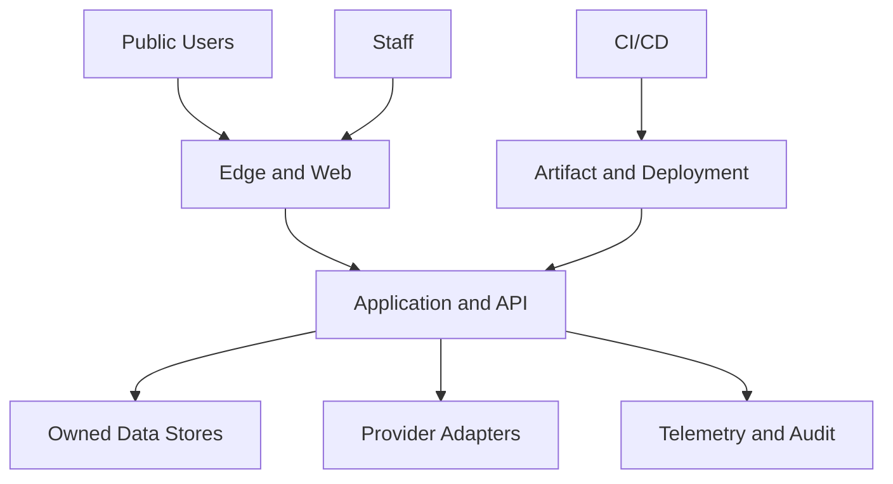
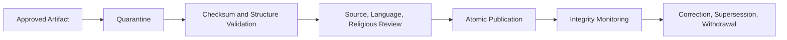
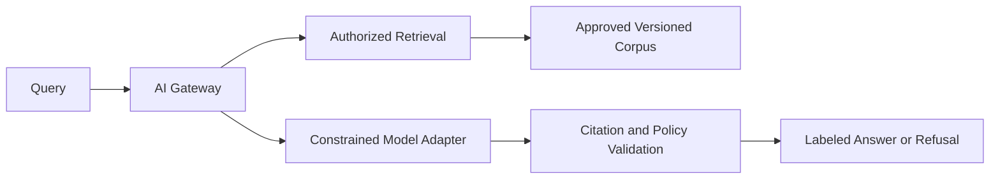
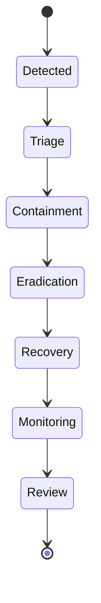

# Alsamad — Security Architecture

**Status:** Approved architecture; documentation only  
**Release model:** Core Release 1 / Expanded V1 separately feature-gated / Prepared / Approved Later Module / Future–Research
**Authority:** Product, Database, Admin, AI, Sakinah, Infrastructure, Observability, QA, Analytics, and Roadmap architecture documents.

This document defines Alsamad's permanent security, privacy, content-integrity, resilience, and recovery architecture. It authorizes no code, UI, migration, provider, deployment, or later module.

---

# 1. Security Mission

Alsamad protects people, canonical religious content, editorial decisions, private data, availability, and institutional trust. Security is an architectural property of identity, authorization, data ownership, content lifecycle, APIs, infrastructure, delivery, observability, recovery, and future AI.

Canonical Quran text, authenticated Sunnah evidence, editions, licenses, sources, classifications, translations, review decisions, publication history, corrections, and withdrawals are high-integrity assets even when publicly readable. Talibeen identity, private profiles, discovery, safety, block, conversation, contact-sharing, verification, media, and retention data are Highly Restricted regardless of its Expanded V1 governance classification.

# 2. Permanent Principles

## 2.1 Security by Design

Threats, trust boundaries, abuse cases, secure defaults, failure modes, detection, recovery, and verification are defined before implementation. Functional completion is not production readiness.

## 2.2 Privacy by Design

Collect only data required for a named purpose; constrain use, access, retention, export, and disclosure; preserve guest access; prefer local-first state; isolate high-sensitivity modules; and make deletion/correction real. Analytics, support, and AI receive no blanket exception.

## 2.3 Least Privilege

Humans, services, jobs, providers, databases, CI, and support tools receive only necessary capability, resource, environment, locale/region, and duration. Privilege is reviewable, revocable, and auditable.

## 2.4 Defense in Depth

Identity assurance, capability checks, module ownership, database constraints, network policy, encryption, review workflows, audit, detection, backups, and recovery jointly protect the system.

## 2.5 Default Deny

Privileged action, network path, secret access, cross-module write, export, callback, and sensitive discovery is denied until explicitly allowed.

## 2.6 Content Integrity Protection

Religious truth is a security asset. Imports are quarantined. Source, license, edition, checksum, language, religious review, publication, correction, and withdrawal controls are mandatory. Machine output, admin convenience, and direct database edits cannot bypass them.

## 2.7 Single Ownership

Every table/resource has exactly one owner that governs writes. Cross-module mutation uses the owner's explicit command. Shared physical-table ownership is prohibited.

## 2.8 Separation of Duties

Drafting, source verification, language review, religious review, publication, permission administration, emergency action, infrastructure administration, and audit review are distinct capabilities.

## 2.9 Minimize Blast Radius

Separate environments, credentials, roles, providers, data classes, modules, deployments, and separately gated Talibeen/future-AI boundaries. Assume components can fail or be compromised.

## 2.10 Secure Failure and Reversibility

Protected operations fail closed. High-impact changes have rollback, supersession, withdrawal, revocation, restore, or compensation. Immutable history is preserved.

## 2.11 Verifiable Security

Controls require tests, configuration evidence, logs, alerts, access reviews, restore exercises, scan results, incident exercises, and release gates.

# 3. Governance and Classification

Material exceptions require owner, reason, compensating controls, expiry, and review. Religious integrity decisions include qualified content authority. Talibeen activation requires Security, Privacy, Safety, Legal, and module approval. Runtime AI requires AI, Content Integrity, Security, Privacy, and qualified reviewers.

| Class             | Examples                                                      | Handling                                            |
| ----------------- | ------------------------------------------------------------- | --------------------------------------------------- |
| Public            | Published Quran, translation, duas, methods                   | Integrity protected; policy-cacheable               |
| Internal          | Non-sensitive operations                                      | Authenticated, least privilege                      |
| Confidential      | Drafts, reviews, staff/provider details                       | Encrypted, scoped                                   |
| Restricted        | Sessions, credentials, security evidence, precise preferences | Narrow access; prohibited from ordinary logs        |
| Highly Restricted | Talibeen/safety/conversations, sensitive AI traces            | Isolated, purpose-bound, heightened audit/retention |

# 4. Threat Model

Threat actors include bots, credential attackers, abusive scrapers, malicious/compromised staff, compromised dependencies/CI/providers/workstations, hostile imports, religious-text tampering, future prompt/corpus injection, Talibeen stalkers/scammers/extortionists/enumerators, and accidental operator/configuration failure.

| Threat                       | Target                  | Principal controls                                                      |
| ---------------------------- | ----------------------- | ----------------------------------------------------------------------- |
| Quran/Sunnah tampering       | Canonical text/evidence | Quarantine, checksums, reviews, immutable versions, monitoring, restore |
| Privilege escalation         | Admin/editorial         | MFA, capabilities, separation, audit, recertification                   |
| Account takeover             | Staff/future users      | Passkeys/MFA, secure recovery, sessions, anomaly detection              |
| Injection/SSRF/XSS           | App/API                 | Validation, parameterization, encoding, CSP, egress controls            |
| Exfiltration                 | Restricted data         | Minimization, isolation, encryption, access detection                   |
| Supply-chain compromise      | Build/deploy            | Pinning, provenance, scans, signed artifacts, protected CI              |
| AI injection/poisoning       | Future AI               | Trusted corpus, retrieval isolation, policy/citation validation         |
| Enumeration/stalking         | Talibeen Expanded V1    | Opaque IDs, anti-enumeration, privacy discovery, blocks                 |
| Destructive admin/ransomware | Production/backups      | Segmentation, immutable backups, dual control, restore drills           |
| Availability abuse           | Public service          | CDN/WAF, limits, graceful degradation, capacity alerts                  |

Every trust-boundary crossing is explicitly public or authenticated, encrypted, authorized, minimized, rate-controlled where appropriate, and observable.

# 5. Quran and Authenticated Sunnah Integrity

Mandatory controls:

- Record provider, license, edition/version, import date, parser version, manifest, and checksum.
- Never serve quarantined bytes as published.
- Verify surah/ayah counts, coordinates, order, encoding, Unicode, marks, and corpus invariants.
- Keep canonical Arabic separate from translation editions.
- Make published text immutable; correction creates a new version/event.
- Show source, translation attribution, review, and correction state publicly.
- Treat search, cache, embedding, and AI corpora as rebuildable projections.
- Run integrity checks on import, release, schedule, restore, and suspicion.
- Support emergency withdrawal without destroying history.

Editorial General Dua retains structural classification, language review, religious-appropriateness review, mandatory label, and prohibited authenticated badges. Citation for inspiration does not transform editorial wording into Quran/Sunnah. AI text remains a draft.

| Action                |           Author | Source reviewer | Language reviewer | Religious reviewer |                  Publisher |
| --------------------- | ---------------: | --------------: | ----------------: | -----------------: | -------------------------: |
| Draft                 |            Allow |            Read |              Read |               Read |                       Read |
| Evidence verification |           Submit |           Allow |              Read |               Read |                       Read |
| Language approval     | No self-approval |            Read |      Allow scoped |               Read |                       Read |
| Religious approval    |               No |            Read |              Read |       Allow scoped |                       Read |
| Publish               |               No |              No |                No |                 No |            After all gates |
| Emergency withdrawal  |               No |              No |                No |          Recommend | Explicit capability/reason |

# 6. Identity, MFA, Passkeys, Recovery, Sessions

Core Release 1 public reading remains guest-first. `REG-0028` and `ADR-0011` open Public ALSAMAD Identity as an Expanded V1 prerequisite architecture track while implementation and real-user activation remain blocked. Staff/Editorial identity is separate from public accounts, and the separately feature-gated Talibeen context is not a public-profile extension.

The durable ALSAMAD account subject is provider-neutral and distinct from credentials, provider subjects, sessions, recovery methods, presentation fields, Editorial Identity, and dependent private-module profiles. Authentication may later prove control of a credential/provider identity and resolve it to the stable account; provider replacement or recovery must not silently create a second account. Sessions represent revocable authorized access in an authenticated account context, may coexist across future authorized clients/devices, and remain bounded by current account state. Exact credential, provider, linking, session storage/transport, timeout, recovery, and account-state implementations require later contracts.

`REG-0028`/`ADR-0011` established that account lifecycle must distinguish usable access, restricted/disabled access, deletion in progress, and terminal completion at the semantic level without then freezing a physical representation. Deletion completion cannot assume a blind cascade into dependent sensitive/private modules: every such module must govern ownership, disposition, retention, legal/safety evidence, and cleanup before production linkage. No module data, retention period, support bypass, provider, table, API, or implementation is authorized by that architecture boundary.

`REG-0029` and accepted `ADR-0012` now freeze the provider-neutral physical contract for a possible future runtime-inert `users` root: application-generated immutable UUIDv7 `id`; checked `status` limited to `active`, `disabled`, `deletion_pending`, or `deleted`; immutable `created_at`; and lifecycle-only `updated_at`. The contract contains no credential, secret, provider identity, session, recovery, contact, presentation/profile, preference, saved-item, Editorial, Talibeen, or other module data. It remains personal-data-capable architecture even though any first inert implementation must contain zero seed, backfill, real, or production account rows.

Before that inert root may be accepted, evidence must prove the exact four-column schema, UUIDv7/no-default identifier boundary, closed status check, immutable identity/creation evidence, fail-closed lifecycle trigger, zero rows, zero runtime readers and writers, no runtime import/composition, no repository/service/API/UI/provider/seed consumer, exact migration and schema verification, exact file/diff scope, and rollback of the unused isolated unit. Entering `deleted` is permitted only from `deletion_pending`; `deleted` is terminal. Reactivation, grace, appeal, retention, legal hold, hard deletion, anonymization, and real-user lifecycle operations remain later contracts.

The root's sole purpose is stable shared ALSAMAD account identity. Real-user activation remains blocked until later governance settles lawful basis, privacy notice, retention, deletion completion, access/export, backups, audit/logging, provider metadata, subprocessors/transfers, support access, jurisdiction obligations, threat/data-flow review, and applicable provider/mechanism acceptance. Future dependent private modules require their own ownership/deletion/retention/cleanup contracts and receive no cascade or linkage authority here. This physical contract does not authorize a table, migration, provider, account row, runtime, API, or deployment.

`REG-0031`/`ADR-0013` add an architecture-only authentication identity linkage boundary. One durable account may eventually have multiple authentication identities, but each authentication identity may resolve to at most one account. Resolution fails closed on ambiguity, conflict, provider-subject collision, mutable-contact collision, stale linkage, or prior linkage to another account. Future additional linkage requires proof of control of both the existing durable account and the new authentication identity. Email, phone, and other mutable contact attributes cannot establish equivalence or enable automatic merge, transfer, duplicate-account creation, or takeover.

Unlinking must not silently strand the account without another separately governed secure access or recovery path. Replacement or relinking must preserve necessary security/audit lineage conceptually; exact audit content, retention, deletion, and privacy rules remain deferred. Authentication assurance proves only the control relationship required for access and conveys no trust, reputation, piety, compatibility, Editorial or Talibeen authority, membership tier, payment status, or social standing. Linking, unlinking, replacement, conflict handling, enumeration resistance, and identifier-leakage controls must be concretely specified before any runtime authorization. Provider, credential, session, token/cookie, and recovery mechanisms remain deferred; no schema, API, runtime, real identity, or personal-data processing is authorized here.

- Passkeys/WebAuthn are preferred.
- Staff MFA is mandatory; high-impact roles require phishing-resistant methods where available.
- TOTP is a controlled fallback; SMS is not the preferred strong factor.
- Passwords, if used, receive memory-hard hashing, breached-password screening, safe limits, and no arbitrary periodic rotation.
- OAuth/OIDC is adapter-based; verified provider subject maps to stable internal identity.

Passkey registration requires authenticated ceremony; credential IDs are unique; public keys are stored; user verification is enforced by role policy; lost credentials are removable after secure recovery.

Recovery uses one-time codes or organization-controlled verification, cooldown for high-risk changes, notification to existing channels, session revocation, and audit. Support cannot view/set passwords or bypass MFA without exceptional dual control.

Sessions use high-entropy opaque tokens, stored hashed when server-managed; Secure/HttpOnly/SameSite cookies; short staff idle/absolute lifetime; rotation on login, privilege/recovery change; revocation on logout, compromise, grant removal, or disablement; and privacy-aware anomaly signals rather than sole IP binding.

# 7. Capability-Based Authorization

Authorization evaluates subject, capability, owner, resource, content class, locale, region, environment, assurance, time, and constraints. Roles are grant templates, not decisions. UI hiding is not enforcement. Database privileges add defense but do not replace application checks.

| Class            | Examples                     | Extra control                                |
| ---------------- | ---------------------------- | -------------------------------------------- |
| Public read      | Published Quran/duas/methods | Published-state filter                       |
| Editorial write  | Revision/translation         | Module and locale scope                      |
| Religious review | Authenticated content        | Qualification and separation                 |
| Publication      | Publish/correct/withdraw     | Strong auth and completed gates              |
| Security admin   | Grants/sessions/incidents    | Strong auth and strict audit                 |
| Infrastructure   | Deploy/secrets/database      | Workload/user identity and environment scope |
| Talibeen Expanded V1 | Safety/support/moderation | Purpose, case, heightened audit              |

Direct cross-module table writes are denied. Row-level security may reinforce private modules but never replaces ownership/use-case testing.

# 8. Administrative Security

- Dedicated staff identity and admin surface.
- Mandatory MFA; managed-device posture for privileged production access.
- No generic production CRUD console for religious content.
- Scoped, expiring grants and periodic access recertification.
- Just-in-time elevation for rare actions.
- Bulk actions require dry run, reason, counts, confirmation, idempotency, audit, and rollback.
- Production database access is exceptional, time-bound, recorded, and read-only by default.
- Break-glass credentials are offline-protected, monitored, tested, dual-controlled where feasible, and rotated after use.
- No silent user impersonation; private-data support access requires case and purpose.

# 9. API and Application Security

- TLS, HSTS, Secure cookies, strict origins, narrow CORS, CSRF defense.
- Runtime schemas; size/depth/count limits; field allowlists; reject unknown mutation fields.
- Parameterized SQL and safe query composition.
- Context-aware output encoding; reviewed sanitization of allowed rich content.
- CSP with nonce/hash; no unsafe inline/eval by default.
- SSRF defenses: destination allowlist, DNS/IP validation, redirect control, egress policy, timeout/size limit.
- Upload quarantine, signature/type checks, limits, malware scanning where appropriate, randomized keys, non-executable serving.
- No unsafe deserialization, dynamic evaluation, shell construction, or user templates.
- Errors do not expose stack, SQL, topology, providers, secrets, user/Talibeen existence.
- Layered rate limits protect auth, search, intake, admin, export, AI, callbacks, and Talibeen discovery while preserving accessibility.

# 10. Browser and PWA Security

Service-worker scope is minimal and versioned. Sensitive/admin responses are never cached offline. Published immutable content may be cached with version integrity. Update policy prevents indefinite vulnerable clients. No secret is embedded in JavaScript, source maps, manifests, or bundles. Third-party scripts are minimized, reviewed, CSP-isolated, consent-aware, and excluded from sacred reading flows unless strongly justified. Redirects/deep links are allowlisted.

# 11. AI and RAG Security — Future/Research

Threats include prompt injection, corpus poisoning, citation fabrication/mismatch, jailbreak, provider leakage, unauthorized training reuse, unsafe tools, cross-scope retrieval, false religious authority, and model drift.

Required controls:

- Only approved immutable corpus revisions enter retrieval.
- Authorization and visibility filter before model access.
- Retrieved text is untrusted data, never system instruction.
- Model has no direct database, shell, network, publication, message, payment, or account authority.
- Future tools are allowlisted, typed, bounded, validated, timed out, budgeted, and human-approved where impactful.
- Citation validator confirms IDs, versions, excerpts, and claim support.
- Generated output is visibly distinct from Quran/Sunnah.
- Refuse/escalate personalized fatwa, takfir, unsupported doctrine, and high-risk advice.
- Record prompt/model/provider/corpus/embedding/policy/evaluation versions without unnecessary sensitive queries.
- Provider contracts restrict training/retention and assess transfers.
- Kill switch restores deterministic search.

No launch before threat model, corpus approval, adversarial/citation/refusal evaluation, privacy review, red-team, monitoring, incident response, rollback, and qualified human approval pass.

# 12. Talibeen Expanded V1 Heightened Privacy and Isolation

`REG-0025` promotes Talibeen to an Expanded V1 separately feature-gated governance-design track outside frozen Core Release 1. It still has zero Core Release 1 tables and no implementation authority. Real-user processing, beta, monetization, SEO exposure, and public launch require the applicable separate Privacy, Safety, Legal, Security, identity, data, consumer, operational, and launch approvals. Every capability is default-off until its own staged-release gate passes.

- Dedicated owner and schema/data boundary; separate service role/encryption context where practical.
- No public indexing of private marriage profiles or sensitive discovery projections; no session replay, general admin browsing, unrestricted AI access/training, or public-profile joins. A non-personal public SEO layer remains separately gated and receives no private-profile authority.
- Minimized discovery projections; source profiles private.
- Field visibility, coarse location by default, and no exact location absent a later essential protected use.
- Opaque IDs, anti-enumeration responses, rate-limited discovery, no bulk export/scraping.
- Block, report, safety exit, consent, and communication boundaries.
- Purpose-bound, case-bound, audited sensitive access.
- Separate retention for deletion, blocks, abuse evidence, legal hold, and safety cases.
- Minimal isolated safety retention, never reused for engagement.
- Rapid removal from discovery and documented erasure/anonymization timeline.
- Adults only (`18+`); minors are ineligible for marriage discovery/contact. Date of birth is not public by implication, and exact assurance, suspected-minor handling, minimized evidence, and appeals remain later jurisdiction-aware contracts.
- One ALSAMAD identity root with an isolated private Talibeen bounded context; no duplicate Talibeen account, public/social-profile conversion, religious/devotional/Knowledge/editorial storage, or Editorial Identity reinterpretation.
- Identity verification is separate from display identity, membership/payment, compatibility, religious status, and generalized trust claims.
- External contact information is not ordinary discovery-profile content. Later sharing requires an explicit per-person grant after the governed relationship state; acceptance never reveals it automatically, and revocation cannot promise recovery of information already viewed/copied.
- Authoritative domain/backend enforcement, not UI-only filtering, must preserve the governed man/woman marriage-candidate invariant before discovery activation.
- Private conversation requires the governed mutual-introduction state; arbitrary mass messaging is prohibited.
- Blocking provides immediate protection. Report-and-block, trained human moderation, purpose-bound evidence access, sanctions, appeals, repeat-offender/block-evasion handling, severity, legal hold, emergency escalation, and staffing/SLAs are required before public discovery/contact/messaging.
- Payment grants no ranking, compatibility, verification, safety, moderation immunity, religious/moral status, or preferential marriage opportunity.
- Photos remain governed Highly Restricted media. In-product consent never implies public, social-media, Social Reach, or unrelated-AI consent.
- Talibeen notification preferences are separable from religious/content notifications; previews minimize sensitive marriage data, non-security notifications are independently mutable/quiet, and marketing remains distinct from account/security notices.
- Feature and jurisdiction controls fail closed, support staged cohorts and a kill switch, and do not treat global-by-design as global legal approval.

Before real-user processing or public release, maintained data-flow/threat models and reviewed contracts must cover age and identity assurance, lawful bases, sensitive-data purposes and fields, consent, transfers/subprocessors, user rights, retention/deletion/legal hold/backups, staff access, moderation/evidence duties, harassment, sexual content, threats, extortion, financial solicitation, fraud/scams, impersonation, stalking/doxxing, block evasion, image abuse, incident response, notification consent, and operational escalation. Monetization additionally requires reviewed consumer-subscription, localized-price, tax/payment, cancellation/refund/renewal, and provider obligations. Public SEO additionally requires aggregation/re-identification, low-count, anti-enumeration, content-quality, canonical/locale, and future-domain review. This architecture makes no jurisdictional compliance claim and selects no provider or cryptographic implementation.

| Actor             |              Own profile | Discovery projection | Other private profile |  Safety evidence |
| ----------------- | -----------------------: | -------------------: | --------------------: | ---------------: |
| User              |        Scoped read/write |  Approved candidates |                  Deny | Own reports only |
| Ordinary support  |             Case-minimal |                 Deny |                  Deny |             Deny |
| Safety specialist |            Case-required |        Case-required |         Purpose-bound |   Scoped/audited |
| Engineer          |           Synthetic only |       Synthetic only |                  Deny |             Deny |
| Analyst           | Aggregated/de-identified |           Aggregated |                  Deny |             Deny |

# 13. Secrets and Encryption

Secrets live in an approved manager, never source, tickets, chat, screenshots, logs, client bundles, or ordinary database rows. Workloads use identity-bound injection. Separate by environment/provider/purpose. Prefer short-lived scoped credentials. Support planned and emergency rotation, overlap, access audit, anomaly alerts, and isolated development credentials.

TLS protects every external and authenticated internal boundary. Databases, caches, object storage, providers, and telemetry verify encrypted connections. Managed at-rest encryption covers disks, databases, backups, logs, objects, and artifacts. Highly Restricted fields may use application envelope encryption with independent keys/context. Passwords are memory-hard hashes; session/recovery/API tokens are high entropy and hashed where lookup permits. Backups use independent access and keys.

# 14. Database Security

- Separate migration, application, read-only, job, analytics, and break-glass roles.
- Application privilege only for required owned objects.
- Foreign keys, checks, uniqueness, append-only controls, and transactions enforce integrity.
- Published content and review/publication history are immutable to normal roles.
- Reviewed forward-only production migrations tested on real PostgreSQL.
- Protected/access-logged snapshots and restores.
- Query timeouts, connection limits, and statement controls.
- Explicitly authorized exports/replicas; analytics excludes raw Highly Restricted data.
- Seeds/fixtures never copy production personal data.

# 15. Infrastructure and Network Security

- Separate production, staging, development, and CI trust environments.
- No public production database/private-service exposure.
- Explicit protected ingress and allowlisted egress where feasible.
- Reproducible reviewed infrastructure and drift detection.
- Default-deny network paths; identity/encryption between services.
- Strong, short, auditable admin access; no permanent open SSH.
- Minimal non-root containers, read-only filesystem where practical, restricted capabilities, resource limits, scans.
- Protect metadata/control planes from SSRF and overbroad workload roles.
- CDN/WAF, rate controls, capacity, cache protection, dependency isolation, and graceful degradation address denial of service.

# 16. Supply Chain

Lockfiles and reproducible installs are mandatory. Direct dependencies receive maintenance, license, provenance, and risk review. Automated vulnerability/malicious-package signals are triaged. Lifecycle scripts and transitive additions are code-execution risk.

Protected branches, required reviews, least-privileged ephemeral CI, and secret isolation apply. Untrusted pull requests cannot access production secrets. Artifacts are immutable, checksummed, signed/attested where supported, promoted rather than rebuilt, and accompanied by SBOM/provenance. Deployment verifies approved artifact identity.

Providers receive only required scopes/data and undergo security, privacy, retention, breach, subprocessor, availability, portability, and exit assessment. Every provider has a disable/replace path.

# 17. CI/CD and Deployment Security

Merge and deploy permissions are separate. Production requires approved artifact, environment authorization, compatible migration plan, recovery readiness, observability, and rollback. Database/application sequence stays backward-compatible. Progressive rollout has stop criteria. Emergency changes remain narrowly scoped, logged, and retrospectively reviewed. No production deployment originates from a developer workstation.

# 18. Logging, Audit, Detection

Operational telemetry uses timestamp, environment, service/module, route template/operation, status, correlation ID, safe error, and bounded context. Metrics avoid high-cardinality identity.

Never log passwords, passkeys, recovery codes, tokens, cookies, keys, full authorization, unnecessary religious payload, raw private query by default, precise private location, Talibeen data, payment credentials, sensitive AI prompts, or raw webhooks beyond minimized verified evidence.

Append-only audit covers privileged mutations, grants, reviews, publication/correction/withdrawal, configuration, secret/admin access, export, recovery, break glass, incident actions, and future sensitive support. Record actor, action, target, time, outcome, required reason, correlation, and safe references—not duplicated secret/content payload. Audit access is restricted and audited.

Detection covers auth/recovery anomalies; new factors/privileges; unusual staff access/export; anomalous publication/withdrawal; checksum mismatch; disabled checks/audit gaps; secret anomalies; unexpected database writes; artifact/provenance mismatch; critical dependencies; WAF/availability anomalies; backup/restore failure; future AI citation/refusal regressions; and staged Talibeen scraping/enumeration/safety signals. Every alert has owner, severity, runbook, escalation, deduplication, and test cadence.

# 19. Incident Response

Priority: protect people and prevent misinformation/exposure; preserve controlled evidence; contain credentials/services/providers/content/deployments; restore known-good state and verify; communicate as required; complete root cause and corrective-action verification.

Playbooks cover canonical integrity/mistaken publication, staff takeover, secret exposure, personal-data breach, ransomware/destructive database action, CI/dependency compromise, provider failure, future AI harm/poisoning, and Talibeen safety incidents before any staged real-user release. A content-integrity event may require withdrawal, CDN/cache purge, search rebuild, corpus disablement, public correction, and qualified review before restoration.

# 20. Backup and Recovery Security

- Encrypted automated backups with documented RPO/RTO.
- Separate role/account and failure domain; immutable/write-protected copies.
- Backup access narrower than ordinary production reads and audited.
- Independently protected keys and recovery procedures.
- Scheduled restore into isolation.
- Verify counts, constraints, checksums, canonical religious integrity, publication/audit continuity, and application smoke tests.
- Restore never republishes withdrawn/superseded content.
- Talibeen deletion/retention reconciles with backups before staged real-user activation.
- An untested backup is not an accepted control.

# 21. Availability and Continuity

Release 1 favors a secure understandable single-region foundation with tested recovery unless later requirements justify multi-region. Safe CDN caching supports immutable public content. Administrative writes fail closed when integrity dependencies fail.

Graceful degradation preserves correct Quran/source access, then devotional reading, then disclosed prayer/Hijri behavior. Deterministic search may degrade to direct navigation. Disable analytics, integrations, future AI, and later modules before weakening integrity/privacy.

# 22. Vulnerability Management

Dependency, container, infrastructure, cloud, source, secret, dynamic, penetration, provider, and disclosure findings share one triage process. Severity includes exploitability, exposure, privilege, data class, religious-integrity impact, availability, controls, and active exploitation; a lower CVSS issue affecting canonical content or Talibeen privacy may be critical.

Each finding has owner, deadline, fix/mitigation, verification, and exception expiry. Critical exposed issues block release or trigger emergency response. Exceptions require explicit risk acceptance. Maintain an accessible security contact and safe reporting process.

# 23. Security Testing

| Area              | Evidence                                                             |
| ----------------- | -------------------------------------------------------------------- |
| Authentication    | Passkey/MFA/session/recovery normal and abuse cases                  |
| Authorization     | Capability matrix, cross-scope denial, self-approval denial          |
| API               | Injection, SSRF, CSRF, CORS, XSS, mass assignment, limits, redaction |
| Database          | Real PostgreSQL constraints, roles, append-only, migration safety    |
| Content Integrity | Quarantine, checksums, edition/source/reviews, correction/withdrawal |
| Supply chain      | Dependency/container scans, SBOM, provenance, artifact verification  |
| Infrastructure    | IaC scan, exposure, egress, identity, secret policy                  |
| Recovery          | Encrypted restore and canonical checksum verification                |
| Privacy           | Inventory, minimization, export/deletion, log inspection             |
| AI later          | Injection, poisoning, citations, refusal, leakage, tool abuse, drift |
| Talibeen Expanded V1 | Enumeration, scraping, visibility, contact containment, block, deletion, evidence/legal hold, safety access |

Tests run in CI where appropriate, pre-production, after material change, and periodically. High-risk modules require independent penetration testing. Scan completion is not acceptance; findings must be verified closed.

# 24. Privacy Engineering

Maintain purpose, authority/lawful basis, fields, owner, recipients, retention, deletion, and transfers for each personal-data flow. Core worship content remains account-free. Tasbeeh and ordinary unsynced preferences remain local-first. Consent is specific where used and cannot gate unrelated core service. Avoid dark patterns.

Exports exclude internal security signals and others' data. Deletion distinguishes active removal, required retention, anonymization, and backup expiry. Analytics is minimal, pseudonymous, retention-bounded, and prohibited from religious ranking. Do not infer/monetize religious belief. Children/minors and cross-border transfer/subprocessors require heightened review.

# 25. Security Matrix

| Domain            | Prevent                                         | Detect                              | Respond/Recover                         |
| ----------------- | ----------------------------------------------- | ----------------------------------- | --------------------------------------- |
| Content Integrity | Quarantine, checksum, review, immutable publish | Scheduled checks/publication alerts | Withdraw, purge, restore, correct       |
| Identity          | Passkeys/MFA, limits, secure recovery           | Login/recovery anomalies            | Revoke/reset/investigate                |
| Authorization     | Capabilities, scope, separation                 | Denials/grant anomalies             | Revoke/contain/audit                    |
| API               | Validation, CSRF/CSP/SSRF controls              | WAF/app anomalies                   | Block/patch/rotate/deploy               |
| Data              | Minimize, encrypt, isolate                      | Access/export anomalies             | Contain/notify/restore/delete           |
| Supply chain      | Pin, review, signed artifact                    | Scan/provenance mismatch            | Stop/rebuild trusted chain              |
| Availability      | CDN, limits, capacity                           | SLO/attack alerts                   | Degrade/fail over/restore               |
| AI later          | Trusted corpus/tools/validator                  | Citation/policy regression          | Kill switch/model-corpus rollback       |
| Talibeen Expanded V1 | Isolation/private discovery/contact containment/blocks | Scraping, enumeration and safety signals | Freeze/protect/preserve scoped evidence |

# 26. Release Classification

## Release 1

Threat modeling; guest-core security; staff identity/MFA/session/capabilities/separation; religious content integrity and audited publication/correction/withdrawal; API, database, infrastructure, secrets, encryption, supply chain, CI/CD, telemetry, incident response, backups/restores, testing, and security release gate.

## Expanded V1 — Separately Feature-Gated

Public ALSAMAD Identity architecture under `REG-0028`/`ADR-0011`: shared provider-neutral durable account identity; authentication/session/recovery and essential lifecycle boundaries; Editorial Identity separation; multi-client reuse; and governed future private-module linkage. Architecture is open; implementation, provider selection, tables, APIs, real accounts/data, and dependent-module linkage remain blocked.

Talibeen governance design under `REG-0025`, outside frozen Core Release 1. Public identity activation; isolated Highly Restricted data contracts; Privacy/Safety/Legal/Security approval; exact discovery/contact/messaging/media/notification/payment/SEO/analytics consumer contracts; purpose-bound administration; default-off feature and staged-release gates; and one exact later Roadmap implementation crossing remain required. Classification does not authorize activation.

## Prepared

Public Identity implementation/provider integration; sync/bookmarks/preferences/saved items; correction intake; media/audio; notification preferences; event/outbox/webhook foundations after a consumer is approved.

## Approved Later Module

Hadith additions; subscriptions/payments outside separately gated Talibeen contracts; immutable Balance ledger; notification delivery outside separately gated Talibeen contracts; advanced moderation outside separately gated Talibeen contracts.

## Future/Research

Runtime AI/RAG, semantic search/embeddings, Knowledge Graph/recommendations, and advanced automated governance.

Description does not authorize activation.

# 27. Security Release Gate

Production requires current threat/data-flow model; no unresolved blocking findings; verified staff MFA/capability matrix; religious import/publication/correction/withdrawal gates; environment/secrets separation; reviewed dependency/container/source/IaC scans; SBOM/provenance/artifact identity; log redaction and audit completeness; tested alerts/runbooks; successful restore with canonical checksums; abuse/performance controls; privacy/retention/deletion verification; rollback and emergency-withdrawal exercise; and documented owner approval.

# 28. Open Decisions

- Hosting, PostgreSQL, storage, CDN/WAF, secret manager, and observability providers.
- Staff identity provider, passkey/MFA timeline, production access/device posture.
- RPO/RTO, backup/audit/log/security-evidence retention and restore cadence.
- Vulnerability SLAs, penetration-test provider, disclosure channel, incident contacts.
- Exact Quran/translation editions, durable-storage rights, attribution, quotas, and artifact-signing approach; Quran.Foundation is the approved primary Quran provider.
- Exact Public Identity physical/API implementation, provider/mechanism selection, privacy acceptance, account deletion operations, and activation requirements; the Expanded V1 architecture track is open under `REG-0028`/`ADR-0011`, but implementation and real accounts remain blocked.
- Key hierarchy, rotation, emergency recovery custody.
- Talibeen initial jurisdictions, age-assurance method/provider for the settled `18+` boundary, identity verification, safety operation, isolation details, staff-access model, retention/legal hold, beta cohort, and staged public-launch approval.
- AI provider terms, data handling, evaluation thresholds, and red-team governance before approval.

# 29. Final Validation

## 28.1 M0.5 Quran.Foundation controls

Quran.Foundation app secrets, access tokens, refresh tokens, and confidential credentials remain server-side, environment-separated, least-privileged, rotated, and absent from browser bundles, Git, logs, and public errors. Content credentials and optional user OAuth credentials are isolated. Authorization Code + PKCE/OIDC account linking is Prepared only; QF `sub` is an external alias and never canonical ALSAMAD identity.

Provider payloads are untrusted structured input: validate schema and checksums, sanitize translation/tafsir markup, allowlist media/snapshot hosts and schemes, and translate provider errors. Enforce the default seven-day legal retention ceiling, private `no-store` User API responses, deletion/withdrawal events, revocation, incident notification, and provider termination. Expired QF content cannot be served merely because the provider is unavailable.

- Security by Design, Privacy by Design, Least Privilege, Defense in Depth, Default Deny, and Content Integrity Protection are first-class.
- Threat model covers external, insider, provider/build, content, future AI, and separately feature-gated Talibeen risks.
- Quran/Sunnah integrity, identity/MFA/passkeys/recovery/sessions, capability authorization, admin/API/app security, AI/RAG, Talibeen isolation, secrets/encryption, supply chain/CI/CD, logging/audit/detection/response, backup/recovery, vulnerabilities, testing, release classification, open decisions, Mermaid diagrams, and matrices are complete.
- Release 1 remains minimal and future evolution additive.
